# A guide to SQL

## Module 1: INTRODUCTION TO KIMTAY PET SUPPLIES AND STAYWELL STUDENT ACCOMMODATION DATABASES

### WHAT IS A DATABASE?

- A **database** is a structure that contains different *categories* of information and the *relationships* between these categories. 
    - For example, the KimTay Pet Supplies database contains information about categories such as sales representatives (sales reps), customers, invoices, and items. The StayWell database contains information about the offices that manage the accommodation, the owners of the accommodation, the residents, and the services (such as cleaning and maintenance) offered for the properties.
    - Each database also contains relationships between categories. For example, the KimTay Pet Supplies database contains information that relates sales reps to the customers they represent and customers to the invoices they have placed. The StayWell database contains information that relates the two main company offices to the properties that they manage, the owners, the different services to the service request, and to the resident renting a property.

### THE KIMTAY PET SUPPLIES DATABASE

#### Problem (Why Kim Pet Supplies needs a database)

- The management of KimTay Pet Supplies (a supplier of pet supplies, food, and accessories located in Cody, Wyoming) has determined that the company’s recent growth no longer makes it feasible to maintain customer, invoice, and inventory data using its manual systems. In addition, KimTay Pet Supplies wants to build an Internet presence. With the data stored in a database, management will be able to ensure that the data is up-to-date and more accurate than in the current manual systems. In addition, managers will be able to obtain answers to their questions concerning the data in the database easily and quickly, with the option of producing a variety of useful reports.
- Management has determined that KimTay Pet Supplies must maintain the following
information about its sales reps, customers, and inventory in the new database:
    - The sales rep ID, first name, last name, full address, cell phone number, total commission, and commission rate for each sales rep.
    - The customer ID, first name, last name, full address, e-mail address, current balance, and credit limit for each customer, as well as the ID of the sales rep who represents the customer.
    - The item ID, description, number of units on hand, category, storage location,and unit price for each item in inventory.
- KimTay Pet Supplies also must store information about invoices. Figure 1-1 shows a sample invoice.
- The sample invoice shown in Figure 1-1 has three sections:
    - The heading (top) of the invoice contains the company name and contact information; the invoice number and date; the customer’s ID, name, and full address; and the sales rep’s ID and full name.
    - The body of the invoice contains one or more invoice lines, sometimes called line items. Each invoice line contains an item ID, an item description,the number of units of the item ordered, and the quoted price for the item. Each invoice line also contains a total, usually called an extension, which is the result of multiplying the number ordered by the quoted price.
    - Finally, the footing (bottom) of the invoice contains the invoice total.
    
  


- KimTay Pet Supplies also must store the following items in the database for each
customer’s invoice:
    - The invoice number, the date the invoice was placed, and the ID of the customer that placed the invoice. The customer’s name, full address, and the ID of the sales rep who represents the customer are stored with the customer information. The name of the sales rep is stored with the sales rep information.
    - The invoice number, the item ID, the quantity ordered, and the quoted price for each invoice line. The item description is stored with the information about items. The result of multiplying the number of units ordered by the quoted price is not stored because the database can calculate it when needed.
- The overall invoice total is not stored. Instead, the database calculates the total whenever an invoice is printed or displayed on the screen.
- Figure 1-2 shws sample data for KimTay Pet Supplies.


- In the SALES_REP table, you see that there are four reps, whose ID values are 05, 10, 15, and 20. The name of sales rep 05 is Susan Garcia. Her street address is 42 Mountain Ln. She lives in Cody, WY, and her postal code is 82414. Her cell phone number is 307-824-1245. Her total commission is \$12,743.16, and her commission rate is 0.04 (four percent).
- In the CUSTOMER table, 12 KimTay Pet Supplies customers are identified with the ID values of 126, 182, 227, 294, 314, 375, 435, 492, 543, 616, 721, and 795. The name of customer number 126 is Joey Smith. This customer’s address is 17 Fourth St in Cody, WY, with a postal code of 82414. The e-mail address of the customer is jsmith17@ example.com. The customer’s current balance is \$80.68, and their credit limit is \$500.00. The value 05 in the REP_ID column indicates that Joey Smith is represented by sales rep 05 (Susan Garcia).
- In the table named ITEM, you see that there are 15 items, whose item ID values are AD72, BC33, CA75, DT12, FM23, FS39, FS42, KH81, LD14, LP73, PF19, QB92, SP91, UF39, and WB49. Item AD72 is a Dog Feeding Station, and KimTay Pet Supplies has 12 units of this item on hand. The Dog Feeding Station item is in the DOG category, and it is located in area B. The price of the Dog Feeding Station is \$79.99. Other categories are BRD (bird), CAT, FSH (fish), and HOR (horse).
- In the table named INVOICES, you see that there are eight invoices which are identified with the numbers 14216, 14219, 14222, 14224, 14228, 14231, 14233, and 14237. Invoice number 14216 was placed on November 15, 2021, by customer 125 (Joey Smith).
- The table named INVOICE_LINE might seem strange at first glance. Why do you need a separate table for the invoice lines? Could they be included in the INVOICES table? The answer is technically yes. You could structure the table named INVOICES as shown in Figure 1-3. Notice that this table contains the same invoices as shown in Figure 1-2, with the same dates and customer ID numbers. In addition, each table row in Figure 1-3 contains all the invoice lines for a given invoice. Examining the second row, for example, you see that invoice 14219 has two invoice lines. One of the invoice lines is for 2 units of item AD72 at \$79.99 each, and the other invoice line is for 4 units of item DT12 at \$39.99 each.


> **Q & A**
> **Question**: How is the information from Figure 1-2 represented in Figure 1-3?
> Answer: Examine the INVOICE_LINE table shown in Figure 1-2 and note the second and third rows. The second row indicates that there is an invoice line on invoice 14219 for 2 units of item AD72 at \$79.99 each. The third row indicates that there is an invoice line on invoice 14219 for 4 units of item DT12 at \$39.99 each. Thus, the information that you find in Figure 1-3 is represented in Figure 1-2 in two separate rows rather than in one row.

- It might seem inefficient to use two rows to store information that could be represented in one row. There is a problem, however, with the arrangement shown in Figure 1-3 — the table is more complicated. In Figure 1-2, there is a single entry at each location in the table. In Figure 1-3, some of the individual positions within the table contain multiple entries, making it difficult to track the information between columns. In the row for invoice number 14219, for example, it is crucial to know that the AD72 corresponds to the 2 in the QUANTITY column (not to the 4) and that it corresponds to the \$79.99 in the QUOTED_PRICE column (not to the \$39.99). In addition, a more complex table raises practical issues, such as the following:
    - How much room do you allow for these multiple entries?
    - What happens when an invoice has more invoice lines than you have allowed room for?
    - For a given item, how do you determine which invoices contain invoice lines for that item?
- Although none of these problems is unsolvable, they do add a level of complexity that is not present in the arrangement shown in Figure 1-2. In Figure 1-2, there are no multiple entries to worry about, it does not matter how many invoice lines exist for any invoice, and finding every invoice that contains an invoice line for a given item is easy (just look for all invoice lines with the given item number in the ITEM_ID column). In general, this simpler structure is preferable, and that is why invoice lines appear in a separate table.
- To test your understanding of the KimTay Pet Supplies data, use Figure 1-2 to answer the following questions.

> **Q & A**
> **Question**: What are the customer ID values of the customers represented by Susan Garcia?
> **Answer**: 126, 375, 543, and 795. (Look up the REP_ID value of Susan Garcia in the SALES_REP table and obtain the value 05. Then find all customers in the CUSTOMER table that have the value 05 in the REP_ID field.)

> **Q & A**
> **Question**: What is the name of the customer that placed invoice 14222, and what is the name of the sales rep who represents the customer?
> **Answer**: Samantha Smith is the customer, and Richard Miller is the sales rep. (Look up the CUST_ID value in the INVOICES table for invoice 14222 and obtain the ID value 294. Then find the customer in the CUSTOMER table with the CUST_ID value of 294. Using the REP_ID value, which is 10, find the name of the sales rep in the SALES_REP table.)

> **Q & A**
> **Question**: List all items that appear in invoice 14228. For each item, give the description, quantity ordered, and quoted price.
> **Answer**: Item ID: FS42; description: Aquarium (55 Gallon); quantity ordered: 1; and quoted price: \$124.99. Also, item ID: PF19; description: Pump & Filter Kit; quantity ordered: 1; and quoted price: \$74.99. (Look up each INVOICE_LINE table row on which the invoice number is 14228. Each of these rows contains an item ID, quantity ordered, and quoted price. Use the item ID to look up the corresponding item description in the ITEM table.)

> **Q & A**
> **Question**: Why is the QUOTED_PRICE column in the INVOICE_LINE table? Can’t you just use the item ID and look up the price in the ITEM table?
> **Answer**: If the QUOTED_PRICE column did not appear in the INVOICE_LINE table, you would need to obtain the price for an item on an invoice line by looking up the price in the ITEM table. Although this approach is reasonable, it prevents KimTay Pet Supplies from charging different prices to different customers for the same item. Because KimTay Pet Supplies wants the flexibility to quote and charge different prices to different customers, the QUOTED_PRICE column is included in the INVOICE_LINE table. If you examine the INVOICE_LINE table, you will see cases in which the quoted price matches the actual price in the ITEM table, and cases in which it differs. For example, in invoice number 14216, Joey Smith bought three Enclosed Cat Litter Stations, and KimTay Pet Supplies charged only \$37.99 each, not the regular price of \$39.99.

### STAYWELL STUDENT ACCOMMODATION DATABASE

- StayWell finds and manages accommodation for owners of student accommodation in the Seattle area. The company rents out and helps to maintain 1–5-bedroom properties located in two main areas in the city, Columbia City and Georgetown. This is done on behalf of property owners based both in the local area and throughout the United States. Each location is administrated by a different office, StayWell-Columbia City and StayWell-Georgetown.
- StayWell wishes to expand its business. The current model relies on advertisements in student and university publications in print and online, but prospective owners and renters need to contact the offices and speak to an administrator on all matters relating to renting of properties. The office organizes maintenance services for a fee, which is also currently done via email or direct communication.
- StayWell has decided that the best way to increase efficiency and move toward an e-commerce-based business model is to store all the data about the properties, owners, tenants and services in databases. This will mean that the information can be easily accessed. StayWell hopes that these databases can then be used in future projects such asmobile apps and online booking systems.
- The data is split into several tables as described below.
- The OFFICE table shown in Figure 1-4 shows the office number, office location,
address, area, city, state, and ZIP code.


- StayWell is split into two offices to better manage the properties. This management includes communicating with owners about the status and upkeep of their properties. They also facilitate the payment from the properties, meaning that the owners get regular income without having to collect rent in arrears. Offices also advertise properties and place students in appropriate properties, facilitating initial visits and taking deposits. Lastly the office administers the maintenance of the properties, communicating with residents, owners, and maintenance services. This is discussed later.
- StayWell stores information about the owners of each property in the OWNER table, as seen in Figure 1-5. Each owner is identified by a unique owner number that consists of two uppercase letters followed by a three-digit number. For each owner, the table also includes the last name, first name, address, city, state, and ZIP code. Notice the owners are from across the United States. Although some apartments may be owned by a couple or a family, only the primary contact is given.


- Each property at each location is identified by a property ID, as seen in Figure 1-6. Each property also includes the office number that manages the property, address, floor size, the number of bedrooms, the number of floors, monthly rent per property, and the owner number. The property ID is an integer unique for each property.


-It might at first seem reasonable to include property IDs in the OWNER table, as it would only add one more column. However, if you look at the tables, you notice that there are more properties than owners because some owners have more than one property managed by StayWell. If the OWNER table included the property codes, this would require some entries to have more than one property ID. This would either require multiple property columns or require single rows to contain multiple data entries, creating issues in cross-referencing.
- StayWell provides maintenance services across the properties in the two areas; this is shown in Figure 1-7. The SERVICE_CATEGORY table includes details of these services. The CATEGORY_NUM provides a unique number for the service, and
CATEGORY_DESCRIPTION shows what the service is.


- The SERVICE_REQUEST, as shown in Figure 1-8, table shows requests that residents have put into the offices for maintenance. Each row contains a unique service ID number, the property ID, and the category relating to Figure 1-7. For example, the first line shows the unique service ID, followed by the property ID, which is 11. Looking at the PROPERTY table, we can see that this is 9531 Sherwood Rd, and by referencing the office number we can see that this is managed by StayWell-Georgetown. The table includes details of the request, along with the current status. The estimated time to complete the service is included, plus the actual amount of time and the date of the action to be taken, where applicable.


- The RESIDENTS database, as shown in Figure 1-9, includes details about the residents living in each property. The RESIDENT column includes the first name and last name for each of the residents, along with a resident ID. The PROPERTY_ID is the unique identification number of the property in which they are staying.


### Module Summary

- KimTay Pet Supplies is an organization whose information requirements include sales reps, customers, items, invoices, and invoice lines.
- StayWell Student Accommodation is an organization whose information requirements include management offices, property details, owners, residents, and services requests.

### Key Term

- database

### Case Exercises

#### KimTay Pet Supplies

- Answer each of the following questions using the KimTay Pet Supplies data shown in Figure 1-2. No computer work is required.

> **Q-1**: List the first and last names of all customers that have a credit limit above, but not including,$500
> 
> **Answer**: Billy Rufton, James Gonzalez, Angie Hendricks, Leslie Smith

> **Q-2**: List the invoice numbers for invoices placed by customer ID 435 on November 18, 2021.
> 
> **Answer**: 14228, 14233

> **Q-3**: List the item ID, item description, and on-hand value for each item in category HOR. (Hint: On-hand value is the result of multiplying the number of units on hand by the price.)
> 
> **Answer**:
> | item ID | item description       | on-hand value  |
> | ---     | ---                    | ---            |
> | FM23    | Fly Mask with Ears     | $(41*24.95)    |
> | FS39    | Folding Saddle Stand   | $(12*39.99)    |
> | QB92    | Quilted Stable Blanket | $(32*119.99)   |
> | WB49    | Insulated Water Bucket | $(34*79.99)    |

> **Q-4**: List the item ID and item description of all items that are in category DOG.
> 
> **Answer**:
> | item ID | item description         |
> | ---     | ---                      |
> | AD72    | Dog Feeding Station      |
> | DT12    | Dog Toy Gift Set         |
> | LD14    | Locking Small Dog Door   |
> | LP73    | Large Pet Carrier        |
> | UF39    | Underground Fence System |

> **Q-5**: How many customers have a balance that exceeds their credit limit?
> 
> **Answer**: 1  Customer. Customer 375 (Melanie, Jackson).

> **Q-6**: What is the item ID, description, and price of the least expensive item in the database?
> 
> **Answer**:
> | item ID | description            | price          |
> | ---     | ---                    | ---            |
> | KH81    | Wild Bird Food (25 lb) | $19.99         |

> **Q-7**: For each invoice, list the invoice number, invoice date, customer ID, and customer first and last names.
> 
> **Answer**:
> | Invoice number | invoice date | customer ID | customer first and last names|
> | ---   | ---        | --- | ---            |
> | 14216 | 11/15/2021 | 126 | Joey Smith     |  
> | 14219 | 11/15/2021 | 227 | Sandra Pincher |
> | 14222 | 11/16/2021 | 294 | Samantha Smith |
> | 14224 | 11/16/2021 | 182 | Billy Rufton   |
> | 14228 | 11/18/2021 | 435 | James Gonzalez |
> | 14231 | 11/18/2021 | 126 | Joey Smith     |
> | 14233 | 11/18/2021 | 435 | James Gonzalez |
> | 14237 | 11/19/2021 | 616 | Sally Cruz     |

> **Q-8**: For each invoice placed on November 16, 2021, list the invoice number, customer ID, and customer first and last names.
> 
> **Answer**:
> | Invoice number | customer ID | customer first and last names| 
> | ---   | --- | ---            |
> | 14222 | 294 | Samantha Smith |
> | 14224 | 182 | Billy Rufton   |

> **Q-9**: 
> List the sales rep ID, and first and last names, for every sales rep who represents at least one customer with a credit limit of $1,000.
> 
> **Answer**:
> | sales rep ID | first and last names |
> | --- | ---            | 
> | 15  | James Gonzalez | 
> | 10  | Leslie Smith   | 

> **Q-10**: For each invoice placed on November 15, 2021, list the invoice number, item ID, item description, and category for each item ordered.
> 
> **Answer**:
> | Invoice number | Item ID | Item description | Category |
> | ---   | ---  | ---                          | --- |
> | 14216 | CA75 | Enclosed Cat Litter Station  | CAT |
> | 14219 | AD72 | Dog Feeding Station          | DOG |
> | 14219 | DT12 | Dog Toy Gift Set             | DOG |

- Critical Thinking
> **Q-1**: KimTay Pet Supplies needs to be able to contact customers when problems arise concerning an invoice. What other types of data could KimTay include in the CUSTOMER table to assist in contacting customers?
> 
> **Answer**: Phone number

#### StayWell Student Accomodation

Answer each of the following questions using the StayWell data shown in Figures 1-4
through 1–9. No computer work is required.

> **Q-1.** List the owner number, last name, and first name of every property owner.
> **Answer**:
> 
> | owner number | last name | first name |
> | --- | --- | --- |
> | MO100 | Moore | Elle-May | 
> | PA101 | Patel | Makesh |
> | AK102 | Aksoy | Ceyda | 
> | CO103 | Cole | Meerab |
> | KO104 | Kowalczyk | Jakub |
> | SI105 | Sims | Haydon |
> | BU106 | Burke | Ernest |
> | RE107 | Redman | Seth |
> | LO108 | Lopez | Janine |
> | BI109 | Bianchi | Nicole |
> | JO110 | Jones | Ammarah |

> **Q-2.** List the last name and first name of every owner located in Seattle.
> 
> **Answer**:
> | last name | first name |
> | --- | --- |
> | Patel | Makesh |
> | Aksoy | Ceyda |
> | Redman | Seth |
> | Jones | Ammarah |

> **Q-3.** List the property ID for each condo that is smaller than 1,600 square feet.
> 
> **Answer**: 1, 3, 5, 9, 11

> **Q-4.** List the last name, first name, and city of every owner who owns more than one property in the database.
> 
> **Answer**:
> | last name | first name | city |
> | --- | --- | --- |
> | Kowalczyk | Jakub | Bellingham |

> **Q-5.** List the last name, first name, and city of every owner with a property that has a monthly rent of less than $1,400 per month.
> 
> **Answer**:
> | last name | first name | city |
> | --- | --- | --- |
> | Bianchi | Nicole | New York |
> | Sims | Haydon | Portland |
> | Patel | Makesh | Seattle |
> | Jones | Ammarah | Seattle |

> **Q-6.** List all the residents staying at 782 Queen Ln.
> 
> **Answer**: Milosz Polansky, Ashanti Lucas, Randy Woodrue

> **Q-7.** How many properties have two floors?
> 
> **Answer**: 5 (Property ID 2, 6, 7, 8, and 12)

> **Q-8.** How many owners live outside of Washington state (WA)?
> 
> **Answer**: 4 owners. (Moore Elle-May, Sims Haydon, Burke Ernest, Bianchi Nicole)

> **Q-9.** List the owner’s last and first names and property IDs for each property that has a scheduled or open service request.
> 
> **Answer**:
> | Last name | First name | Property ID |
> | --- | --- | --- |
> | Redman | Seth | 11 |
> | Burke | Ernest | 1 |
> | Moore | Elle-May | 6 |
> | Aksoy | Ceyda | 2 |
> | Kowalczyk | Jakub | 8 |
> | Kowalczyk | Jakub | 4 |
> | Patel | Makesh | 9 |
> | Redman | Seth | 12 |

> **Q-10.** List the property ID and square footage for each property that has a maintenance service request.
> 
> **Answer**:
> | Property ID | Square footage |
> | --- | --- |
> | 11 | 1,075 |
> | 1 | 1,600 |
> | 6 | 2,125 |
> | 2 | 2,100 |
> | 8 | 2,700 |
> | 4 | 1,750 |
> | 9 | 700 | 
> | 12 | 1,400 |

> **Q-11.** List the property ID and office number for all service requests for which the estimated number of hours is greater than 5.
> 
> **Answer**:
> | Property ID | Office number |
> | --- | --- |
> | 10 | 2 |
> | 8 | 2 |

> **Q-12.** What is the average rent for all three-bedroom properties?
> 
> **Answer**:
>  (1400 + 1650 + 1700 + 1600 + 1700) / 5


## Module 2: DATABASE DESIGN FUNDAMENTALS

### INTRODUCTION

- **Database design**: The process of determining the particular tables and columns that comprise a database, and identify the relationships between the tables.

### DATABASE CONCEPTS

####  Relational Databases

- A **relational database** is a collection of tables like the ones you examined for KimTay Pet Supplies in Module 1. Formally, these tables are called relations, and this is how this type of database gets its name.


> **HELPFUL HINT**: 
> - The names of columns and tables in this text follow a common naming convention in which column names use uppercase letters and replace spaces between words with an underscore (_). For example, KimTay Pet Supplies uses the column named FIRST_NAME to store first names and the column named INVOICE_NUM to store invoice numbers.

####  Entities, Attributes, and Relationships

- An **entity** is like a noun; it is a person, place, thing, or event. For example, the entities of interest to KimTay Pet Supplies are customers, invoices, and sales reps. The entities that are of interest to a school include students,faculty, and classes; a real estate agency is interested in clients, houses, and agents; and a used car dealer is interested in vehicles, customers, and manufacturers.
- An **attribute** is a property of an entity. The term is used here exactly as it is used in everyday English. For example, for the entity person, the list of attributes might include such things as eye color and height. For KimTay Pet Supplies, the attributes of interest for the entity customer are first name, last name, address, city, and so on. For the entity faculty at a school, the attributes are faculty ID, name, office number, phone, and so on. For the entity vehicle at a car dealership, the attributes are the vehicle identification number, model, color, year, and so on.
- A **relationship** is the association between entities. For example, at KimTay Pet Supplies there is an association between customers and sales reps. A sales rep is associated with all of his or her customers, and a customer is associated with his or her sales rep. Technically, you say that a sales rep is *related* to all of his or her customers, and a customer is *related* to his or her sales rep.
- The relationship between sales reps and customers is an example of a **one-to-many relationship** because one sales rep is associated with many customers, but each customer is associated with only one sales rep. In this type of relationship, the word *many* is used in a way that is different from everyday English; it might not always mean a large number. In this context, for example, the term many means that a sales rep might be associated with *any* number of customers. That is, one sales rep can be associated with zero, one, or more customers.
> **Question**: 
> - How does a relational database handle entities, attributes of entities, and relationships between entities? 
> **Answer**: 
> - Entities and attributes are fairly simple. Each entity has its own table. In the KimTay Pet Supplies database, there is one table for sales reps, one table for customers, and so on. The attributes of an entity become the columns in the table. In the table for sales reps, for example, there is a column for the sales rep ID, a column for the sales rep’s first name, and so on.
> **Question**: 
> - What about relationships? At KimTay Pet Supplies, there is a one-to-many relationship between sales reps and customers, meaning each sales rep is related to the many customers that he or she represents, and each customer is related to the one sales rep who represents the customer. How is this relationship implemented in a relational database?
> **Answer**: 
> - If you want to determine the name of the sales rep who represents Billy Rufton (customer ID 182), you would locate the row for Billy Rufton in the CUSTOMER table and determine that the value for REP_ID is 10. Then you would look for the row in the SALES_REP table in which the REP_ID is 10. The one rep with REP_ID 10 is Richard Miller, who represents Billy Rufton.
> - On the other hand, if you want to determine the names of all the customers of the rep named Susan Garcia, you locate the row for Susan Garcia in the SALES_REP table and determine that the value in the REP_ID column is 05. Then you look for all the rows in the CUSTOMER table on which the REP_ID is 05. After identifying Susan Garcia’s rep number, you find that the many customers she represents are numbered 125 (Joey Smith), 375 (Melanie Jackson), 543 (Angie Hendricks), and 795 (Randy Blacksmith).
> - You implement these relationships by having common columns in two or more tables. The REP_ID column in the SALES_REP table and the REP_ID column in the CUSTOMER table are used to implement the relationship between sales reps and customers. Given a sales rep, you can use these columns to determine all the customers that he or she represents; given a customer, you can use these columns to find the sales rep who represents the customer.
> - In this context, a relation is essentially a two-dimensional table. You can see that certain restrictions are placed on relations. Each column has a unique name, and entries within each column should match this column name. For example, if the column name is CREDIT_LIMIT, all entries in that column must be credit limits. In addition, each row should be unique — when two rows are identical, the second row does not provide any new information. For maximum flexibility, the order of the columns and rows should be immaterial. Finally, the table’s design should be as simple as possible by restricting each position to a single entry and by preventing multiple entries (also called repeating groups) in an individual location in the table. Figure 2-2 shows a table design that includes repeating groups.
> 
> 
> 
> - Figure 2-3 shows a better way to represent the same information shown in Figure 2-2. In Figure 2-3, every position in the table contains a single value.
> 
> 
> 
> - When you remove the repeating groups from Figure 2-2, all of the rows in Figure 2-3 are single-valued. This structure is formally called a relation. A relation is a two-dimensional table in which the entries in the table are single-valued (each location in the table contains a single entry), each column has a distinct name, all values in the column match this name, the order of the rows and columns is immaterial, and each row contains unique values. A relational database is a collection of relations.

> **HELPFUL HINT**:
> - Rows in a table (relation) are also called records or tuples. Columns in a table (relation) are also called fields or attributes. This text uses the terms tables, columns, and rows unless the more formal terms of relation, attributes, and tuples are necessary for clarity.

- There is a commonly accepted shorthand representation to show the tables and columns in a relational database: for each table, you write the name of the table and then within parentheses list all of the columns in the table. In this representation, each table appears on its own line. Using this method, you represent the KimTay Pet Supplies database as follows:

> SALES_REP (REP_ID, FIRST_NAME, LAST_NAME, ADDRESS, CITY, STATE, POSTAL, CELL_PHONE, COMMISSION, RATE)

> CUSTOMER (CUST_ID, FIRST_NAME, LAST_NAME, ADDRESS, CITY, STATE, POSTAL, EMAIL, BALANCE, CREDIT_LIMIT, REP_ID)

> INVOICES (INVOICE_NUM, INVOICE_DATE, CUST_ID)

> INVOICE_LINE (INVOICE_NUM, ITEM_ID, QUANTITY, QUOTED_PRICE)

> ITEM (ITEM_ID, DESCRIPTION, ON_HAND, CATEGORY, LOCATION, PRICE)

- Notice that some tables contain columns with duplicate names. For example, the REP_ID column appears in both the SALES_REP table and the CUSTOMER table. Suppose a situation existed wherein someone, or the **database management system (DBMS)** might confuse the two columns. Note the DBMS is a set of programs that allows users to store, manipulate, and retrieve data efficiently. For example, if you write REP_ID, it is not clear which REP_ID column you want to use. You need a mechanism for indicating the REP_ID column to which you are referring. One common approach to solving this problem is to write both the table name and the column name, separated by a period. Thus, you reference the REP_ID column in the CUSTOMER table as CUSTOMER.REP_ID, and you reference the REP_ID column in the SALES_REP table as SALES_REP.REP_ID. Technically, when you reference columns in this format, you say that you qualify the names. It is always acceptable to qualify column names, even when there is no potential for confusion. If confusion might arise, however, it is *essential* to qualify column names.

### FUNCTIONAL DEPENDENCE

- To illustrate functional dependence, suppose that the SALES_REP table for KimTay Pet Supplies is structured as shown in Figure 2-4. The only difference between the
SALES_REP table shown in Figure 2-4 and the one shown in module 1 is the addition of an extra column named PAY_CLASS.


- Suppose that one of the policies at KimTay Pet Supplies is that all sales reps in any given pay class earn their commissions at the same rate. To describe this situation, you could say that a sales rep’s pay class *determines* his or her commission rate. Alternatively, you could say that a sales rep’s commission rate *depends* on his or her pay class. This phrasing uses the words *determines* and *depends* on in the same way that you describe functional dependency. If you wanted to be formal, you would precede either expression with the word functionally. For example, you might say, "A sales rep’s pay class functionally
determines his or her commission rate," and "A sales rep’s commission rate functionally depends on his or her pay class." You can also define functional dependency by saying that when you know a sales rep’s pay class, you can determine his or her commission rate.
- In a relational database, column B is functionally dependent on another column (or a collection of columns), A, if at any point in time a value for A determines a single value for B. You can think of this as follows: When you are given a value for A, do you know that you can find a single value for B? If so, B is functionally dependent on A (often written as A → B). You also can say that A functionally determines B.
- At KimTay Pet Supplies, is the LAST_NAME column in the SALES_REP table functionally dependent on the REP_ID column? Yes, it is. If you are given a value for REP_ID, such as 10, there is a single LAST_NAME, Miller, associated with it. This is represented as: REP_ID → LAST_NAME

> **Q & A**
> **Question**: In the CUSTOMER table, is LAST_NAME functionally dependent on REP_ID?
> **Answer**: No. Given the REP_ID 10, for example, you do not find a single customer last name because the sales rep with REP_ID 10 appears on more than one row in the table because he has four customers.

> **Q & A**
> **Question**: In the INVOICE_LINE table, is QUANTITY functionally dependent on INVOICE_NUM?
> **Answer**: No. An INVOICE_NUM might be associated with several items in an invoice, so having just an INVOICE_NUM does not provide enough information.

> **Q & A**
> **Question**: Is QUANTITY functionally dependent on ITEM_ID?
> **Answer**: No. Again, just as with INVOICE_NUM, an item ID might be associated with more than one invoice, so ITEM_ID does not provide enough information.

> **Q & A**
> **Question**: On which columns in the INVOICE_LINE table is QUANTITY functionally dependent?
> **Answer**: To determine a value for QUANTITY, you need both an invoice number and an item ID. In other words, QUANTITY is functionally dependent on the combination (formally called the concatenation) of INVOICE_NUM and ITEM_ID. That is, given an invoice number and an item ID, you can find a single value for QUANTITY.

- At this point, a question naturally arises: How do you determine functional dependencies? Can you determine them by looking at sample data, for example? The answer is no.
- Consider the SALES_REP table in Figure 2-5, in which last names are unique. It is very tempting to say that LAST_NAME functionally determines ADDRESS, CITY, STATE, and POSTAL (or equivalently that ADDRESS, CITY, STATE, and POSTAL are all functionally dependent on LAST_NAME). After all, given the last name of a rep, you can find the single complete address; however, this is not always the case. What would happen if multiple sales reps had the same last name?


- What would happen if the last name of rep 20 was also Garcia? You would have the
situation illustrated in Figure 2-6. Because there are now two reps with the last name of Garcia, you can no longer find a single address using a rep’s last name—you were misled by the original data. The only way to determine functional dependencies is to examine the user’s policies. This process can involve discussions with users, an examination of user documentation, and so on. For example, if managers at KimTay Pet Supplies have a policy not to hire two reps with the same last name, then LAST_NAME would indeed determine the other columns.

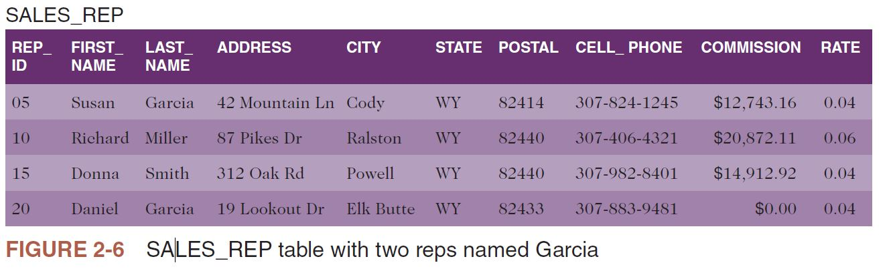

### PRIMARY KEYS

- In the simplest terms, the **primary key** is the unique identifier for a table. For example, the REP_ID column is the unique identifier for the SALES_REP table. Given a rep ID in the table, such as 10, there is only one row on which that rep ID occurs. Thus, the rep ID 10 uniquely identifies a row (in this case, the second row).
- Column A (or a collection of columns) is the primary key for a table if the following is true:
    - Property 1. All columns in the table are functionally dependent on A.
    - Property 2. No subcollection of the columns in A (assuming A is a collection of columns and not just a single column) also has Property 1.
  
> **Q & A**
> **Question**: Is the CATEGORY column the primary key for the ITEM table?
> **Answer**: No, because the other columns are not functionally dependent on CATEGORY. Given the category DOG, for example, you cannot determine an item ID, description, or anything else, because there are several rows on which the category is DOG.

> **Q & A**
> **Question**: Is the CUST_ID column the primary key for the CUSTOMER table?
> **Answer**: Yes, because KimTay Pet Supplies assigns unique customer ID values. A specific customer ID cannot appear on more than one row. Thus, all columns in the CUSTOMER table are functionally dependent on CUST_ID.

> **Q & A**
> **Question**: Is the INVOICE_NUM column the primary key for the INVOICE_LINE table?
> **Answer**: No, because it does not functionally determine either QUANTITY or QUOTED_PRICE.

> **Q & A**
> **Question**: Is the combination of the INVOICE_NUM and ITEM_ID columns the primary key for the INVOICE_LINE table?
> **Answer**: Yes, because you can determine all columns by this combination of columns, and, further, neither the INVOICE_NUM nor the ITEM_ID alone has this property.

> **Q & A**
> **Question**: Is the combination of the ITEM_ID and DESCRIPTION columns the primary key for the ITEM table?
> **Answer**: No. Although it is true that you can determine all columns in the ITEM table by this combination, ITEM_ID alone also has this property.

- You can indicate a table’s primary key with a shorthand representation of a database by underlining the column or collection of columns that comprise the primary key. The complete shorthand representation for the KimTay Pet Supplies database is as follows:

> SALES_REP (<ins>REP_ID</ins>, FIRST_NAME, LAST_NAME, ADDRESS, CITY, STATE, POSTAL, CELL_PHONE, COMMISSION, RATE)

> CUSTOMER (<ins>CUST_ID</ins>, FIRST_NAME, LAST_NAME, ADDRESS, CITY, STATE, POSTAL, EMAIL, BALANCE, CREDIT_LIMIT, REP_ID)

> INVOICES (<ins>INVOICE_NUM</ins>, INVOICE_DATE, CUST_ID)

> INVOICE_LINE (<ins>INVOICE_NUM</ins>, <ins>ITEM_ID</ins>, QUANTITY, QUOTED_PRICE)

> ITEM (<ins>ITEM_ID</ins>, DESCRIPTION, ON_HAND, CATEGORY, LOCATION, PRICE)

> HELPFUL HINT:
> - Sometimes you might identify one or more columns that you can use as a table’s primary key. For example, if the KimTay Pet Supplies database also included an EMPLOYEE table that contains employee numbers and Social Security numbers, either the employee number or the Social Security number could serve as the table’s primary key. In this case, both columns are referred to as candidate keys. Like a primary key, a candidate key is a column or collection of columns on which all columns in the table are functionally dependent—the definition for primary key really defines candidate key as well. From all the candidate keys, you would choose one to be the primary key.

> HELPFUL HINT:
> - According to the definition of a candidate key, a Social Security number is a legitimate primary key. Many databases, such as those that store data about students at a college or university or those that store data about employees at a company, store a person’s Social Security number as a primary key. However, many institutions and organizations are moving away from using Social Security numbers as primary keys because of privacy issues. Instead of using Social Security numbers, many institutions and organizations use unique student ID values or employee numbers as primary keys.

> HELPFUL HINT: 
> - Some institutions prefer to assign values to use as primary keys for items such as customer ID values, item ID values, and student numbers. Others simply let the computer generate the values. In this case, the DBMS simply assigns the next available value. For example, if the database has already assigned customer numbers 1500 through 1936, it assigns the next new customer added to the database the customer number 1937.

### DATABASE DESIGN

- To design a database, you *must* be given a set of requirements that the database must support. The determination of the requirements is part of the process known as **systems analysis**. A systems analyst interviews users, examines existing and proposed documents, and examines organizational policies to determine exactly the type of data needs the database must support. This text does not cover this analysis. Rather, it focuses on how to take the set of requirements that this process produces and determine the appropriate database design.

#### Design Method

To design a database for a set of requirements, complete the following steps:

1. Read the requirements, identify the entities (objects) involved, and name the entities. For example, when the design involves departments and employees, you might use the entity names DEPARTMENT and EMPLOYEE. When the design involves customers and sales reps, you might use the entity names CUSTOMER and SALES_REP.
2. Identify the unique identifiers for the entities you identified in Step 1. For
example, when one of the entities is ITEM, determine what information is
required to uniquely identify each individual item. In other words, what
information does the organization use to distinguish one item from another? For the ITEM entity, the unique identifier for each item might be ITEM_ID; for a CUSTOMER entity, the unique identifier might be CUST_ID. When no unique identifier is available from the data you know about the entity, you need to create one. For example, you might use a unique number to identify items when no item numbers exist.
3. Identify the attributes for all the entities. These attributes become the columns in the tables. It is possible for two or more entities to contain the same attributes.
4. Identify the functional dependencies that exist among the attributes. Ask yourself the following question: If you know a unique value for an attribute, do you also know the unique values for other attributes? For example, when you have the three attributes REP_ID, FIRST_NAME, and LAST_NAME and you know a unique value for REP_ID, do you also know a unique value for FIRST_NAME and LAST_NAME? If so, then FIRST_NAME and LAST_NAME are functionally dependent on REP_ID (REP_ID → FIRST_NAME, LAST_NAME).
5. Use the functional dependencies to identify the tables by placing each attribute with the attribute or minimum combination of attributes on which it is functionally dependent. The attribute(s) for an entity on which all other attributes are dependent is the primary key of the table. The remaining attributes are the other columns in the table. Once you have determined all the columns in the table, you can give the table an appropriate name. Usually the name will be the same as the name you identified for the entity in Step 1.
6. Identify any relationships between tables. In some cases, you might be able to determine the relationships directly from the requirements. It might be clear, for example, that one sales rep is related to many customers and that each customer is related to exactly one sales rep. When it is not, look for matching columns in the tables you created. For example, if both the SALES_REP table and the CUSTOMER table contain a REP_ID column and the values in these columns must match, you know that reps and customers are related. The fact that the REP_ID column is the primary key in the SALES_REP table tells you that the SALES_REP table is the one part of the relationship and the CUSTOMER table is the *many* part of the relationship.

- In the next section, you will apply this process to produce the design for the KimTay Pet Supplies database using the collection of requirements that this database must support.

#### Database Design Requirements

The analyst has interviewed users and examined documents at KimTay Pet Supplies. In the process, the analyst has determined that the database must support the following requirements:
1. For a sales rep, store the sales rep’s ID, first name, last name, street address, city, state, postal code, cell phone number, total commission, and commission rate.
2. For a customer, store the customer’s ID, first name, last name, street address, city, state, postal code, e-mail address, balance, and credit limit. In addition, store the ID, first name, and last name of the sales rep who represents this customer. The analyst has also determined that a sales rep can represent many customers, but a customer must have exactly one sales rep (in other words, a sales rep must represent a customer; a customer cannot be represented by zero or more than one sales reps).
3. For an item, store the item’s ID, description, units on hand, category, the value of the location in which the item is located, and the price. All units of a particular item are stored in the same location.
4. For an invoice, store the invoice number, invoice date, along with the ID, first name, and last name of the customer that placed the invoice, as well as the ID of the sales rep who represents that customer.
5. For each invoice item within an invoice, store the item ID and description, the quantity ordered, and the quoted price. The analyst also obtained the following information concerning invoices:
    <ol style="list-style-type: lower-alpha;">
        <li>There is only one customer per invoice.</li>
        <li>On a given invoice, there is at most one line item for a given item. For example, item AD72 cannot appear on several lines within the same invoice.</li>
        <li>The quoted price might differ from the actual price when the sales rep discounts a certain item on a specific invoice.</li>
    </ol>

#### Database Design Process Example

The following steps apply the design process to the requirements for KimTay Pet Supplies to produce the appropriate database design:
- **Step 1**: There appear to be four entities: sales reps, customers, items, and invoices. The names assigned to these entities are SALES_REP, CUSTOMER, ITEM, and INVOICES, respectively.
- **Step 2**: From the collection of entities, review the data and determine the unique identifier for each entity. For the SALES_REP, CUSTOMER, ITEM, and INVOICES entities, the unique identifiers are the rep ID, customer ID, item ID, and invoice number, respectively. These unique identifiers are named REP_ID, CUST_ID, ITEM_ID, and INVOICE_NUM, respectively.
- **Step 3**: The attributes mentioned in the first requirement all refer to sales reps. The specific attributes mentioned in the requirement are the sales rep’s ID, first name, last name, street address, city, state, postal code, cell phone number, total commission, and commission rate. Assigning appropriate names to these attributes produces the following list:
    <ul style="list-style-type: none">
        <li>REP_ID</li>
        <li>FIRST_NAME</li>
        <li>LAST_NAME</li>
        <li>ADDRESS</li>
        <li>CITY</li>
        <li> STATE</li>
        <li>POSTAL</li>
        <li>CELL_PHONE</li>
        <li>COMMISSION</li>
        <li>RATE</li>
    </ul>
- The attributes mentioned in the second requirement refer to customers. The specific attributes are the customer’s ID, first name, last name, street address, city, state, postal code, e-mail address, balance, and credit limit. The requirement also mentions the rep ID, first name, and last name of the sales rep who represents this customer. Assigning appropriate names to these attributes produces the following list:
    <ul style="list-style-type: none">
        <li>CUST_ID</li>
        <li>FIRST_NAME</li>
        <li>LAST_NAME</li>
        <li>ADDRESS</li>
        <li>CITY</li>
        <li>STATE</li>
        <li>POSTAL</li>
        <li>EMAIL</li>
        <li>BALANCE</li>
        <li>CREDIT_LIMIT</li>
        <li>REP_ID</li>
        <li>REP_FIRST_NAME</li>
        <li>REP_LAST_NAME</li>
    </ul>
> **HELPFUL HINT**
> Note above that the names given to the first and last name for each customer is FIRST_NAME and LAST_NAME, similar to the names given to represent the first and last names of each sales rep when determining the list of attributes for the entity SALES_REP. However, in this case we are wanting to include both the first and last names for the customer and the first and last names for the sales rep, in the same list pertaining to the entity CUSTOMER. When naming attributes associated with a single entity, in this case CUSTOMER, no two attributes can have the same name. Therefore, we cannot use FIRST_NAME and LAST_NAME for the first and last name for the sales rep (as attributes associated with the entity CUSTOMER) and use FIRST_NAME and LAST_NAME as the first and last name of a customer. Instead, we can use REP_FIRST_NAME and REP_LAST_NAME to represent the first and last name of the sales rep as attributes related to CUSTOMER. You will see as we continue to progress through the design process that this will be remedied and not be an issue. However, it is important to note at this juncture. In summary, two attributes can have the same name if they refer to different entities such as using FIRST_NAME and LAST_NAME as attributes for the entities SALES_REP and CUSTOMER independently; however, when associated with a single entity, no two attributes can have the same name.

- There are attributes named FIRST_NAME, LAST_NAME, ADDRESS, CITY, STATE, and POSTAL for sales reps as well as attributes named FIRST_NAME, LAST_NAME, ADDRESS, CITY, STATE, and POSTAL for customers. To distinguish these attributes in the final collection, follow the name of the attribute by the name of the corresponding entity in parentheses. For example, the address for a sales rep is ADDRESS (SALES_REP) and the address for a customer is ADDRESS (CUSTOMER).
- The attributes mentioned in the third requirement refer to items. The specific attributes are the item’s ID, description, units on hand, category, value of the location in which the item is located, and price. Assigning appropriate names to these attributes produces the following list:
    <ul style="list-style-type: none">
        <li>ITEM_ID</li>
        <li>DESCRIPTION</li>
        <li>ON_HAND</li>
        <li>CATEGORY</li>
        <li>LOCATION</li>
        <li>PRICE</li>
    </ul>
- The attributes mentioned in the fourth requirement refer to invoices. The specific attributes include the invoice number, invoice date, customer’s ID, first and last names of who placed the invoice, and ID of the sales rep who represents the customer. Assigning appropriate names to these attributes produces the following list:
    <ul style="list-style-type: none">
        <li>INVOICE_NUM</li>
        <li>INVOICE_DATE</li>
        <li>CUST_ID</li>
        <li>FIRST_NAME</li>
        <li>LAST_NAME</li>
        <li>REP_ID</li>
    </ul>
- The specific attributes associated with the statement in the requirements concerning invoice line items are the invoice number (to determine the invoice to which the line item corresponds), item ID, description, quantity ordered, and quoted price. If the quoted price must be the same as the price, you could simply call it PRICE. According to requirement 5c, however, the quoted price might differ from the price, so you must add the quoted price to the list. Assigning appropriate names to these attributes produces the following list:
    <ul style="list-style-type: none">
        <li>INVOICE_NUM</li>
        <li>ITEM_ID</li>
        <li>DESCRIPTION</li>
        <li>QUANTITY</li>
        <li>QUOTED_PRICE</li>
    </ul>
- The complete list grouped by entity is as follows:
    <ul style="list-style-type: none">
        <li><b>SALES_REP</b></li>
        <li>REP_ID</li>
        <li>FIRST_NAME (SALES_REP)</li>
        <li>LAST_NAME (SALES_REP)</li>
        <li>ADDRESS (SALES_REP)</li>
        <li>CITY (SALES_REP)</li>
        <li>STATE (SALES_REP)</li>
        <li>POSTAL (SALES_REP)</li>
        <li>CELL_PHONE</li>
        <li>COMMISSION</li>
        <li>RATE</li>
    </ul>

     <ul style="list-style-type: none">
        <li><b>CUSTOMER</b></li>
        <li>CUST_ID</li>
        <li>FIRST_NAME (CUSTOMER)</li>
        <li>LAST_NAME (CUSTOMER)</li>
        <li>ADDRESS (CUSTOMER)</li>
        <li>CITY (CUSTOMER)</li>
        <li>STATE (CUSTOMER)</li>
        <li>POSTAL (CUSTOMER)</li>
        <li>EMAIL</li>
        <li>BALANCE</li>
        <li>CREDIT_LIMIT</li>
        <li>REP_ID</li>
        <li>REP_FIRST_NAME</li>
        <li>REP_LAST_NAME</li>
    </ul>

    <ul style="list-style-type: none">
        <li><b>ITEM_ID</b></li>
        <li>DESCRIPTION</li>
        <li>ON_HAND</li>
        <li>CATEGORY</li>
        <li>LOCATION</li>
        <li>PRICE</li>
    </ul>

    <ul style="list-style-type: none">
        <li><b>INVOICES</b></li>
        <li>INVOICE_NUM</li>
        <li>INVOICE_DATE</li>
        <li>CUST_ID</li>
        <li>FIRST_NAME</li>
        <li>LAST_NAME</li>
        <li>REP_ID</li>
    </ul>

- For invoice line items within an invoice:
    <ul style="list-style-type: none">
        <li>INVOICE_NUM</li>
        <li>ITEM_ID</li>
        <li>DESCRIPTION</li>
        <li>QUANTITY</li>
        <li>QUOTED_PRICE</li>
    </ul>

- **Step 4**: The fact that the unique identifier for sales reps is the rep ID gives the following functional dependencies:
<dl>
    <dd>
        FIRST_NAME (SALES_REP), LAST_NAME (SALES_REP), ADDRESS (SALES_REP), CITY (SALES_REP), STATE (SALES_REP), POSTAL (SALES_REP), CELL_PHONE, COMMISSION, RATE
    </dd>
</dl>

- This notation indicates that the FIRST_NAME (SALES_REP), LAST_NAME (SALES_REP), ADDRESS (SALES_REP), CITY (SALES_REP), STATE (SALES_REP), POSTAL (SALES_REP), CELL_PHONE, COMMISSION, and RATE are all functionally dependent on REP_ID.
- The fact that the unique identifier for customers is the customer ID gives the following functional dependencies:
<dl>
    <dd>
        CUST_ID → FIRST_NAME (CUSTOMER), LAST_NAME (CUSTOMER), ADDRESS (CUSTOMER), CITY (CUSTOMER), STATE (CUSTOMER), POSTAL (CUSTOMER), EMAIL, BALANCE, CREDIT_LIMIT, REP_ID, REP_FIRST_NAME, REP_LAST_NAME
    </dd>
</dl>

>**Q & A**
> **Question**: Do you really need to include the first name and last name of a sales rep in the list of attributes determined by the customer ID?
> **Answer**: There is no need to include them in this list because they both can be determined from the sales rep ID and are already included in the list of attributes determined by REP_ID.

- Thus, the functional dependencies for the CUSTOMER entity are as follows:

<dl>
    <dd>
        CUST_ID → FIRST_NAME (CUSTOMER), LAST_NAME (CUSTOMER), ADDRESS (CUSTOMER), CITY (CUSTOMER), STATE (CUSTOMER), POSTAL (CUSTOMER), EMAIL, BALANCE, CREDIT_LIMIT, REP_ID
    </dd>
</dl>

- The fact that the unique identifier for items is the item number gives the following functional dependencies:

<dl>
    <dd>
        CUST_ID → FIRST_NAME (CUSTOMER), LAST_NAME (CUSTOMER), ADDRESS (CUSTOMER), CITY (CUSTOMER), STATE (CUSTOMER), POSTAL (CUSTOMER), EMAIL, BALANCE, CREDIT_LIMIT, REP_ID
    </dd>
</dl>

The fact that the unique identifier for invoices is the invoice number gives the
following functional dependencies:

<dl>
    <dd>
        INVOICE_NUM → INVOICE_DATE, CUST_ID, FIRST_NAME (CUSTOMER), LAST_NAME(CUSTOMER), REP_ID
    </dd>
</dl>

>**Q & A**
> **Question**: Do you really need to include the first name and last name of a customer and the ID of the customer’s rep in the list of attributes determined by the invoice number?
> **Answer**: There is no need to include the customer’s first and last names and the rep ID in this list because you can determine them from the customer ID and they are already included in the list of attributes determined by CUST_ID.

- The functional dependencies for the INVOICES entity are as follows:
  
<dl>
    <dd>
        INVOICE_NUM → INVOICE_DATE, CUST_ID
    </dd>
</dl>

- The final attributes to be examined are those associated with the invoice line items within the invoice: ITEM_ID, DESCRIPTION, QUANTITY, and QUOTED_PRICE.

>**Q & A**
> **Question**: Why are QUANTITY and QUOTED_PRICE not included in the list of attributes determined by the invoice number?
> **Answer**: There is no need to include them in this list because they both can be determined from the sales rep ID and are already included in the list of attributes determined by REP_ID.

- Thus, the functional dependencies for the CUSTOMER entity are as follows:

<dl>
    <dd>
        CUST_ID → FIRST_NAME (CUSTOMER), LAST_NAME (CUSTOMER), ADDRESS (CUSTOMER), CITY (CUSTOMER), STATE (CUSTOMER), POSTAL (CUSTOMER), EMAIL, BALANCE, CREDIT_LIMIT, REP_ID
    </dd>
</dl>

- The fact that the unique identifier for items is the item number gives the following functional dependencies:

<dl>
    <dd>
        ITEM_ID → DESCRIPTION, ON_HAND, CATEGORY, LOCATION, PRICE
    </dd>
</dl>

The fact that the unique identifier for invoices is the invoice number gives the following functional dependencies:

<dl>
    <dd>
        INVOICE_NUM → INVOICE_DATE, CUST_ID, FIRST_NAME (CUSTOMER), LAST_NAME(CUSTOMER), REP_ID
    </dd>
</dl>

>**Q & A**
> **Question**: Do you really need to include the first name and last name of a customer and the ID of the customer’s rep in the list of attributes determined by the invoice number?
> **Answer**: There is no need to include the customer’s first and last names and the rep ID in this list because you can determine them from the customer ID and they are already included in the list of attributes determined by CUST_ID.

- The functional dependencies for the INVOICES entity are as follows:
  
<dl>
    <dd>
        INVOICE_NUM → INVOICE_DATE, CUST_ID
    </dd>
</dl>

The final attributes to be examined are those associated with the invoice line items within the invoice: ITEM_ID, DESCRIPTION, QUANTITY, and QUOTED_PRICE.

>**Q & A**
> **Question**: Why are QUANTITY and QUOTED_PRICE not included in the list of attributes determined by the invoice number?
> **Answer**: To uniquely identify a particular value for QUANTITY or QUOTED_PRICE, INVOICE_NUM alone is not sufficient, because there can be multiple items purchased on a single invoice. Therefore, it requires the combination of INVOICE_NUM and ITEM_ID.

- The following shorthand representation indicates that the combination of INVOICE_NUM and ITEM_ID functionally determines QUANTITY and QUOTED_PRICE:

<dl>
    <dd>
        INVOICE_NUM, ITEM_ID → QUANTITY, QUOTED_PRICE
    </dd>
</dl>

>**Q & A**
> **Question**: Does DESCRIPTION need to be included in this list?
> **Answer**: No, because DESCRIPTION can be determined by the ITEM_ID alone, and it already appears in the list of attributes dependent on the ITEM_ID.

- The complete list of functional dependencies is as follows:

<dl>
    <dd>
        REP_ID → FIRST_NAME (SALES_REP), LAST_NAME (SALES_REP), ADDRESS (SALES_REP),CITY (SALES_REP), STATE (SALES_REP), POSTAL (SALES_REP), CELL_PHONE,COMMISSION, RATE
    </dd>
</dl>

<dl>
    <dd>
        CUST_ID → FIRST_NAME (CUSTOMER), LAST_NAME (CUSTOMER), ADDRESS (CUSTOMER), CITY (CUSTOMER), STATE (CUSTOMER), POSTAL (CUSTOMER), EMAIL, BALANCE, CREDIT_LIMIT, REP_ID
    </dd>
</dl>

<dl>
    <dd>
        ITEM_ID → DESCRIPTION, ON_HAND, CATEGORY, LOCATION, PRICE
    </dd>
</dl>

<dl>
    <dd>
        INVOICE_NUM → INVOICE_DATE, CUST_ID
    </dd>
</dl>

<dl>
    <dd>
        INVOICE_NUM, ITEM_ID → QUANTITY, QUOTED_PRICE
    </dd>
</dl>

- **Step 5**: Using the functional dependencies, you can create tables with the attribute(s) to the left of the arrow being the primary key and the attribute(s) to the right of the arrow being the other columns. For relations corresponding to those entities identified in Step 1, you can use the name you already determined. Because you did not identify any entity that had a unique identifier that was the combination of INVOICE_NUM and ITEM_ID, you need to assign a name to the table whose primary key consists of these two columns. Because this table represents the individual lines within an invoice, the name INVOICE_LINE is a good choice. The final collection of tables is as follows:

<dl>
    <dd>
        SALES_REP (<ins>REP_ID</ins>, FIRST_NAME, LAST_NAME, ADDRESS, CITY, STATE, POSTAL, CELL_PHONE, COMMISSION, RATE)
    </dd>
</dl>

<dl>
    <dd>
        CUSTOMER (<ins>CUST_ID</ins>, FIRST_NAME, LAST_NAME, ADDRESS, CITY, STATE, POSTAL, EMAIL, BALANCE, CREDIT_LIMIT, REP_ID)
    </dd>
</dl>

<dl>
    <dd>
        ITEM (<ins>ITEM_ID</ins>, DESCRIPTION, ON_HAND, CATEGORY, LOCATION, PRICE)
    </dd>
</dl>

<dl>
    <dd>
        INVOICES (<ins>INVOICE_NUM</ins>, INVOICE_DATE, CUST_ID)
    </dd>
</dl>

<dl>
    <dd>
        INVOICE_LINE (<ins>INVOICE_NUM</ins>, <ins>ITEM_ID</ins>, QUANTITY, QUOTED_PRICE)
    </dd>
</dl>

- **Step 6**: Examining the tables and identifying common columns gives the following list of relationships between the tables:
    - The CUSTOMER and SALES_REP tables are related using the REP_ID columns. Because the REP_ID column is the primary key for the SALES_REP table, this indicates a one-to-many relationship between SALES_REP and CUSTOMER (one rep to many customers).
    - The INVOICES and CUSTOMER tables are related using the CUST_ID columns. Because the CUST_ID column is the primary key for the CUSTOMER table, this indicates a one-to-many relationship between CUSTOMER and INVOICES (one customer to many invoices).
    - The INVOICE_LINE and INVOICES tables are related using the INVOICE_NUM columns. Because the INVOICE_NUM column is the primary key for the INVOICES table, this indicates a one-to-many relationship between INVOICES and INVOICE_LINE (one invoice to many invoice lines).
    - The INVOICE_LINE and ITEM tables are related using the ITEM_ID columns. Because the ITEM_ID column is the primary key for the ITEM table, this indicates a one-to-many relationship between ITEM and INVOICE_LINE (one item to many invoice lines).

#### NORMALIZATION

- After creating the database design, you must analyze it to make sure it is free of potential problems. To do so, you follow a process called normalization, in which you identify the existence of potential problems, such as data duplication and redundancy, and implement ways to correct these problems.
- The goal of normalization is to convert unnormalized relations (tables that satisfy the definition of a relation except that they might contain repeating groups) into various types of normal forms. A table in a particular normal form possesses a certain desirable collection of properties. Although there are several normal forms, the most common are first normal form, second normal form, and third normal form. Normalization is a process in which a table that is in first normal form is better than a table that is not in first normal form, a table that is in second normal form is better than one that is in first normal form, and so on. The goal of this process is to allow you to take a table or collection of tables and produce a new collection of tables that represents the same information but is free of problems.

##### First Normal Form

- According to the definition of a relation, a relation (table) cannot contain a repeating group in which multiple entries exist on a single row. However, in the database design process, you might create a table that has all the other properties of a relation but contains a repeating group. Removing repeating groups is the starting point when converting an unnormalized collection of data into a table that is in first normal form. A table (relation) is in first normal form (1NF) when it does not contain a repeating group.
- For example, in the design process you might create the following INVOICES table, in which there is a repeating group consisting of ITEM_ID and QUANTITY. The notation for this table is as follows:

<dl>
    <dd>
        INVOICES (<ins>INVOICE_NUM</ins>, INVOICE_DATE, (ITEM_ID, QUANTITY))
    </dd>
</dl>

- This notation describes a table named INVOICES that consists of a primary key, INVOICE_NUM, and a column named INVOICE_DATE. The inner parentheses indicate a repeating group that contains two columns, ITEM_ID and QUANTITY. This table contains one row per invoice with values in the ITEM_ID and QUANTITY columns for each invoice with the number INVOICE_NUM and placed on INVOICE_DATE. Figure 2-7 shows a single invoice with multiple combinations of an item ID and a corresponding quantity of units ordered.


To convert the table to first normal form, you remove the repeating group as follows: INVOICES (<ins>INVOICE_NUM</ins>, INVOICE_DATE, ITEM_ID, QUANTITY) Figure 2-8 shows the table in first normal form.

<dl>
    <dd>
        INVOICES (<ins>INVOICE_NUM</ins>, INVOICE_DATE, <ins>ITEM_ID</ins>, QUANTITY)
    </dd>
</dl>

Figure 2-8 shows the table in first normal form.


In Figure 2-7, the second row indicates that item AD72 and item DT12 are both included in invoice 14219. In Figure 2-8, this information is represented by two rows, the second and third. The primary key for the unnormalized INVOICES table was the INVOICE_NUM column alone. The primary key for the normalized table is now the combination of the INVOICE_NUM and ITEM_ID columns.
- When you convert an unnormalized table to a table in first normal form, the primary key of the table in first normal form is usually the primary key of the unnormalized table concatenated with the key for the repeating group. The key for the repeating group is the column in the repeating group that distinguishes one occurrence of the repeating group from another. In the INVOICES table, ITEM_ID was the key to the repeating group and INVOICE_NUM was the primary key for the table. When converting the unnormalized data to first normal form, the primary key becomes the concatenation of the INVOICE_NUM and ITEM_ID columns.

##### Second Normal Form

The following INVOICES table is in first normal form, because it does not contain a
repeating group:

<dl>
    <dd>
        INVOICES (INVOICE_NUM, INVOICE_DATE, ITEM_ID, DESCRIPTION, QUANTITY,QUOTED_PRICE)
    </dd>
</dl>

- The table contains the following functional dependencies:

<dl>
    <dd>
        INVOICE_NUM → INVOICE_DATE
        ITEM_ID → DESCRIPTION
        INVOICE_NUM, ITEM_ID → INVOICE_DATE, DESCRIPTION, QUANTITY
    </dd>
</dl>

- This notation indicates that INVOICE_NUM alone determines INVOICE_DATE, and ITEM_ID alone determines DESCRIPTION, but it requires both INVOICE_NUM and ITEM_ID to determine either QUANTITY or QUOTED_PRICE. Consider the sample of this table shown in Figure 2-9.


- Although the INVOICES table is in first normal form (because it contains no repeating groups), problems exist within the table that require you to restructure it.
- The description of a specific item, KH81 for example, occurs twice in the table. This duplication (formally called redundancy) causes several problems. It is certainly wasteful of space, but that is not nearly as serious as some of the other problems. These other problems are called update anomalies and they fall into four categories:

    1. **Updates**: If you need to change to the description of item KH81, you must change it twice—once in each row on which item KH81 appears. Updating the item description more than once makes the update process much more cumbersome and time consuming.
    2. **Inconsistent data**: There is nothing about the design that prohibits item KH81 from having two *different* descriptions in the database. In fact, if item KH81 occurs on 2 rows in the table, it is possible for this item to have 20 different descriptions in the database.
    3. **Additions**: When you try to add a new item and its description to the database, you will face a real problem. Because the primary key for the INVOICES table consists of both INVOICE_NUM and ITEM_ID, you need values for both of these columns to add a new row to the table. If you add an item to the table that does not yet have any invoices, what do you use for INVOICE_NUM? The only solution is to create a dummy INVOICE_NUM and then replace it with a real INVOICE_NUM once an order for this item is actually received. Certainly, this is not an acceptable solution.
    4. **Deletions**: If you delete invoice 14216 from the database and it is the only invoice that contains item CA75, deleting the invoice also deletes all information about item CA75. For example, you would no longer know that item CA75 is an Enclosed Cat Litter Station.

- These problems occur because the DESCRIPTION column is dependent on only a portion of the primary key (ITEM_ID) and *not* on the complete primary key. This situation leads to the definition of second normal form. Second normal form represents an improvement over first normal form because it eliminates update anomalies in these situations. A table (relation) is in **second normal form (2NF)** when it is in first normal form and no nonkey column (that is, a column that is not part of the primary key) is dependent on only a portion of the primary key.

>**HELPFUL HINT**
> When the primary key of a table contains only a single column, the table is automatically in second normal form.

- You can identify the fundamental problem with the INVOICES table: It is not in second normal form. Although it is important to identify the problem, what you really need is a method to correct it; you want to be able to convert tables to second normal form. First, take each subset of the set of columns that make up the primary key and begin a new table with this subset as its primary key. For the INVOICES table, the new design is as follows:

<dl>
    <dd>
        (INVOICE_NUM,
        (ITEM_ID,
        (INVOICE_NUM, ITEM_ID,
    </dd>
</dl>

- Next, place each of the other columns with the appropriate primary key; that is, place each one with the minimal collection of columns on which it depends. For the INVOICES table, add the new columns as follows:

<dl>
    <dd>
        (INVOICE_NUM, INVOICE_DATE)
        (ITEM_ID, DESCRIPTION)
        (INVOICE_NUM, ITEM_ID, QUANTITY, QUOTED_PRICE)
    </dd>
</dl>

Each of these new tables is given a descriptive name based on the meaning and contents of the table, such as INVOICES, ITEM, and INVOICE_LINE. Figure 2-10 shows samples of these tables.


- In Figure 2-10, converting the original INVOICES table to a new INVOICES table, an ITEM table, and an INVOICE_LINE table eliminates the update anomalies. A description appears only once for each item, so you do not have the redundancy that existed in the original table design. Changing the description of item KH81 from Wild Bird Food (25 lb) to KimTay Premium Wild Bird Food (25 lb), for example, is now a simple process involving a single change. Because the description for an item occurs in a single place, it is not possible to have multiple descriptions for a single item in the database at the same time.
- To add a new item and its description, you create a new row in the ITEM table,regardless of whether that item has pending or actual invoices. In addition, deleting invoice 14216 does not delete item number CA75 from the database because it still exists in the ITEM table. Finally, you have not lost any information by converting the INVOICES table to second normal form. You can reconstruct the data in the original table from the data in the new tables.

##### Third Normal Form

Problems can still exist with tables that are in second normal form. For example, suppose that you create the following CUSTOMER table:

<dl>
    <dd>
        CUSTOMER (CUST_ID, FIRST_NAME, LAST_NAME, BALANCE, CREDIT_LIMIT, REP_ID, REP_FIRST_NAME, REP_LAST_NAME)
    </dd>
</dl>

This table has the following functional dependencies:

<dl>
    <dd>
        CUST_ID point &rarr; FIRST_NAME, LAST_NAME, BALANCE, CREDIT_LIMIT, REP_ID, REP_FIRST_NAME, REP_LAST_NAME
        REP_ID &rarr; REP_FIRST_NAME, REP_LAST_NAME
    </dd>
</dl>

- CUST_ID determines all the other columns. In addition, REP_ID determines
REP_FIRST_NAME and REP_LAST_NAME.
- When a table’s primary key is a single column, the table is automatically in second normal form. (If the table were not in second normal form, some column would be dependent on only a portion of the primary key, which is impossible when the primary key is just one column.) Thus, the CUSTOMER table is in second normal form.
- Although this table is in second normal form, Figure 2-11 shows that it still possesses update problems similar to those identified for the INVOICES table shown in Figure 2-9. In Figure 2-11, the sales rep name occurs many times in the table.


- The redundancy of including a sales rep ID and full name in the CUSTOMER table results in the same set of problems that existed for the INVOICES table. In addition to the problem of wasted space, you have the following update anomalies:

    1. **Updates**: Changing the sales rep full name requires changes to multiple rows in the table.
    2. **Inconsistent** data: The design does not prohibit multiple iterations of sales rep names in the database. For example, a sales rep might represent 20 customers, and his or her name might be entered 20 different ways in the table.
    3. **Additions**: To add sales rep 25 (Juanita Sanchez) to the database, she must represent at least one customer. If Juanita does not yet represent any customers, you either cannot record the fact that her name is Juanita Sanchez, or you must create a fictitious customer for her to represent until she represents an actual customer. Neither of these solutions is desirable.
    4. **Deletions**: If you delete all the customers of sales rep 05 from the database, you will also lose all information about sales rep 05.

- These update anomalies are because the REP_ID determines REP_FIRST_NAME and
REP_LAST_NAME, but REP_ID is not the primary key. As a result, the same REP_ID and
consequently the same REP_FIRST_NAME and REP_LAST_NAME can appear on many
different rows.
- You have seen that tables in second normal form represent an improvement over tables in first normal form, but to eliminate problems with tables in second normal form, you need an even better strategy for creating tables. Third normal form provides that strategy. Before looking at third normal form, however, you need to become familiar with the special name that is given to any column that determines another column (like REP_ID in the CUSTOMER table). Any column (or collection of columns) that determines another column is called a **determinant**. A table’s primary key is a determinant. In fact, by definition, any candidate key is a determinant. (Remember that a candidate key is a column or collection of columns that could function as the primary key.) In Figure 2-11, REP_ID is a determinant, but it is not a candidate key, and that is the problem.
- A table is in **third normal form (3NF)** when it is in second normal form and the only determinants it contains are candidate keys.

> **HELPFUL HINT**
> This text’s definition of third normal form is not the original definition. This more recent definition, which is preferable to the original, is often referred to as **Boyce-Codd normal form (BCNF)** when it is important to make a distinction between this definition and the original definition. This text does not make such a distinction but will take this to be the definition of third normal form.

- Now you have identified the problem with the CUSTOMER table: It is not in third normal form. There are several steps for converting tables to third normal form.
- First, for each determinant that is not a candidate key, remove from the table the columns that depend on this determinant (but do not remove the determinant). Next, create a new table containing all the columns from the original table that depend on this determinant. Finally, make the determinant the primary key of this new table.
- In the CUSTOMER table, for example, remove REP_FIRST_NAME and REP_LAST_NAME because they depend on the determinant REP_ID, which is not a candidate key. A new table, SALES_REP, is formed, consisting of REP_ID as the primary key and the columns REP_FIRST_NAME and REP_LAST__NAME, as follows:

<dl>
    <dd>
        CUSTOMER (<ins>CUST_ID<ins>, FIRST_NAME, LAST_NAME, BALANCE, CREDIT_LIMIT, REP_ID)
    <dd>
</dl>

and

<dl>
    <dd>
        SALES_REP (<ins>REP_ID<ins>, REP_FIRST_NAME, REP_LAST_NAME)
    <dd>
</dl>

- Previously the first and last names for the sales rep were named REP_FIRST_NAME and REP_LAST_NAME, respectively. It was not possible to use the identifiers FIRST_NAME and LAST_NAME because in the CUSTOMER table FIRST_NAME and LAST_NAME were being used to identify the first and last names of the customer. Because the fields REP_FIRST_NAME and REP_LAST_NAME are now being removed from the CUSTOMER table and placed into the SALES_REP table, it is now possible to use the identifiers of FIRST_NAME and LAST_NAME to correspond to the first and last names for a sales rep. The SALES_REP table will now be noted as follows, incorporating the desired identifiers for the first and last names for the sales rep:

<dl>
    <dd>
        SALES_REP (<ins>REP_ID<ins>, FIRST_NAME, LAST_NAME)
    <dd>
</dl>

Figure 2-12 shows the original CUSTOMER table and the tables created when converting the original table to third normal form.


- Has this new design for the CUSTOMER table corrected all of the previously identified problems? A sales rep’s name appears only once, thus avoiding redundancy and simplifying the process of storing a sales rep’s first and last name. This design prohibits a sales rep from having different names in the database. To add a new sales rep to the database, you add a row to the SALES_REP table; it is not necessary for a new rep to represent a customer. Finally, deleting all customers of a given sales rep will not remove the sales rep’s record from the SALES_REP table, retaining the sales rep’s first and last name in the database. You can reconstruct all the data in the original table from the data in the new collection of tables. All previously mentioned problems have indeed been solved.

<dl>
    <dd>
        STUDENT_NUM &rarr; STUDENT_NAME, NUM_CREDITS, ADVISOR_NUM, ADVISOR_NAME
    </dd>
    <dd>
        ADVISOR_NUM &rarr; ADVISOR_NAME, COURSE_NUM
    </dd>
    <dd>
        COURSE_NUM &rarr; DESCRIPTION.
    </dd>
    <dd>
        STUDENT_NUM, COURSE_NUM &rarr; GRADE.
    </dd>
</dl>


<dl>
    <dd>
        STUDENT (<ins>STUDENT_NUM<ins>, NAME, NUM_CREDITS, ADVISOR_NUM, COURSE_NUM)
    </dd>
    <dd>
        ADVISOR (<ins>ADVISOR_NUM<ins> ADVISOR_NAME, COURSE_NUM)
    </dd>
    <dd>
        COURSE (<ins>COURSE_NUM<ins>, DESCRIPTION)
    </dd>
    <dd>
        GRADE (<ins>STUDENT_NUM<ins>, <ins>COURSE_NUM<ins>, GRADE).
    </dd>
</dl>

> **Q & A**
> Question: Convert the following table to third normal form. In this table, STUDENT_NUM determines STUDENT_NAME, NUM_CREDITS, ADVISOR_NUM, and ADVISOR_NAME. ADVISOR_NUM determines ADVISOR_NAME. COURSE_NUM determines DESCRIPTION. The combination of a STUDENT_NUM and a COURSE_NUM determines GRADE.
> <dl>
>   <dd>
>       STUDENT (<ins>STUDENT_NUM</ins>, STUDENT_NAME, NUM_CREDITS, ADVISOR_NUM, ADVISOR_NAME, (COURSE_NUM, DESCRIPTION, GRADE))
>   </dd>
> </dl>
> **Answer:** Complete the following steps:
> - **Step 1**: Remove the repeating group to convert the table to first normal form, as follows:
> <dl>
>   <dd>
>       STUDENT (<ins>STUDENT_NUM</ins>, STUDENT_NAME, NUM_CREDITS, ADVISOR_NUM, ADVISOR_NAME, <ins>COURSE_NUM</ins>, DESCRIPTION, GRADE)
>   </dd>
> </dl>
> - The STUDENT table is now in first normal form because it has no repeating groups. It is not, however, in second normal form because STUDENT_NAME is dependent only on STUDENT_NUM, which is only a portion of the primary key.
> - **Step 2**: Convert the STUDENT table to second normal form. First, for each subset of the primary key, start a table with that subset as its key yielding the following:
> <dl>
>   <dd>
>       (<ins>STUDENT_NUM</ins>, )
>       (<ins>COURSE_NUM</ins>, )
>       (<ins>STUDENT_NUM</ins>, <ins>COURSE_NUM</ins>,)
>   </dd>
> </dl>
> Next, place the rest of the columns with the smallest collection of columns on which they depend, as follows:
> <dl>
>   <dd>
>       (<ins>STUDENT_NUM</ins>, STUDENT_NAME, NUM_CREDITS, ADVISOR_NUM, ADVISOR_NAME)
>       (<ins>COURSE_NUM</ins>, DESCRIPTION)
>       (<ins>STUDENT_NUM</ins>, <ins>COURSE_NUM</ins>, GRADE)
>   </dd>
> </dl>
> Finally, assign names to each of the new tables:
> <dl>
>   <dd>
>       STUDENT (<ins>STUDENT_NUM</ins>, STUDENT_NAME, NUM_CREDITS, ADVISOR_NUM, ADVISOR_NAME)
>       COURSE(<ins>COURSE_NUM</ins>, DESCRIPTION)
>       STUDENT_COURSE(<ins>STUDENT_NUM</ins>, <ins>COURSE_NUM</ins>, GRADE)
>   </dd>
> </dl>
> - Although these tables are all in second normal form, the COURSE and STUDENT_COURSE tables are also in third normal form. The STUDENT table is not in third normal form, however, because it contains a determinant (ADVISOR_NUM) that is not a candidate key.
> - **Step 3**: Convert the STUDENT table to third normal form by removing the column that depends on the determinant ADVISOR_NUM and placing it in a separate table, as follows:
> <dl>
>   <dd>
>       (<ins>STUDENT_NUM</ins>, STUDENT_NAME, NUM_CREDITS, ADVISOR_NUM)
>       (<ins>ADVISOR_NUM</ins>, ADVISOR_NAME))
>   </dd>
> </dl>
> - **Step 4**: Name the tables and put the entire collection together, as follows:
> <dl>
>   <dd>
>       STUDENT (<ins>STUDENT_NUM</ins>, STUDENT_NAME, NUM_CREDITS, ADVISOR_NUM)
>       ADVISOR (<ins>ADVISOR_NUM</ins>, ADVISOR_NAME))
>       COURSE (<ins>COURSE_NUM</ins>, DESCRIPTION)
>       STUDENT_COURSE (<ins>STUDENT_NUM</ins>, <ins>COURSE_NUM</ins>, GRADE)
>   </dd>
> </dl>

### DIAGRAMS FOR DATABASE DESIGN

- For many people, an illustration of a database’s structure is quite useful. A popular type of illustration used to represent the structure of a database is the **entity-relationship (E-R)** diagram. In an E-R diagram, a rectangle represents an entity (table). One-to-many relationships between entities are drawn as lines between the corresponding rectangles.
- Several different styles of E-R diagrams are used to diagram a database design. In the version shown in Figure 2-13, an arrowhead indicates the many side of the relationship between tables. In the relationship between the SALES_REP and CUSTOMER tables, for example, the arrow points from the SALES_REP table to the CUSTOMER table, indicating that one sales rep is related to many customers. The INVOICE_LINE table has two one-to-many relationships, as indicated by the line from the INVOICES table to the INVOICE_LINE table and the line from the ITEM table to the INVOICE_LINE table.


> HELPFUL HINT
> - In this style of E-R diagram, you can put the rectangles in any position to represent the entities and relationships. The important thing is that the arrows connect the appropriate rectangles.

- Another style of E-R diagram is to represent the many side of a relationship between
tables with a crow’s foot, as shown in Figure 2-14.


- The E-R diagram shown in Figure 2-15 represents the original style of E-R diagrams. In this style, relationships are indicated in diamonds that describe the relationship. The relationship between the SALES_REP and CUSTOMER tables, for example, is named REPRESENTS, reflecting the fact that a sales rep represents a customer. The relationship between the CUSTOMER and INVOICES table is named PLACED, reflecting the fact that customers place invoices. The relationship between the INVOICES and INVOICE_LINE tables is named CONTAINS, reflecting the fact that an invoice contains invoice lines. The relationship between the ITEM and INVOICE_LINE tables is named IS_ON, reflecting the fact that a given item is on many invoices. In this style of E-R diagram, the number 1 indicates the one side of the relationship and the letter n represents the many side of the relationship.


### Module Summary

- An entity is a person, place, thing, or event. An attribute is a property of an entity. A relationship is an association between entities.
- A relation is a two-dimensional table in which the entries in the table contain only single values, each column has a distinct name, all values in a column match this name, the order of the rows and columns is immaterial, and each row contains unique values. A relational database is a collection of relations.
- Column B is functionally dependent on another column, A (or possibly a collection of columns), when a value for A determines a single value for B at any one time.
- Column A (or a collection of columns) is the primary key for a relation (table), R, if all columns in R are functionally dependent on A and no subcollection of the columns in A (assuming A is a collection of columns and not just a single column) also has Property 1.
- To design a database to satisfy a particular set of requirements, first read the requirements and identify the entities (objects) involved. Give names to the entities and identify the unique identifiers for these entities. Next, identify the attributes for all the entities and the functional dependencies that exist among the attributes and then use the functional dependencies to identify the tables and columns. Finally, identify any relationships between tables by looking at matching columns.
- A table (relation) is in first normal form (1NF) when it does not contain a repeating group. To convert an unnormalized table to first normal form, remove the repeating group and expand the primary key to include the original primary key along with the key to the repeating group.
- A table (relation) is in second normal form (2NF) when it is in first normal form and no nonkey column (that is, a column that is not part of the primary key) is dependent on only a portion of the primary key. To convert a table in first normal form to a collection of tables in second normal form, take each subset of the set of columns that make up the primary key and begin a new table with this subset as its primary key. Next, place each of the other columns with the appropriate primary key; that is, place each one with the minimal collection of columns on which it depends. Finally, give each of these new tables a name that is descriptive of the meaning and contents of the table.
• A table is in third normal form (3NF) when it is in second normal form and the only determinants (columns on which at least one other column depends) it contains are candidate keys (columns that could function as the primary key). To convert a table in second normal form to a collection of tables in third normal form, first, for each determinant that is not a candidate key, remove from the table the columns that depend on this determinant (but do not remove the determinant). Next, create a new table containing all the columns from the original table that depend on this determinant. Finally, make the determinant the primary key of this new table.
• An entity-relationship (E-R) diagram is an illustration that represents the design of a database. There are several common styles of illustrating database design that use shapes to represent entities and connectors to illustrate the relationships between those entities.


### Key Terms

- attribute, Boyce-Codd normal form (BCNF), candidate key, concatenation, database design, database management system (DBMS), determinant, entity, entity-relationship (E-R) diagram, field, first normal form (1NF), functionally dependent, functionally determine, nonkey column, normal form, normalization, one-to-many relationship, primary key, qualify, record, redundancy, relation, relational database, relationship, repeating group, second normal form (2NF), third normal form (3NF), tuple, unnormalized relation, update anomaly

### Review Questions

#### Module Quiz

> **Q-1**: What is an entity?
> 
> **Answer**: An entity is an object that exists. For example, a person, place, thing, or event. 

> **Q-2**: What is an attribute?
> 
> **Answer**: An attribute is a property of an entity. For example, attibutes of the person attribute might include such thing as first name, last name, eye color, height, gender, weight, etc.

> **Q-3**: What is a relationship? What is a one-to-many relationship?
> 
> **Answer**: 
> - A relationship is the association between two entities. For example, there might be an association between the customer entity and the sale representative entity.
> - A one-to-many relationship is the one in which one record in one entity is associated to any number of records in the other entity. For example, the customer entity and the sale representative entity have a one-to-many relationship because one sale representative can represent more than one customer.

> **Q-4**: What is a repeating group?
> 
> **Answer**: A repeating group is a case in which multiple entries exist in an individual location in a relation or table. For example, a cell in a relation or table can contain more than one entries. 

> **Q-5**: What is a relation?
> 
> **Answer**: A relation is a two-dimensional table in which the entries in the table contain only single values, each column has a distinct name, all values in a column match this name, the order of the rows and columns is immaterial, and each row contains unique values.

> **Q-6**: What is a relational database?
> 
> **Answer**: A relational database is a collection of relations. 

> **Q-7**: Describe the shorthand representation of the structure of a relational database. Why is it important to be able to represent the structure of a database in a shorthand fashion?
> 
> **Answer**: The shorthand representation of the structure of a relational database is used to show the tables and the columns in a relational database. For each table, you write the name of the table and then within parenthesis list all the columns in the table. In this representation, each table appears on its own line. The primary key of each table can be indicated underlining the column or collection of columns that comprise the primary key.
> 

> **Q-8**: How do you qualify the name of a field, and when do you need to do this?
> 
> **Answer**: Some tables contains columns with duplicate names.  To avoid confusion, You need to qualify each name by writing both the table name and the column name, separated by a period. For example, if you have a CUSTOMER table with a column named REP_ID and a SALES_REP table with a column named REP_ID, you can reference the REP_ID column in the CUSTOMER table as CUSTOMER.REP_ID and the REP_ID in the SALES_REP table as SALES_REP.REP_ID.

> **Q-9**: What does it mean for a column to be functionally dependent on another column?
> 
> **Answer**: A column say Y is functionally dependent on another column (or a collection of columns), say X, if at any point in time a value of X determines a single value for Y. You can say that X functionaly determines Y. For example, you can say that in a SALES_REP table, THE sales rep first and last names is functionally dependent on the REP_ID column because you can determine the first name and the last name of that sales rep using his or her sales rep ID.

> **Q-10**: What is a primary key? Why is a primary key required for proper database design?
> 
> **Answer**: A primary key is a unique identifier for a table that is used to uniquely identify each row or record in the table. For example, in a SALES_REP table, REP_ID is the primary key because it's used to uniquely identify each row in the SALES_REP table. Also, all the other columns in the table are fuctionally dependent on the primary key.

> **Q-11**: A database at a college must support the following requirements:
>   <ol>
>       <li style="list-style-type:lower-alpha">
>           For a department, store its number and name.
>       </li>
>       <li style="list-style-type:lower-alpha">
>           For an advisor, store his or her number, last name, first name, and the department number to which the advisor is assigned.
>       </li>
>       <li style="list-style-type:lower-alpha">
>           For a course, store its code and description (for example, DBA210, SQL Programming).
>       </li>
>       <li style="list-style-type:lower-alpha">
>           For a student, store his or her number, first name, and last name. For each course the student takes, store the course code, course description, and grade earned. Also, store the number and name of the student’s advisor. Assume that an advisor might advise any number of students but that each student has just one advisor. 
>       </li>
>   </ol>
>
> Design the database for the preceding set of requirements. Use your own experience as a student to determine any functional dependencies. List the tables, columns, and relationships. In addition, represent your design with an E-R diagram.
> 
> **Answer**:
>
> **Step 1**: From the requirements, there appear to be four entities: department, advisor, course, and student. They will be named DEPARTMENT, ADVISOR, COURSE, and STUDENT, respectively. 
>
> **Step 2**: For the DEPARTMENT, ADVISOR, COURSE, and STUDENT entities, the unique identifiers are department number, advisor number, course code, and student number. They will be named DEPARTMENT_NUM, ADVISOR_NUM, COURSE_CODE, and STUDENT_NUM, respectively.
>
> **Step 3**: From the requirement, the attributes for each entity is as follows:
>
> **DEPARTMENT**
> DEPARTMENT_NUM
> NAME
>
> **ADVISOR**
> ADVISOR_NUM
> LAST_NAME
> FIRST_NAME
> DEPARTMENT_NUM
> 
> **COURSE**
> COURSE_CODE
> DESCRIPTION
> 
> **STUDENT**
> STUDENT_NUM
> FIRST_NAME (STUDENT)
> LAST_NAME (STUDENT)
> COURSE_CODE
> COURSE_ DESCRIPTION
> COURSE_GRADE
> ADVISOR_NUM
> ADVISOR_LAST_NAME
> ADVISOR_FIRST_NAME
>
> **Step 4**:
>
> The fact that the unique identifier for DEPARTMENT entity is the DEPARTMENT_NUM gives the following functional dependencies:
> 
> <ul style="list-style-type: none;">
>   <li>
>       DEPARTMENT_NUM &rarr; NAME
>   </li>
> </ul>
>
> The fact that the unique identifier for ADVISOR entity is the ADVISOR_NUM gives the following functional dependencies:
>
> <ul style="list-style-type: none;">
>   <li>
>       ADVISOR_NUM &rarr; LAST_NAME, FIRST_NAME, DEPARTMENT_NUM
>   </li>
> </ul>
>
> The fact that the unique identifier for COURSE entity is the COURSE_CODE gives the following functional dependencies:
>
> <ul style="list-style-type: none;">
>   <li>
>       COURSE_CODE &rarr; DESCRIPTION
>   </li>
> </ul>
>
> The fact that the unique identifier for STUDENT entity is the STUDENT_NUM gives the following functional dependencies:
>
> <ul style="list-style-type: none;">
>   <li>
>       STUDENT_NUM &rarr; FIRST_NAME, LAST_NAME, COURSE_CODE, COURSE_DESCRIPTION, COURSE_GRADE, ADVISOR_NUM, ADVISOR_LAST_NAME, ADVISOR_FIRST_NAME
> </ul>
>
> **Step 5**:
> The final collection of tables are as follows:
>
> <ul style="list-style-type: none;">
>   <li>
>        DEPARTMENT (<ins>DEPARTMENT_NUM</ins>, NAME)
>   </li>
> </ul>
>
> <ul style="list-style-type: none;">
>   <li>
>       ADVISOR (<ins>ADVISOR_NUM</ins>, LAST_NAME, FIRST_NAME, DEPARTMENT_NUM)
>   </li>
> </ul>
>
> <ul style="list-style-type: none;">
>   <li>
>       COURSE (<ins>COURSE_CODE</ins>, DESCRIPTION)
>   </li>
> </ul>
>
> <ul style="list-style-type: none;">
>   <li>
>       STUDENT (<ins>STUDENT_NUM</ins>, FIRST_NAME, LAST_NAME, COURSE_CODE, COURSE_DESCRIPTION, GRADE, ADVISOR_NUM, ADVISOR_LAST_NAME, ADVISOR_FIRST_NAME)
> </ul>
>
> **Step 6**: The following is a list of relationships between tables:
>
> **Answer**: 
> The DEPARTMENT and ADVISOR tables are related using the DEPARTMENT_NUM columns. Because DEPARTMENT_NUM is the primary key for the DEPARTMENT table, this indicates a one-to-many relationship between DEPARTMENT and ADVISOR (one department can have to many advisors).
> 
> The ADVISOR and STUDENT tables are related using the ADVISOR_NUM columns. Because ADVISOR_NUM is the primary key for the ADVISOR table, this indicates a one-to-many relationship between ADVISOR and STUDENT (one advisor can advice many students).
> 
> The COURSE and STUDENT tables are related using the COURSE_CODE columns. Because COURSE_CODE is the primary key for the COURSE table, this indicates a one-to-many relationship between COURSE and STUDENT (one course can have many students).
>
> The DEPARTMENT and STUDENT tables are related using the DEPARTMENT_NUM columns. Because DEPARTMENT_NUM is the primary key for the DEPARTMENT table, this indicates a one-to-many relationship between DEPARTMENT and STUDENT (one department can have to many students).
>
> The E-R diagram for the design is as follows:
>
> 

> **Q-12**: Define first normal form. What types of problems might you encounter using tables that are not in first normal form??
> 
> **Answer**: 
> 
>  A table or relation is in the first normal form (1NF) when it does not contain a repeating group. Tables that are not in the first normal form (1NF) have no primary key column or a collection of columns. This may lead to the table have duplicate rows. The lack of a primary key may make the database difficult to query or update

> **Q-13**: Define second normal form. What types of problems might you encounter using tables that are not in second normal form?
> 
> **Answer**:
> - A table is in the second normal form (2NF) when it is in first normal form and no nonkey column (that is, a column that is not part of the primary key) is dependent on only a portion of the primary key. 
> - A table that is not in the second normal form has duplication or redundancy problem in which is wasteful of space. It also leads to an update anomalies. 

> **Q-14**: Define third normal form. What types of problems might you encounter using tables that are not in third normal form?
> 
> **Answer**:
> -  A table is in the third normal form (3NF) when it is in second normal form and the only determinants (that is, any column or a collection of columns that determines another column) it contains are candidate keys.
> - Using tables that are not in third normal form is wasteful of space and also leads to update anomalies because changing a value may require changing multiple rows in the table. It also leads to inconsistent data values because of the multiple entries.

> **Q-15**: Using the functional dependencies that you determined in Question 11, convert the following table to an equivalent collection of tables that are in third normal form.
> 
> <dl>
>   <dd>
>       STUDENT (STUDENT_NUM, STUDENT_LAST_NAME, STUDENT_FIRST_NAME, ADVISOR_NUM, ADVISOR_LAST_NAME, ADVISOR_FIRST_NAME, (COURSE_CODE, DESCRIPTION, GRADE))
>   </dd>
> </dl>
> 
> **Answer**:
>
> **Step 1**: Convert the STUDENT table to first normal form by removing the repeated groups:
>
> <dl>
>   <dd>
>       STUDENT (<ins>STUDENT_NUM</ins>, STUDENT_LAST_NAME, STUDENT_FIRST_NAME, ADVISOR_NUM, ADVISOR_LAST_NAME, ADVISOR_FIRST_NAME, <ins>COURSE_CODE</ins>, DESCRIPTION, GRADE)
>   </dd>
> </dl>
>
> The table is now in the first normal form with STUDENT_NUM and COURSE_CODE as the primary keys. However, it is not in the second normal form as some nonkey columns such as STUDENT_LAST_NAME are dependent only on STUDENT_NUM, which is a portion of the primary key.
>
> **Step 2**: Convert the tables to second normal form:
>
> <dl>
>   <dd>
>       STUDENT (STUDENT_NUM,  STUDENT_LAST_NAME, STUDENT_FIRST_NAME, ADVISOR_NUM, ADVISOR_LAST_NAME, ADVISOR_FIRST_NAME)
>       COURSE (COURSE_CODE, DESCRIPTION)
>       STUDENT_COURSE(STUDENT_NUM, COURSE_CODE, GRADE)
>   <dd>
> <dl>
>
> The COURSE and STUDENT_COURSE tables are in the third normal form because they do not have a determinant column that is a nonkey. However, the STUDENT table is in the second normal form but not in the third normal form because ADVISOR_NUM is a determinant of ADVISOR_LAST_NAME and ADVISOR_FIRST_NAME yet it's not a candidate key. 
>
> **Step 3**: Convert the STUDENT table to the third normal form by removing the columns that depends on the ADVISOR_NUM and placing it in a separate table:
>
> <dl>
>   <dd>
>       STUDENT (STUDENT_NUM,  STUDENT_LAST_NAME, STUDENT_FIRST_NAME, ADVISOR_NUM)
>       ADVISOR (ADVISOR_NUM, ADVISOR_LAST_NAME, ADVISOR_FIRST_NAME)
>   <dd>
> <dl>
>
> An equivalent collection of tables that are in third normal form is:
>
> <dl>
>   <dd>
>       STUDENT (STUDENT_NUM,  STUDENT_LAST_NAME, STUDENT_FIRST_NAME, ADVISOR_NUM)
>       ADVISOR (ADVISOR_NUM, ADVISOR_LAST_NAME, ADVISOR_FIRST_NAME)
>       COURSE (COURSE_CODE, DESCRIPTION)
>       STUDENT_COURSE(STUDENT_NUM, COURSE_CODE, GRADE)
>   <dd>
> <dl>

#### Critical Thinking

> **Q-1**: List the changes to your answer for Question 11 needed to make the requirements change so a student can have more than one advisor.
> 
> **Answer**:
> For a student to have more than one advisor, the STUDENT_NUM and ADVISOR_NUM columns must be the primary key of the STUDENT table. This will therefore create the following functional dependency:
> <dl>
>   <dd>
>      STUDENT_NUM, ADVISOR_NUM &rarr; FIRST_NAME, LAST_NAME, COURSE_CODE, COURSE_DESCRIPTION, GRADE, ADVISOR_LAST_NAME, ADVISOR_FIRST_NAME
>   </dd>
> </dl>
> 
> The student table will look as follows
>
> <dl>
>   <dd>
>      STUDENT (<ins>STUDENT_NUM</ins>, FIRST_NAME, LAST_NAME, COURSE_CODE, COURSE_DESCRIPTION, GRADE, <ins>ADVISOR_NUM</ins>, ADVISOR_LAST_NAME, ADVISOR_FIRST_NAME)
>   </dd>
> </dl>
>
> **Q-2**: List the changes to your answer for Question 11 needed to make the requirements change so that you must store the year and the semester in which a student took a course and received a grade.
> 
> **Answer**:
>
> To store the year and the semester in which a student took a course, you should add YEAR and SEMESTER in the STUDENT tables as column which will be dependent on STUDENT_NUM. The table will look as follows: 
>
> <ul style="list-style-type: none;">
>   <li>
>       STUDENT (<ins>STUDENT_NUM</ins>, FIRST_NAME, LAST_NAME, COURSE_CODE, COURSE_DESCRIPTION, YEAR, SEMESTER, GRADE, ADVISOR_NUM, ADVISOR_LAST_NAME, ADVISOR_FIRST_NAME)
> </ul>
>
> This assumes that one student is only allowed to take one course.

#### Case Exercises

##### KimTay Pet Supplies

- Answer each of the following questions using the KimTay Pet Supplies data shown in Figure 2-1.
- No computer work is required.

> **Q-1**: Indicate the changes (using the shorthand representation) that you would need to make to the original KimTay Pet Supplies database design (see Figure 2-1) to support the following requirements. A customer is not necessarily represented by a single sales rep, but they can be represented by several sales reps. When a customer places an order, the sales rep who gets the commission on the invoice must be in the collection of sales reps who represent the customer.
>
> **Answer**: 
> For a customer to be represented by several sales reps, the CUST_ID must be included as column in the SALES_REP table, and the primary key of the new SALES_REP table be REP_ID and CUST_ID. Since REP_ID and CUST_ID are the new primary key, the new table could be renamed as CUSTOMER_SALES_REP as shown below:
>
> <dl>
>   <dd>
>       CUSTOMER_SALES_REP (<ins>REP_ID</ins>, FIRST_NAME, LAST_NAME, ADDRESS, CITY, STATE, POSTAL_CELL_PHONE, COMMISSION, RATE, <ins>CUST_ID</ins>)
>   </dd>
> </dl>
>

> **Q-2**: Indicate the changes (using the shorthand representation) that you would need to make to the original KimTay Pet Supplies database design to support the following requirements. There is no relationship between customers and sales reps. When a customer places an order, any sales rep can process the order and create the invoice. On the invoice, you need to identify both the customer placing the order and the sales rep responsible for the invoice. Draw an E-R diagram for the new design.
>
> **Answer**:
>
> CUSTOMER and SALES_REP tables are connected using the REP_ID columns. To remove the relationship between customers and sales reps, we need to remove REP_ID column from the CUSTOMER table. The following is a shorthand representation of the new table:
>
> <dl>
>   <dd>
>       CUSTOMER (CUST_ID, FIRST_NAME, LAST_NAME, ADDRESS, CITY, STATE, POSTAL, EMAIL, BALANCE, CREDIT_LIMIT)
>   </dd>
> </dl>
> 
> To identify both the customer placing the order and the sales rep responsible for the invoice, we need to include REP_ID as a column of the INVOICE table. Since REP_ID is the primary key of the SALES_REP table, there will be a one-to-many relationship between SALES_REP and INVOICE (one sales rep can create many invoices)
>
> <dl>
>   <dd>
>       INVOICES (INVOICE_NUM, INVOICE_DATE, CUST_ID, REP_ID)
>   </dd>
> </dl>
>
> The new design is shown in the following E-R diagram:
> 
> 
> 


> **Q-3**: Indicate the changes (using the shorthand representation) that you would need to make to the original KimTay Pet Supplies database design in the event that the original Requirement 3 is changed as follows. For an item, store the item’s ID, description, category, and price. In addition, for each location in which the item is located, store the value of the location, the description of the location, and the number of units of the item stored in the location. Draw an E-R diagram for the new design. 
>
> **Answer**:
>  You will need to come up with the ITEM table and the LOCATION table that are related using the LOCATION_ID columns. Since LOCATION_ID is the primary key of the LOCATION table, the ITEM and LOCATION have a one-to-many relationship (one location can have many items).
>
> <dl>
>   <dd>
>       ITEM (ITEM_ID, DESCRIPTION, CATEGORY, PRICE, LOCATION_ID)
>   </dd>
>   <dd>
>       LOCATION (LOCATION_ID, VALUE, DESCRIPTION, ON_HAND)
>   </dd>
> </dl>
>
> 

> **Q-4**: Using your knowledge of KimTay Pet Supplies, determine the functional dependencies that exist in the following table. After determining the functional dependencies, convert this table to an equivalent collection of tables that are in third normal form.
> <ul style="list-style-type: none">
>   <li>
>       ITEM (ITEM_ID, DESCRIPTION, ON_HAND, CATEGORY, LOCATION, PRICE, (INVOICE_NUM, INVOICE_DATE, CUST_ID, FIRST_NAME, LAST_NAME, QUANTITY, QUOTED_PRICE))
>   </li>
> </ul>
>
> **Answer**:
>
> The functional dependencies that exist in the above table are:
>
> <dl>
>   <dd>
>       ITEM_ID &rarr; DESCRIPTION, ON_HAND, CATEGORY, LOCATION, PRICE
>   </dd>
>   <dd>
>       INVOICE_NUM &rarr; INVOICE_DATE, CUST_ID
>   </dd>
>   <dd>
>       CUST_ID &rarr; FIRST_NAME, LAST_NAME
>   </dd>
>   <dd>
>       INVOICE_NUM, ITEM_ID &rarr; QUANTITY, QUOTED_PRICE
>   </dd>
> </dl>
>
> The equivalent collection of tables that are in third normal form are as follows:
>
> <dl>
>   <dd>
>       ITEM (<ins>ITEM_ID</ins>, DESCRIPTION, ON_HAND, CATEGORY, LOCATION, PRICE)
>   </dd>
>   <dd>
>       INVOICES (<ins>INVOICE_NUM</ins>, INVOICE_DATE, CUST_ID)
>   </dd>
>   <dd>
>       CUSTOMER (<ins>CUST_ID</ins>, FIRST_NAME, LAST_NAME)
>   </dd>
>   <dd>
>       INVOICE_LINE (<ins>INVOICE_NUM</ins>, <ins>ITEM_ID</ins>, QUANTITY, QUOTED_PRICE)
>   </dd>
> </dl>
>
> ##### Critical Thinking
>
> **Q-4**: Indicate the changes you need to make to the KimTay Pet Supplies database to support the following additional requirement. Each location has a manager who is identified by a manager ID, a manager first name, and a manager last name.
>
> **Answer**:
>
> You need to add an extra entity called MANAGER and a table called MANAGER to the KimTay Pet Supplies database. The shorthand representation for the MANAGER table is:
>
> <dl>
>   <dd>
>       MANAGER (<ins>MANAGER_ID</ins>, FIRST_NAME, LAST_NAME)
>   </dd>
> </dl>
>
> You also need to add an extra entity called LOCATION and a table called LOCATION to the KimTay Pet Supplies database with MANAGER_ID column as one of the columns in the LOCATION table. The shorthand representation for the LOCATION table is:
>
> <dl>
>   <dd>
>       LOCATION (LOCATION_ID, DESCRIPTION, MANAGER_ID)
>   </dd>
> </dl>
>
> ##### StayWell Student Accommodation
>
> Answer each of the following questions using the StayWell Student Accommodation data shown in Figures 1-4 through 1-9 in Module 1. No computer work is required.
>
> **Q-1**: Determine the functional dependencies that exist in the following table and then convert this table to an equivalent collection of tables that are in third normal form.
>
> <dl>
>   <dd>
>       OFFICE (OFFICE_NUM, OFFICE_NAME, (ADDRESS, SQR_FT, BDRMS, FLOORS, MONTHLY_RENT, OWNER_NUM))
>   </dd>
> </dl>
>
> **Answer**:
>
> The functional dependencies that exist are:
> <dl>
>   <dd>
>       OFFICE_NUM &rarr; OFFICE_NAME, ADDRESS
>   </dd>
>   <dd>
>       OFFICE_NUM, ADDRESS &rarr; SQR_FT, BDRMS, FLOORS, MONTHLY_RENT, OWNER_NUM
>   </dd>
> </dl>
>
> An equivalent collection of tables that are in third normal form are:
>
> <dl>
>   <dd>
>       OFFICE (<ins>OFFICE_NUM </ins>, OFFICE_NAME, ADDRESS)
>   </dd>
>   <dd>
>       OFFICE_ADDRESS (<ins>OFFICE_NUM</ins>, <ins>ADDRESS</ins>, SQR_FT, BDRMS, FLOORS, MONTHLY_RENT, OWNER_NUM)
>   </dd>
> </dl>
>
>
> **Q-2**: Determine the functional dependencies that exist in the following table and then convert this table to an equivalent collection of tables that are in third normal form.
>
> <dl>
>   <dd>
>       PROPERTY (PROPERTY_ID, OFFICE_NUM, ADDRESS, SQR_FT, BDRMS, FLOORS, MONTHLY_RENT, OWNER_NUM, LAST_NAME, FIRST_NAME)
>   </dd>
> </dl>
>
> **Answer**:
>
> The functional dependencies that exist are:
>
> <dl>
>   <dd>
>       PROPERTY_ID &rarr; OFFICE_NUM, ADDRESS, SQR_FT, BDRMS, FLOORS, MONTHLY_RENT, OWNER_NUM
>   </dd>
>   <dd>
>       OWNER_NUM &rarr; LAST_NAME, FIRST_NAME
>   </dd>
> </dl>
>
> An equivalent collection of tables that are in third normal form are:
>
> <dl>
>   <dd>
>       PROPERTY (<ins>PROPERTY_ID</ins>, OFFICE_NUM, ADDRESS, SQR_FT, BDRMS, FLOORS, MONTHLY_RENT, OWNER_NUM)
>   </dd>
>   <dd>
>       OWNER (<ins>OWNER_NUM</ins>, LAST_NAME, FIRST_NAME)
>   </dd>
> </dl>
>
> **Q-3**: StayWell also rents out properties on a weekly basis to students attending summer school in the Seattle area. Design a database to meet the following requirements, using the shorthand representation and a diagram of your choice.
> <ol style="list-style-type:lower-alpha;">
>   <li>
>       For each student renter, list his or her number, first name, middle initial, last name, address, city, state, postal code, telephone number, and e-mail address.
>   </li>
>   <li>
>       For each property, list the office number, property address, city, state, postal code, square footage, number of bedrooms, number of floors, maximum number of persons that can sleep in the unit, and the base weekly rate.
>   </li>
>   <li>
>       For each rental agreement, list the renter number, first name, middle initial, last name, address, city, state, postal code, telephone number, start date of the rental, end date of the rental, and the weekly rental amount. The rental period is one or more weeks.
>   </li>
> </ol>
>
> **Answer**:
>
> From the first requirement, we can come up with the following table:
>
> <dl>
>   <dd>
>       STUDENT (STUDENT_NUM, FIRST_NAME, MIDDLE_INITIAL, LAST_NAME, ADDRESS, CITY, STATE, POSTAL_CODE, TELEPHONE_NUMBER, EMAIL_ADDRESS)
>   </dd>
> </dl>
>
> From the second requirement, we can come up with the following table:
>
> <dl>
>   <dd>
>       PROPERTY(PROPERTY_ID, OFFICE_NUMBER, ADDRESS, CITY, STATE, POSTAL_CODE, SQUARE_FOOTAGE, NUMBER_OF_BEDROOMS, NUMBER_OF_FLOORS, NUMBER_OF_PERSONS, BASE_WEEEKLY_RATE)
>   </dd>
> </dl>
>
> From the third requirement, we can come up with the following table:
>
> <dl>
>   <dd>
>       RENTAL_AGREEMENT (STUDENT_NUM, STUDENT_FIRST_NAME, STUDENT_MIDDLE_INITIAL, STUDENT_LAST_NAME, STUDENT_ADDRESS, STUDENT_CITY, STUDENT_STATE, STUDENT_POSTAL_CODE, STUDENT_TELEPHONE_NUMBER, START_DATE, END_DATE, WEEKLY_RENTAL_AMOUNT)
>   </dd>
> </dl>
> 
> The RENTAL_AGREEMENT table will be related to the STUDENT table using the STUDENT_NUM columns, and to the PROPERTY table using the PROPERTY_ID columns. There will be a one-to-many relationship between RENTAL_AGREEMENT and STUDENT (one student can have many rental agreements), and between RENTAL_AGREEMENT and PROPERTY (one property can have many agreements.)
>
> The relationships between the STUDENT, PROPERTY, and RENTAL AGREEMENT entities can be represented by using the following E-R diagram.
>
> 


## MODULE 3: CREATING TABLES

### INTRODUCTION

- In this module, you begin your study of **Structured Query Language (SQL)**, which is one of the most popular and widely used languages for retrieving and manipulating database data.
- In the mid-1970s, SQL was developed as the data manipulation language for IBM’s prototype relational model DBMS, System R, under the name SEQUEL at IBM's San Jose research facilities. In 1980, the language was renamed SQL (but still pronounced sequel although the equally popular pronunciation of S-Q-L [ess-cue-ell] is preferable) to avoid confusion with an unrelated hardware product named SEQUEL. Most DBMSs use a version of SQL as their data manipulation language.
- In this module, you learn: 
    - the basics of working in SQL.
    - how to create tables and assign data types to columns.
    - about a special type of value, called a null value, and learn how to manage these values in tables. 
    - how to insert data into your tables after you create them. 
    - how to describe a table’s layout using SQL.

### CREATING AND RUNNING SQL COMMANDS

- You accomplish tasks in SQL by creating and running commands using a DBMS that
supports SQL. This text uses MySQL to create and run SQL commands. The text also
indicates differences you find if you are using Oracle or Microsoft SQL Server.
- The version of MySQL used in this text is MySQL 8.0 (specifically MySQL Community
Server 8.0.18). You can download and install the latest version, and previous versions, of MySQL 8.0 edition for free from the MySQL Web site (https://dev.mysql.com). Although you may choose any of the setup types during installation dependent upon your needs, to be able to perform operations presented in this text, it is suggested you choose the Developer Default setup type or the Full option. Either of these options include the installation of the MySQL Workbench. MySQL Workbench contains many powerful tools that allows developers and database administrators to visually design, develop, and administer MySQL databases. The MySQL Workbench also contains an SQL editor that is used throughout the text to enter commands and view the results of the commands entered. Be sure to remember the password selected during installation.

#### Using MySQL Workbench

- After installing MySQL 8.0, run the MySQL Workbench 8.0 CE app using whatever method you prefer for running an app (You can download it from https://dev.mysql.com/downloads/workbench/). On the MySQL Workbench opening window, you notice links where you may browse MySQL documentation, access a MySQL blog, and participate in forums related to MySQL. On this main window, you also see a list of the MySQL connections currently available to you. The one connection listed is to the server created during the installation of MySQL. See Figure 3-1.


- Click on the connection box Local instance *MySQL80*. MySQL80 was the default name given during installation if you accepted the defaults. The name may be different if you changed the name during installation. Next provide the password to access the server you created during installation. See Figure 3-2.


- Once you have successfully submitted the password for the connection, you are given
access to the main MySQL Workbench environment for that connection. See Figure 3-3.


- Remember that MySQL Workbench is a very powerful tool that contains many features. We only use the SQL editor within the MySQL Workbench for our purposes. Therefore, we can simplify, or unclutter, the window by hiding some of the panes. The two panes we would like to hide are the Navigation pane and the MySQL Additions pane. To hide these two panes, click on their corresponding toggle button as show in Figure 3-3. The result of hiding the Navigator pane and the SQL Additions pane gives more room for the Query pane and the Output pane. Each pane expands to fill the original window as shown in Figure 3-4.


The next step is to begin entering SQL commands in the MySQL Workbench
environment. 

#### Entering Commands

- Before creating a database on our own, we can first get used to the MySQL Workbench environment by entering a simple SQL command and going through the process to have it executed. MySQL has internal databases it uses to handle its internal processing. These databases will be separate from the database we will be creating; however, they are viewable. Because we have not yet created any databases on our own, and just installed MySQL, any databases listed will be internal to MySQL. To show the databases on a MySQL server host you use the SHOW DATABASES command followed by a semicolon. A semicolon ends a statement in SQL. The syntax is shown in Figure 3-5.

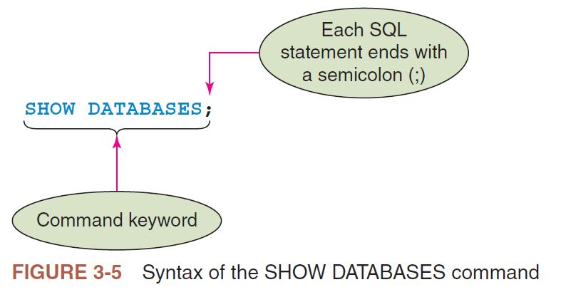

- The next step is to enter the `SHOW DATABASES;`command into the MySQL Workbench SQL editor. Enter the command on the first line as show in Figure 3-6. Be sure to enter the semicolon after the command.


- Notice as you entered the command, the keywords of <span style="color: blue">SHOW DATABASES</span> turn blue.
This color of blue is used to represent keywords in the SQL editor within the MySQL
Workbench. This color scheme is the Microsoft Windows default scheme and can be modified if preferred; however, for the remainder of the text we continue using this color of blue for keywords.
- The next step is to execute the command entered. On the main menu, select the Query menu and select Execute Current Statement as shown in Figure 3-7. This executes the statement you just entered. Note that you could have also selected Execute (All or Selected) because there was only one SQL statement entered.


> **HELPFUL HINT**
> Although some environments may not require a semicolon to end an SQL statement, it is always good practice to do so. For in the event you are using an environment in which it is required and do not include the semicolon, an error will occur. Always follow proper coding practice for any language you are using, regardless of whether the environment is forgiving or not.

- Once the command is executed, a result grid is displayed between the query pane and output pane. Note on the right-hand side of the result grid there are other options available; however, we will not be using them at present. The result of the command SHOW DATABASES lists the databases available in the MySQL server connection. Note we did not create any of these databases; instead, these six internal databases are used by MySQL for its purposes. You may need to use the vertical scroll bar on the right side of the result grid, or adjust the vertical size of the grid, to view all of the databases. Also note in the output pane there is information pertaining to the execution of the statement, such as the time of day it was executed, general description of the processing, outcome, and the time it took for the processing to occur. Note under the message column in the output pane that six rows were returned, which corresponds to the six databases listed. The green circle with a checkmark indicates the command executed successfully. See Figure 3-8.


> **HELPFUL HINT**
> - Note that your specific version of MySQL may have a different number of internal databases listed. This presents no issues.

- To clear the result grid, click on the "x" located on the bottom left of the result grid after "Result #." The grid is removed, and the query and output panes remain. To remove the details from output pane, you may right-click anywhere while the cursor is on the row or pane pertaining to the action. When the menu appears, select the Clear option from the menu, and the information is removed. If you wish to review any history of processing commands, you can click the drop-down arrow beside Action Output in the output pane and select History Output. See Figure 3-9.


- Now that you have entered and executed an SQL command in MySQL Workbench, the next step is to create your own database. Prior to creating your own database, you can clear the query pane by simply highlighting the command and deleting it, or any other method you prefer. You should now have a MySQL Workbench window similar to Figure 3-4, prior to entering any commands and only the query and output panes showing.

> **HELPFUL HINT**
> - Although it is not necessary to clear the query and output panes as you progress to creating a database of your own, it is cleared during the presentation in the textbook to make the examples more readable and easier to understand. This way you can focus on one command, or group of commands, at a time and not constantly viewing previous commands or results.

### CREATING A DATABASE

- There are many objects within a database, including tables and fields. All of these objects have identifiers, or names, associated with them. DBMS rules for naming identifiers vary dependent upon the DBMS. For example, in the version of MySQL used in this text, identifier names for a database, table, or a field can be up to 64 characters; however, that doesnot mean that you should give your identifiers names of that length. It is simply permitted if the need arises to properly describe the object. If you want to name identifiers very uniquely in any DBMS, you should consult the documentation for that specific DMBS. The documentation for naming identifiers in the version of MySQL used in this text can be found at https://dev.mysql.com/doc/refman/8.0/en/identifiers.html. General guidelines that are acceptable to most DBMS are given below. If you adhere to these guidelines for naming identifiers when using a DBMS, it is rare that you will have an issue.

  1. The identifier name cannot exceed 30 characters.
  2. The identifier name must start with a letter.
  3. The identifier name can contain letters, numbers, and underscores (_).
  4. The identifier name cannot contain spaces.

- Prior to defining the objects within a database, the first step is to create the database itself. The command in MySQL to create a database is **CREATE DATABASE** followed by the name of the database. To create a database named KIMTAY, for example, the command is <span style="color: blue">CREATE DATABASE</span> KIMTAY; as shown in Figure 3-10. Note that a semicolon ends the command.


Enter the command to create the KimTay database into the MySQL Workbench SQL editor. Execute the command similar to how you executed the SHOW DATABASES command and view the results. See Figure 3-11.


- Execute the <span style="color: blue">SHOW DATABASES</span>; command as you did previously and view the results in Figure 3-12. The results are now different because the KimTay database has been added, with seven databases now listed. Six of the databases will be internal to MySQL; however, the one additional database is the one you just created.


- Now the KimTay database has been created, you need to create the tables that will reside within the database. In addition, you need to populate the tables with the data from the previous modules. First, we begin by creating the table that holds the sales reps.

#### Changing the Default Database

- To work with a database, you must change the default database to the one you need to use. The default database is the database to which all subsequent commands pertain. To activate the default database, execute the USE command followed by the name of the database. For example, to change the default database to the one you just created for KimTay Pet Supplies, the command would be USE KIMTAY;, as shown in Figure 3-13. Changing the default database is also known as activating or using the database.


- Execute the command to activate the KIMTAY database and see the results in
Figure 3-14.


- Now that the default database has been set to the KIMTAY database, you can now
begin to add the tables to the database.

### CREATING A TABLE

- The first step in creating a table is to describe the layout of the table to the DBMS.

**EXAMPLE 1: Describe the layout of the SALES_REP table to the DBMS.**

- You use the **CREATE TABLE** command to describe the layout of a table. The word TABLE is followed by the name of the table to be created and then by the names and data types of the columns that the table contains (for example, characters, numbers, or dates) as well as the maximum number of characters or digits that the column can store.
- In the previous modules we chose the name SALES_REP to contain the information
pertaining to sales reps employed by KimTay Pet Supplies. The SQL command that creates the SALES_REP table is shown in Figure 3-15.


- This CREATE TABLE command, which uses the data definition features of SQL, describes a table named SALES_REP. The table contains ten columns: REP_ID, FIRST_NAME, LAST_NAME, ADDRESS, CITY, STATE, POSTAL, CELL_PHONE, COMMISSION, and RATE. The REP_ID column can store two characters and is the table’s primary key. The FIRST_NAME and LAST_NAME columns can store 20 characters each, and the STATE column can store two characters. The COMMISSION column can store only numbers, and those numbers are limited to seven digits, including two decimal places. Similarly, the RATE column can store three-digit numbers, including two decimal places. You can think of the SQL command shown in Figure 3-15 as creating an empty table with column headings for each column name.
- In SQL, commands are free format; that is, no rule says that a particular word
must begin in a particular position on the line. For example, you could have written the CREATE TABLE command shown in Figure 3-15 as follows:

```sql
CREATE TABLE SALES_REP (REP_ID CHAR(2) PRIMARY KEY, FIRST_NAME CHAR(20), 
LAST_NAME CHAR(20), ADDRESS CHAR(20), CITY CHAR(15), STATE CHAR(2), 
POSTAL CHAR(5), CELL_PHONE CHAR(12), COMMISSION DECIMAL(7,2), RATE DECIMAL(3,2));
```
- It should be noted that the PRIMARY KEY clause in the previous statement specifies that REP_ID will be the unique identifier to the row meaning "No Duplicate" are allowed for the column.
- The manner in which the CREATE TABLE command shown in Figure 3-15 was
written makes the command more readable. This text strives for such readability when writing SQL commands.

> **HELPFUL HINT**
> - Making code readable is extremely important. The more readable the code, the easier it is to understand and modify. Proper indentation can make code much more readable compared to code that is not indented properly. There is no one way to indent code to make it more readable, each coder will have his/her on way of indenting code for readability. This text attempts to make code much more readable through proper indentation and spacing to maximize readability.
>
> **HELPFUL HINT**
> - SQL is not case sensitive; you can type commands using uppercase or lowercase letters. There is one exception to this rule, however. When you are inserting character values into a table, you must use the correct case.
>
> - To create the SALES_REP table in MySQL Workbench, enter and execute the command shown in Figure 3-15 as you did with the previous commands. Once again, there is a different color scheme for various parts of the command as you enter it. Figure 3-16 shows the executed command and results. The figures in this text may show the panes resized so that more of the command or results is visible to the user.


.JPG)

- Although there was verification from MySQL that the table was created, you may view the list of tables within an activated database by using the SHOW TABLES; command. This command is similar to the SHOW DATABASES command you used previously, but instead it gives you a list of tables residing in the current database in use. In our case, this results in a list of the tables residing in the KIMTAY database. See Figure 3-17 for the results of the command.


#### Correcting Errors in SQL Commands

- Suppose that you attempted to create the SALES_REP table using the CREATE TABLE command shown in Figure 3-18, which contains several mistakes. Instead of displaying a message that the table was created successfully, MySQL displays an error message about a problem that it encountered. In reviewing the command, you see that CHAR is misspelledon line 5, the CITY column was omitted, and line 8 should be deleted. If you run a command and MySQL Workbench displays an error, you can use the mouse and the arrow keys on the keyboard to position the insertion point in the correct position so you can correct these errors using the same techniques that you might use in a word processor. For example, you can use the pointer to select the word CHR on line 5 and type CHAR, and then you can use the pointer to move the insertion point to the end of line 5 so you can press Enter to insert the missing information to create the CITY column. You can use the pointer to select the contents of line 8 and then press Delete to remove it. After making these changes, you can click the Run button to execute the command again. If the command contains additional errors, you see an error message again. If the command is correct, you see the message that the table was created.

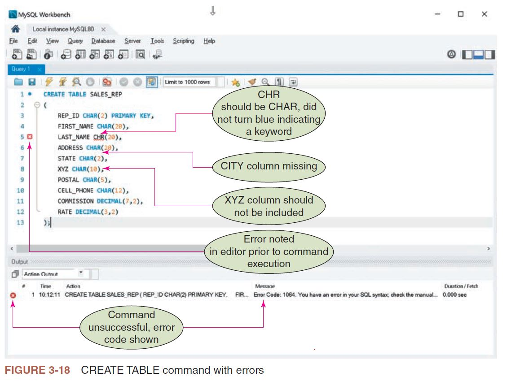

You may have also noticed that the SQL editor within the MySQL Workbench indicated there was a syntax error in the command on line 5 prior to executed, as indicated by the small red box with an X in it beside the line. The SQL editor is quite advanced and understands the correct syntax as you enter the commands. In addition, note that omitting the CITY column and inserting a XYZ column do not produce syntax errors. Instead, they are considered logic errors on your part.

#### Dropping a Table

- After creating a table, you might notice that you added a column that you do not need or that you assigned the wrong data type or size to a column. One way to correct such errors in a table is simply to delete (drop) the table and start over. For example, suppose you wrote a CREATE TABLE command that contained a column named LST instead of LAST or defined a column as CHAR(5) instead of CHAR(15). Suppose you do not discover the rror and you execute the command, creating a table with these problems. In this case, you can delete the entire table using the **DROP TABLE** command and then re-create the table using the correct CREATE TABLE command.
- To drop a table, execute the **DROP TABLE** command, followed by the name of the table you want to delete and a semicolon. To delete the SALES_REP table, for example, you would enter and execute the following command:

```sql
DROP TABLE SALES_REP
```

- Dropping a table also deletes any data that you entered into the table. It is a good idea to check your CREATE TABLE commands carefully before executing them and to correct any problems before adding data. Later in this text, you learn how to change a table’s structure without having to delete the entire table.

> **Q & A**
> - **Question**: How can I correct a mistake that I made when I created a table?
> - **Answer**: Later in the text, you see how to alter a table to make any necessary corrections. For now, the easiest way is to drop the table using the DROP TABLE command and then to execute the correct CREATE TABLE command.

### USING DATA TYPES

- For each column in a table, you must specify the data type to use to store the type of data that the column contains. Figure 3-19 describes some common data types used in databases.

| DataType | Description |
| --- | --- |
| CHAR(n) | Stores a character string n characters long. You use the CHAR data type for columns that contain letters and special characters, and for columns containing numbers that will not be used in any calculations. Because neither sales rep ID numbers nor customer ID numbers will be used in any calculations, for example, the REP_ID and CUST_ID columns are both assigned the CHAR data type. |
| VARCHAR(n) | An alternative to CHAR that stores a character string up to n characters long. Unlike CHAR, only the actual character string is stored. If a character string 20 characters long is stored in a CHAR(30) column, for example, it will occupy 30 characters (20 characters plus 10 blank spaces). If it is stored in a VARCHAR(30) column, it will only occupy 20 spaces. In general, tables that use VARCHAR instead of CHAR occupy less space, but the DBMS does not process them as rapidly during queries and updates. However, both are legitimate choices. This text uses CHAR, but VARCHAR works equally well.
| DATE | Stores date data. The specific format in which dates are stored varies from one SQL implementation to another. In MySQL and SQL Server, dates are enclosed in single quotation marks and have the format YYYY-MM-DD (for example, ‘2020-10-23’ is October 23, 2020). In Oracle, dates are enclosed in single quotation marks and have the format DD-MON-YYYY (for example, '23-OCT-2020' is October 23, 2020). |
| DECIMAL(p,q) | Stores a decimal number p digits long with q of the digits being decimal places to the right of the decimal point. For example, the data type DECIMAL(5,2) represents a number with three places to the left and two places to the right of the decimal (for example, 123.45). You can use the contents of DECIMAL columns in calculations. You also can use the NUMERIC(p,q) data type in MySQL to store a decimal number. Oracle and SQL Server also use NUMBER(p, q) to store a decimal number. |
| INT | Stores integers, which are numbers without a decimal part. The valid range is –2147483648 to 2147483647. You can use the contents of INT columns in calculations. If you follow the word INT with AUTO_INCREMENT, you create a column for which SQL will automatically generate a new sequence number for each time you add a new row. This would be the appropriate choice, for example, when you want the DBMS to generate a value for a primary key.|
| SMALLINT | Stores integers but uses less space than the INT data type. The valid range is –32768 to 32767. SMALLINT is a better choice than INT when you are certain that the column will store numbers within the indicated range. You canuse the contents of SMALLINT columns in calculations.|

FIGURE 3-19 Commonly used data type

### USING NULLS

- Occasionally, when you enter a new row into a table or modify an existing row, the values for one or more columns are unknown or unavailable. For example, you can add a customer’s name and address to a table even though the customer does not have an assigned sales rep or an established credit limit. In other cases, some values might never be known—perhaps there is a customer that does not have a sales rep. In SQL, you handle this situation by using a special value to represent cases in which an actual value is unknown, unavailable, or not applicable. This special value is called a null data value, or simply a null. When creating a table, you can specify whether to allow nulls in the individual columns.

**Q & A**
- **Question**: Should a user be allowed to enter null values for the primary key?
- **Answer**: No. The primary key is supposed to uniquely identify a given row, and this would be impossible if nulls were allowed. For example, if you stored two customer records without values in the primary key column, you would have no way to tell them apart.
- In SQL, you use the **NOT NULL** clause in a CREATE TABLE command to indicate columns that cannot contain null values. The default is to allow nulls; columns for which you do not specify NOT NULL can accept null values.
- For example, suppose that the FIRST_NAME and LAST_NAME columns in the SALES_REP table cannot accept null values, but all other columns in the SALES_REP table can. The CREATE TABLE command in Figure 3-20 accomplishes this goal.


- If you created the SALES_REP table with this CREATE TABLE command, the DBMS would reject any attempt to store a null value in either the FIRST_NAME or LAST_NAME column. The database allows storing NULL values in the ADDRESS column because it was created without specifying NOT NULL when the table was created. Because the primary key column cannot accept null values, you do not need to specify the REP_ID column as NOT NULL.

### ADDING ROWS TO A TABLE

- After you have created a table in a database, you can load data into the table by using the INSERT command.

#### The INSERT Command

- The **INSERT** command adds rows to a table. You type <span style="color: blue">INSERT INTO<span> followed by the name of the table into which you are adding data. Then you type the word <span style="color: blue">VALUES<span> followed by the specific values to be inserted in parentheses. When adding rows to character columns, make sure you enclose the values in single quotation marks (for example, "Susan"). You also must enter the values in the appropriate case, because character data is stored exactly as you enter it.

> **HELPFUL HINT**
> - You must enclose values in single quotation marks for any column whose type is character (CHAR), even when the data contains numbers. Because the POSTAL column in the SALES_REP table has a CHAR data type, for example, you must enclose postal codes in single quotation marks, even though they are numbers.
> - If you need to enter an apostrophe (single quotation mark) into a column, you type two single quotation marks. For example, to enter the name O'Toole in the LAST_NAME column, you would type "O'Toole" as the value in the INSERT command.

**EXAMPLE 2: Add sales rep 05 to the SALES_REP table.**

- The command for this example is shown in Figure 3-21. Note that the character strings ("05," "Susan," "Garcia," and so on) are enclosed in single quotation marks. When you execute the command, the record is added to the SALES_REP table.


- The result of the command being entered and executed is shown in Figure 3-22.


> - **HELPFUL HINT**
> - Make sure that you type the values in the same case as those shown in the figures to avoid problems later when retrieving data from the database.

**EXAMPLE 3: Add sales reps 10 and 15 to the SALES_REP table.**

- You could enter and execute new INSERT commands to add the new rows to the table. However, an easier and faster way to add these new rows to the table is to use the mouse and the keyboard to modify the previous INSERT command and execute it to add the record for the second sales rep. Figure 3-23 shows the new command to add the second record containing the data for sales rep 10. Simply use the mouse and keyboard to modify the command and execute it. Note that if it is easier for you to delete the previous command and enter the new command from the beginning, it is absolutely fine.


- Figure 3-24 shows the results of the command being entered and executed to add the second record to the SALES_REP table, containing the data for sales rep 10.


- The next command to add the third record, containing the data for sales rep 15, is shown in Figure 3-25. Enter the command by modifying the previous command, or deleting the previous command and entering the new command from the beginning. Once entered, execute the command.


- Figure 3-26 shows the results of the command being entered and executed to add the third record to the SALES_REP table, containing the data for sales rep 15.


- The next command to add the fourth record, containing the data for sales rep 20, is shown in Figure 3-27. Enter the command by modifying the previous command or by deleting the previous command and entering the new command from the beginning. Once entered, execute the command.


#### Inserting a Row that Contains Nulls

- To enter a null value into a table, you use a special form of the INSERT command in which you identify the names of the columns that accept non-null values and then list only these non-null values after the VALUES command, as shown in Example 4.

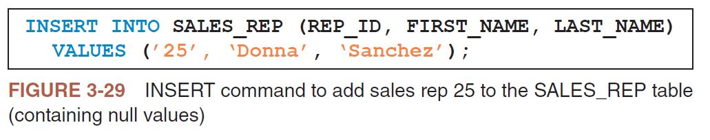

Figure 3-30 shows the results of the command being entered and executed to add the fifth record to the SALES_REP table, containing the data for sales rep 25; however, only the REP_ID, FIRST_NAME, and LAST_NAME fields are added. The remaining fields contain null values. The order of the data aligns with the order of the fields. The value of "25" is inserted into the REP_ID field, the value of "Donna" is inserted into the FIRST_NAME field, and the value of "Sanchez" is inserted into the LAST_NAME field.


### VIEWING TABLE DATA

-To view the data in a table, you use the **SELECT** command, which is described in more detail in Modules 4 and 5. 

**EXAMPLE 5: Display all the rows and columns in the SALES_REP table.**

- You can use a simple version of the SELECT command to display all the rows and columns in a table by typing the word <span style="color: blue">SELECT</span>, followed by an asterisk (*), followed by the keyword FROM and the name of the table containing the data you want to view. Just as with other SQL commands, the command ends with a semicolon. In MySQL, you type the command shown in Figure 3-31.


- Figure 3-32 shows the results of the command being entered and executed, along with the results shown in the results grid. As you can see, in the fifth record the data for the REP_ID, FIRST_NAME, and LAST_NAME fields have been inserted as you wanted. The remaining fields in the fifth record contain null values.

 

 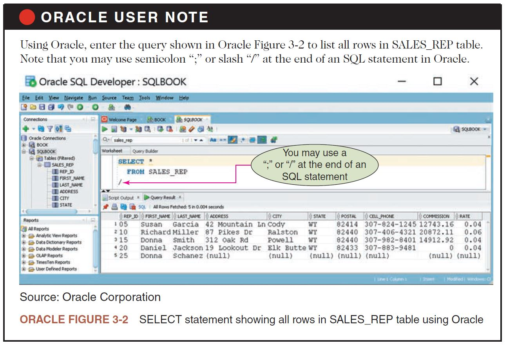

 ](./images/sql-server-figure-3-2-select-statement-showing-all-rows-in-sales_rep-table-using-sql-server.JPG)


 ### CORRECTING ERRORS IN A TABLE

 - After executing a SELECT command to view a table’s data, you might find that you need to change the value in a column. You can use the UPDATE command to change a value in a table. The UPDATE command shown in Figure 3-33 changes the last name in the row on which the sales rep ID is 25 to Salinas.


- Figure 3-34 shows the results of the command being enter and executed. Note the message in the output gives further detail that one row was affected, with one row matching the criteria and one row being changed.
- The same SELECT command used in Figure 3-31 to list all of the records in the SALES_REP table can be used again to show the results of the UPDATE command just executed in Figure 3-34. Figure 3-35 shows the SELECT command being entered and executed, along with displaying the results of the UPDATE command from Figure 3-34, in which the last name for rep number 25 is Salinas.


- Figure 3-37 shows the results of the command being entered and executed. Note the message in the output gives further detail in that one row was affected, or in this case deleted.


- The SELECT command can once again be used to display the records in the SALES_REP table. Figure 3-38 shows the command entered and executed, and it displays the updated data in the table. Note that the data associated with sales rep ID 25 no longer resides in the table.


> **Q & A**
> Question: How do I correct errors in my data?
> Answer: The method you use to correct an error depends on the type of error you need to correct. If you added a row that should not be in the table, use a DELETE command to remove it. If you forgot to add a row, you can use an INSERT command to add it. If you added a row that contains incorrect data, you can use an UPDATE command to make the necessary corrections. Alternatively, you could use a DELETE command to remove the row containing the error and then use an INSERT command to insert the correct row.

### SAVING SQL COMMANDS

- MySQL lets you save SQL commands so you can use them again without retyping them. In MySQL, as well as in many other DBMSs, you save commands in a script file, or simply a script, which is a text file. In MySQL, script files have the .sql filename extension. Some DBMSs, such as Oracle, have a special location called the script repository to store the scripts. With MySQL, you can save your scripts in the location of your choice on your local file system (such as on a hard drive or USB flash drive), therefore, creating your own repository. The following steps describe how to create and use scripts in the MySQL Workbench. If you are using a different version of MySQL or another DBMS, use Help, consult the system documentation, or search the Internet to determine how to accomplish the same tasks.

> **Q & A**'
> **Question**: What are advantages of creating scripts?
> **Answer**: Creating a script offers some distinct advantages. You can create or edit a script using a text editor or word processor and save the script into your own script repository to be used in MySQL. A script can be created separately from the MySQL Workbench environment. Scripts allow you to create a group of SQL commands you would like to execute regularly and have them ready for use without rekeying them. Additionally, there are some advanced features you see later in this text that are only available when using scripts.

- To create a script in MySQL:
    1. Enter the command, or commands, you would like to comprise the script in the query pane.
    2. On the MySQL Workbench main menu, click on the File menu and select the Save Script As option.
    3. You may now navigate to a location in your file system you would like to save the script.
    4. Enter a name for your script in the File name: text box. Note the file type is an SQL file with an extension of .sql.
    5. When you are finished, click the Save button. You return to the query pane with the name of the tab being the name of your script.

- To view or edit a script in MySQL:
    1. On the MySQL Workbench main menu, click on the File menu and select
    Open SQL Script. 
    2. Navigate to the location in your file system where the script is saved.
    3. Select the script and click Open.
    4. Your script is now in a new tab in the query pane with the name being the
    same name as your script.
    5. You may now edit the script.

- To run an existing script in MySQL (Option #2):
    1. On the MySQL Workbench main menu, click on the File menu and select
    Run SQL Script.
    2. Navigate to the location in your file system where the script is saved.
    3. Select the script and click Open.
    4. In the Run SQL Script dialog box, select the Default Schema Name from the
    drop-down menu and click Run.
    5. After the results are displayed, you click on Close to close the Run SQL
    Script dialog box.

- When you are finished using a script and no longer need to store it, you can delete it.
- To delete a script in MySQL:
    1. Navigate to the location in your file system where the script is saved.
    2. Delete the file containing the script by the normal methods for your file
    system.

> **ORACLE USER NOTE**
> Oracle SQL Developer allows to save scripts any folder on your local system. All scripts created in Oracle SQL Developer are text files with the .sql filename extension. To create a script file in Oracle SQL Developer:
> 1. Load the Oracle SQL Developer tool, under Oracle Connections pane click on the desired database. (Note: Initially, you must create a connection entering account credentials as shown in Oracle Figure 3-3.)
> 2. Enter query statement you desire to store and execute the statement to validate it is syntactically correct and it returns the expected results.
> 3. Click the Save button and then enter a name for the script. 
> 
> To view, edit, or run an existing script:
> 1. Load Oracle SQL Developer and double click on Database Connection created previously.
> 2. Click the Open File button on the toolbar.
> 3. Navigate to the folder containing the script file and then click the Open button in the Open File dialog box. The script appears in the Query Editor window. You can view the content of the script to make changes to it by editing the commands. If you want to save your edits to a script, click the Save button to save your changes.
> 4. To run a script, click the Execute button.


> **SQL SERVER USER NOTE**
> SQL Server can store scripts in any folder on your local system. All scripts created in SQL Server are text files with the .sql filename extension. To create a script file in SQL Server:
>   1. Load SQL Server Management Studio and then click the Connect button in the Connect to Server dialog box.
>   2. Open the appropriate database and then click the New Query button.
>   3. Type the command or commands to save in the script. When necessary, click the Execute button to execute the commands saved in the script.
>   4. When you are finished, click the Save button and then enter a name for the script.
> 
> To view, edit, or run an existing script:
>   1. Load SQL Server Management Studio and then click the Connect button in the Connect to Server dialog box.
>   2. Open the appropriate database and then click the New Query button.
>   3. Click the Open File button on the toolbar.
>   4. Navigate to the folder containing the script file and then click the Open button in the Open File dialog box. The script appears in the Query Editor window. You can view the content of the script to make changes to it by editing the commands. If you want to save your edits to a script, click the Save button to save your changes.
>   5. To run a script, click the Execute button.

### CREATING THE REMAINING DATABASE TABLES

- To create the remaining tables in the KimTay Pet Supplies database (KIMTAY), you need to execute the appropriate CREATE TABLE and INSERT commands. You should save these commands as scripts so you can re-create your database, if necessary, by running the scripts.

> **HELPFUL HINT**
> Your instructor might give you the script files to use to create the tables for KimTay Pet Supplies and StayWell Student Accommodation databases and to insert data into them.

- Figure 3-39 shows the CREATE TABLE command for the CUSTOMER table. Notice that the FIRST_NAME and LAST_NAME columns are specified as NOT NULL. Additionally, the CUST_ID column is the table’s primary key, indicating that the CUST_ID column is the unique identifier of rows in the table. With this column designated as the primary key, the DBMS rejects any attempt to store a customer ID that already exists in the table.


- After creating the CUSTOMER table, you can create another file containing the
INSERT commands to add the customer rows to the table. When a script file contains
more than one command, each command must end with a semicolon. Figure 3-40 shows
the INSERT commands to add rows to the CUSTOMER table.


- Figures 3-41 through 3-46 show the scripts for the CREATE TABLE and INSERT commands for creating and inserting data into the INVOICES, ITEM, and INVOICE_LINE tables in the KimTay Pet Supplies database. Figure 3-41 contains the CREATE TABLE command for the INVOICES table.


- Figure 3-42 contains the INSERT commands to load data into the INVOICES table.
Notice the way that dates are entered.


- Figure 3-43 contains the CREATE TABLE command for the ITEM table.


- Figure 3-44 contains the INSERT commands to load data into the ITEM table.


- Figure 3-45 contains the CREATE TABLE command for the INVOICE_LINE table. Notice the way that the primary key is defined when it consists of more than one column.

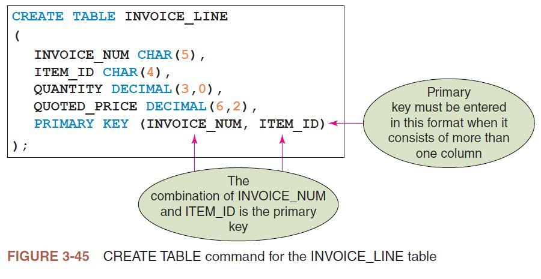

Figure 3-46 contains the INSERT commands to load data into the INVOICE_LINE
table.


### DESCRIBING A TABLE

- The CREATE TABLE command defines a table’s structure by listing its columns, datatypes, and column lengths. The CREATE TABLE command also indicates which columns cannot accept nulls. When you work with a table, you might not have access to the CREATE TABLE command that was used to create it. For example, another programmer might have created the table, or perhaps you created the table several months ago but did not save the command. You might want to examine the table’s structure to see the details about the columns in the table. Each DBMS provides a method to examine a table’s structure.

**EXAMPLE 6: Describe the SALES_REP table.**

- In MySQL, you can use the DESCRIBE command to list all the columns in a table and their properties. Figure 3-47 shows the DESCRIBE command for the SALES_REP table, note that DESC, the abbreviated form of the DESCRIBE command, is accepted in MySQL and Oracle. The result indicates the name of each column in the table, along with its data type and length. The Null column indicates whether the field can accept a value of null. The Key column indicates which fields are part of the primary key.


### Module Summary

- Use the CREATE TABLE command to create a table by typing the table name and then
listing within a single set of parentheses the columns in the table.
- Use the DROP TABLE command to delete a table and all its data from the database.
- Some commonly used data types in are INT, SMALLINT, DECIMAL, CHAR, VARCHAR, and DATE.
- A null data value (or null) is a special value that is used when the actual value for a column is unknown, unavailable, or not applicable.
- Use the NOT NULL clause in a CREATE TABLE command to identify columns that cannot accept null values.
- Use the INSERT command to insert rows into a table.
- Use the SELECT command to view the data in a table.
- Use the UPDATE command to change the value in a column.
- Use the DELETE command to delete a row from a table.
- You can save SQL commands in a script file in MySQL, Oracle, and SQL Server.
- You can use the DESCRIBE command in MySQL and Oracle to display a table’s structure and layout. In SQL Server, execute the SP_COLUMNS stored procedure to display the structure and layout of a table.

### Key Terms

- CREATE DATABASE
- CREATE TABLE
- data type
- default database
- DELETE
- DESCRIBE
- DROP TABLE
- INSERT
- NOT NULL
- null
- null data value
- script
- script file
- script repository
- SELECT
- SHOW DATABASES
- Structured Query Language (SQL)
- UPDATE
- USE

### Review Questions

#### Module Quiz

**Question 1**: How do you create a table using SQL?
 
**Answer**:
- The first step of creating a table is to describe the layout of the table to the DBMS such as MySQL, Oracle, or SQL server using the CREATE TABLE sql command. This command is followed by the name of the table to be created, and then by the names and data types of the columns that the table contains. The data type of each column indicates the type of data that the column can contain as well as the maximum number of characters or digits that the column can store. The data type of the column that is the primary key is followed by the sql clause PRIMARY KEY to indicate that it will be the unique identifier to the row meaning "No duplicate" are allowed for the column.
- For example, suppose you want to create a table called SALES_REP that has the following columns:
- REP_ID: A text with two character, such as "05" and "10". It's the primary key of the table.
  - FIRST_NAME: A variable length text upto 20 characters, such as "Susan" and "Richard".
  - LAST_Name: A variable length text upto 20 characters, such as"Garcia" and "Miller".
  - ADDRESS: A variable length text upto 30 characters, such as "42 Mountain Ln" and "87 Pikes Dr"
  - CITY: A variable length text upto 15 characters, such as "Cody" and "Ralston"
  - STATE: A text with 2 characters, such as "WY"
  - POSTAL: A text with 5 characters, such as "82414" and "82440"
  - CELL_PHONE: A text with 12 characters, such as "307-824-1245" and "307-406-4321"
  - COMMISSION: A 2 decimal point number with 5 digits before the decimal point, such as 12743.16 and 20872.11.
  - RATE:  A 2 decimal point number with 1 digits before the decimal point, such as 0.04 and 0.06.

 - The table described above can be created using the following sql command:

<pre style="white-space: pre-wrap">
<code>
CREATE TABLE SALES_REP
(
    REP_ID CHAR(2) PRIMARY KEY,
    FIRST_NAME CHAR(20),
    LAST_Name CHAR(20),
    ADDRESS CHAR(30),
    CITY CHAR(15),
    STATE CHAR(2),
    POSTAL CHAR(5),
    CELL_PHONE CHAR(12),
    COMMISSION DECIMAL(7, 2)
    RATE DECIMAL(3, 2)
); 
</code>
</pre>


**Question 2**: How do you delete a table using SQL?

**Answer:**

The entire table is deleted using the SQL command DROP TABLE followed by the name of the table that you want to delete and a semicolon. For example if you want to delete a table named SALES_REP, you will execute the following SQL command: 

<pre style="white-space: pre-wrap">
<code>
DROP TABLE SALES_REP;
</code>
</pre>

**Question 3**: What are common data types used to define columns using SQL?

**Answer**:
1. CHAR(n) data type: Specifies that a column stores a character string data that is n charater long. The character string can be a sequence of letters and special charater such as "Susan", "42 Mountain Ln", "307-824-1245", or a sequence of numbers that will not be used in any calculation such as "05" and "82414". 
2. DATE data type: Specifies that a column store a date data. In a MySQL database, defining a column with DATE data type will store dates as "YYYY-MM-DD". For example, June, 20, 1990 will be stored as "1990-06-20".
3. DECIMAL(p,q) data type: Specifies that a column stores q decimal point number that is p digits long. For example, a column that stores commission such as 12743.16 and 20872.11 will have a data type of DECIMAL(7, 2) because it is a 2 decimal points number that is 7 digits long. A column that stores rate as 0.04 and 0.06 will have a data type of DECIMAL(3, 2) because it is a 2 decimal points number that is 3 digits long.
4. INT data type: Specifies that a column stores integer (whole number without the decimal part). The integers can range from –2147483648 to +2147483647. For example, a column that store age such as 20, 19, 22, 34 is better for it to be defined with a INT data type.
5. VARCHAR(n) data type: Specifies a column that stores a character string data that is upto n character long. This is an alternative of CHAR(n). If you define a column with CHAR(20) to store a name such as "Susan", it will be stored in a 20 character space memory (5 with data and 15 with blank spaces). However, if you define a column with VARCHAR(20), the name "Susan" will be stored in a 5 charater space memory. Therefore, table using VARCHAR(n) data type to define columns occupy less space but DBMS such as MySQL does not process them as rapidly during queries and updates. 
6. SMALLINT data type: Specifies that a column stores integer (whole number without the decimal part). The integers can range from –32768 to +32767. For example, a column that store age such as 20, 19, 22, 34 is better for it to be defined with a SMALLINT data type. This a better choice when you are sure the integer number you want to store is a small integer number.

**Question 4**: Identify the best data type to use to store the following data in Oracle, in SQL Server, and in MySQL:
<ul list-style-type: lower-alpha>
   <li>The month, day, and year that an employee was hired</li>
   <li>An employee’s Social Security number</li>
   <li>The department in which an employee works</li>
   <li>An employee’s hourly pay rate</li>
</ul>

**Answer:**

| Data | Oracle | SQL Server | MySQL |
| --- | --- | --- | --- |
| The month, day, and year that an employee was hired | DATE | DATE | DATE |
| An employee’s Social Security number | CHAR(9) |CHAR(9) | CHAR(9) |
| The department in which an employee works | VARCHAR(20) | CHAR(20) | CHAR(20) |
| An employee’s hourly pay rate | DECIMAL(3,2) | DECIMAL(3,2) | DECIMAL(3,2) |


**Question 5**: Identify the following column names as valid or invalid in MySQL:
<ul>
   <li>COMMISSIONRATE</li>
   <li>POSTAL_CODE_5CHAR</li>
   <li>SHIP TO ADDRESS</li>
   <li>INVOICE-NUMBER</li>
</ul> 

**Answer:**
| Column name | Valid or invalid |
| --- | --- |
| COMMISSIONRATE | Valid |
| POSTAL_CODE_5CHAR | Valid |
| SHIP TO ADDRESS | Invalid because it contains empty spaces |
| INVOICE-NUMBER | Invalid because it contains empty a hyphen |

**Question 6**: What is a null value? How do you use SQL to identify columns that cannot accept null values?

**Answer:**
- A null value is any value entered into a table that is either unknown, unavailable or not applicable. For example, a null value can be inserted into a table when you insert values only for 3 columns whereas you have 10 columns in the table.
- We identify columns that cannot accept null values by adding either PRIMARY KEY clause after the data type of the primary key column, or by adding NOT NULL clause after the data type of nonkey columns during the process of creating a table using the CREATE TABLE command. For example, the table created using the following CREATE TABLE command cannot accept null values in the REP_ID, FIRST_NAME, and LAST_NAME columns.


<pre style="white-space: pre-wrap">
<code>
CREATE TABLE SALES_REP 
(
   REP_ID CHAR(2) PRIMARY KEY,
   FIRST_NAME CHAR(20) NOT NULL,
   LAST_NAME CHAR(20) NOT NULL,
   ADDRESS CHAR(30),
   CITY CHAR(15),
   STATE CHAR(2),
   POSTAL CHAR(5),
   CELL_PHONE CHAR(12),
   COMMISSION DECIMAL(7, 2)
   RATE DECIMAL(3, 2)
); 
</code>
</pre>


**Question 7**: Which SQL command do you use to add a row to a table?

**Answer:**: We use INSERT INTO command, followed by the name of the table into which we are adding data. You then type the word VALUES followed by the specific values to be inserted in parenthesis. The values that were defined using CHAR(n) must be enclose in a single quote. For example, 

<pre style="white-space:pre-wrap;">
<code>
INSERT INTO SALES_REP 
    VALUES ("05", "Susan", "Garcia", "42 Mountain Ln", "Cody", "WY","82414", "307-824-1245", 12743.16, 0.04));
</code>
</pre>

The above SQL command is used to add a row to a table created using the following SQL command: 


<pre style="white-space:pre-wrap;">
<code>
CREATE TABLE SALES_REP 
(
   REP_ID CHAR(2) PRIMARY KEY,
   FIRST_NAME CHAR(20),
   LAST_NAME CHAR(20),
   ADDRESS CHAR(30),
   CITY CHAR(15),
   STATE CHAR(2),
   POSTAL CHAR(5),
   CELL_PHONE CHAR(12),
   COMMISSION DECIMAL(7, 2)
   RATE DECIMAL(3, 2)
); 
</code>
</pre>

**Question 8**: Which SQL command do you use to view the data in a table?

**Answer**: We useSELECT command to view the data in a table. For example, to view all the data in a table, you type the word SELECT, followed by an asterisk (*), followed by the keyword FROM, followed by the name of the table containing the data you want to view, and finaly followed by a semicolon to end the SQL command. For example, to view all the data in a table called SALES_REP, you will type the following in the SQL editor, and then execute it:

<pre style="white-space:pre-wrap;">
<code>
    SELECT *
        FROM SALES_REP;
</code>
</pre>

**Question 9**: Which SQL command do you use to change the value in a column in a table?
**Answer**: We use UPDATE command to change the value in a column in a table.
For example, if you want to change the first name of the sales rep with a sales rep ID of "05" in the SALES_REP table from "Susan" to "Sharon", you will type the following in the SQL editor and then execute it:

<pre style="white-space:pre-wrap;">
<code>
    UPDATE SALES_REP
        SET FIRST_NAME = "Sharon"
            WHERE REP_ID = "05";
</code>
</pre>


**Question 10**: Which SQL command do you use to delete rows from a table?
**Answer**: We use DELETE command to delete rows from a table.  For example, the following command can be used to delete the row on which the sales rep ID is 05.

<pre style="white-space:pre-wrap;">
<code>
    DELETE
        FROM SALES_REP
            WHERE REP_ID = "05";
</code>
</pre>


**Question 11**: How do you display the columns in a table and their characteristics in MySQL?
**Answer**: In MySQL, we use the DESCRIB command, followed by the name of the table in which we want to display the columns in the table and their characteristics, followed by a semi-colon. For example, the following SQL command can be used to display the columns in the SALES_REP table and their characteristics in MySQL.

<pre style="white-space:pre-wrap;">
<code>
    DESCRIBE SALES_REP;
</code>
</pre>

##### Critical Thinking

**Question 1**. Explain the difference between the CHAR data type and the VARCHAR data type. Use the Internet to find examples of when to use VARCHAR and when to use CHAR. Be sure to cite the URL(s) that provided the examples as references at the end of your document.
**Answer:**
The following table summarizes the differences between CHAR data type and the VARCHAR data type.

| CHAR data type | VARCHAR data type |
| --- | --- |
| Used to define a column that is used to store a character string data that is expected to have a fixed number of n character long | Used to define a column that is used to store a character string data that is expected to have a variable number of charater from a minimum of 1 to a maximum n character long |
|  DBMS process them more rapidly than VARCHAR(n) during queries and updates  | DBMS such as MySQL does not process them more rapidly as compared to CHAR(n) during queries and updates |
| If a column is defined as CHAR(20) an entry such as "Susan" requires pad space when storing it (5 with character values, and 15 with empty spaces) | If a column is defined as VARCHAR(20) an entry such as "Susan" require  no pad space when storing it (It will be stored as 5 character long)|
| Each character takes 1 byte of storage | Each character takes 1 byte of storage plus an extra byte for holding the length of the information |
 
**Reference**:
1. Singh, A. (2023, January 13). Difference Between Char and Varchar - Shiksha Online. Shiksha.com; Shiksha Online. https://www.shiksha.com/online-courses/articles/difference-between-char-and-varchar/#:~:text=Char%20has%20a%20fixed%20size

**Question 2**. Use the Internet to research BOOLEAN data types. What is a BOOLEAN data type and what is it called in Oracle, SQL Server, and MySQL? Be sure to cite the URL(s) that provided the information at the end of your document.
**Answer:**
A boolean data type allows a column to store either True or False. In databases, True is often stored as 1 and False is normally stored as 0. In Oracle, Booleans are called NUMBER(1). In SQL server, Boolean are called BIT. In MySQL, Booleans are called BIT or TINYINT.

**Reference**:
1. Ben. (2019, August 6). SQL Boolean Data Type. Database Star. https://www.databasestar.com/sql-boolean-data-type/


#### Case Exercises

- To print a copy of your commands using MySQL, start Word or another word processor and create a new document. Select the SQL command(s) in SQL Server, copy it to the Clipboard, and then past it into the document. To export a command’s results in MySQL, you can export a dataset to an external file by selecting the Export/Import option in the result grid. You can then choose the type of file you want to export the data to.
- To print a copy of your commands and results using SQL Server, start Word or another word processor and create a new document. Select the SQL command(s) in MySQL or SQL Server, copy it to the Clipboard, and then paste it into the document. To copy and paste a command’s results in SQL Server, right-click the datasheet selector (the box in the upper-left corner of the datasheet) to select the entire datasheet, copy it to the Clipboard, and then paste it into the document.
- To print a copy of your commands and results using Oracle, use the browser’s Print command on the File menu or click the Print button on the browser’s toolbar.
- You may also consult with your instructor for any specific instructions on how she/he would like your work submitted.

##### KimTay Pet Supplies

- Use SQL to complete the following exercises.

**Question 1**: Create a table named REP. The table has the same structure as the SALES_REP table shown in Figure 3-15 except the LAST_NAME column should use the VARCHAR data type and the COMMISSION and RATE columns should use the NUMERIC data type. Execute the command to describe the layout and characteristics of the REP table.
 
**Answer**: 
- Here is the SQL command that was executed using MySQL:

<pre style="white-space: pre-wrap;">
<code>
CREATE TABLE REP 
(
    REP_ID CHAR(2) PRIMARY KEY,
	FIRST_NAME CHAR(20),
	LAST_NAME VARCHAR(20),
	ADDRESS CHAR(20),
	CITY CHAR(15),
	STATE CHAR(2),
	POSTAL CHAR(5),
	CELL_PHONE CHAR(12),
	COMMISSION DECIMAL(7, 2),
	RATE DECIMAL(3, 2)
);
</code>
</pre>

- Here is the output of the SQL command:


**Question 2**: Add the following row to the REP table: rep ID: 35, first name: Fred; last name: Kiser; address: 427 Billings Dr.; city: Cody; state: WY; postal: 82414; cell phone: 307-555-6309; commission: 0.00; and rate: 0.05. Display the contents of the REP table.

- Here is the SQL commands that was used: 

**Answer**: 

<pre style="white-space: pre-wrap";>
<code>
INSERT INTO REP
    VALUES ("35", "Fred", "Kiser", "427 Billings Dr.", "Cody", "WY", "82414", "307-555-6309", 0.00, 0.05);
</code>
</pre>
    
<pre style="white-space: pre-wrap;">
<code>
SELECT * 
    FROM REP;
</code>
</pre>


- Here is the contents of the REP table:


**Question 3**: Delete the REP table.

**Answer**: 

<pre style="white-space: pre-wrap;">
<code>
DROP TABLE REP;
</code>
</pre>

**Question 4**: Run the script file for the KimTay Pet Supplies database to create the five tables and add records to the tables. Be sure to select the script file for the particular DBMS that you are using (MySQL, Oracle, or SQL Server).

**Answer**: 

**Table 1: SALES_REP**
- Create the SALES_REP table using the CREATE TABLE command in MySQL and use DESCRIBE command to display its structure.:

<pre style="white-space: pre-wrap;">
<code>
CREATE TABLE SALES_REP
(
	REP_ID CHAR (2) PRIMARY KEY,
	FIRST_NAME CHAR (20) NOT NULL,
	LAST_NAME CHAR (20) NOT NULL,
	ADDRESS CHAR (20),
	CITY CHAR (15),
	STATE CHAR (2),
	POSTAL CHAR (5),
	CELL_PHONE CHAR (12),
	COMMISSION DECIMAL (7, 2),
	RATE DECIMAL (3, 2)
);

DESCRIBE SALES_REP;
</code>
</pre>

- Add data to the SALES_REP table using the INSERT INTO command in MySQL and displaying the data after the process using SELECT command.

<pre style="white-space: pre-wrap;">
<code>
INSERT INTO SALES_REP
    VALUES ("05", "Susan", "Garcia", "42 Mountain Ln", "Cody", "WY", "82414", "307-824-1245", 12743.16, 0.04);
    
INSERT INTO SALES_REP
    VALUES ("10", "Richard", "Miller", "87 Pikes Dr", "Ralston", "WY", "82440", "307-406-4321", 20872.11, 0.06);
    
INSERT INTO SALES_REP
    VALUES ("15", "Donna", "Smith", "312 Oak Rd", "Powell", "WY", "82440", "307-982-8401", 14912.92, 0.04);
    
INSERT INTO SALES_REP
    VALUES ("20", "Daniel", "Jackson", "19 Lookout Dr", "Elk Butte", "WY", "82433", "307-833-9481", 0.00, 0.04);
    
SELECT * 
    FROM SALES_REP;
</code>
</pre>


**Table 2: CUSTOMER**
- Create the CUSTOMER table using the CREATE TABLE command in MySQL and use DESCRIBE command to display its structure.:

<pre style="white-space: pre-wrap;">
<code>
CREATE TABLE CUSTOMER
(
    CUST_ID CHAR (3) PRIMARY KEY,
    FIRST_NAME CHAR (20) NOT NULL,
    LAST_NAME CHAR (20) NOT NULL,
    ADDRESS CHAR (20),
    CITY CHAR (15),
    STATE CHAR (2),
    POSTAL CHAR (5),
    EMAIL CHAR (25),
    BALANCE DECIMAL (7, 2),
    CREDIT_LIMIT DECIMAL (7, 2),
    REP_ID CHAR (2)
);

DESCRIBE CUSTOMER;
</code>
</pre>

- Add data to the CUSTOMER table using the INSERT INTO command in MySQL and displaying the data after the process using SELECT command.

<pre style="white-space: pre-wrap;">
<code>
INSERT INTO CUSTOMER
    VALUES ("125", "Joey", "Smith", "17 Fourth St", "Cody", "WY", "82414", "jsmith17@example.com", 80.68, 500.00, "05");
INSERT INTO CUSTOMER
    VALUES ("182", "Billy", "Rufton", "21 Simple Cir", "Garland", "WY", "82435", "billyruff@example.com", 43.13, 750.00, "10");
INSERT INTO CUSTOMER
    VALUES ("227", "Sandra", "Pincher", "53 Verde Ln", "Powell", "WY", "82440", "spinch2@example.com", 156.38, 500.00, "15");
INSERT INTO CUSTOMER
    VALUES ("294", "Samantha", "Smith", "14 Rock Ln", "Ralston", "WY", "82440", "ssmith5@example.com", 58.60, 500.00, "10");
INSERT INTO CUSTOMER
    VALUES ("314","Tom", "Rascal", "1 Rascal Farm Rd", "Cody", "WY", "82414", "trascal3@example.com", 17.25, 250.00, "15");
INSERT INTO CUSTOMER
    VALUES ("375", "Melanie", "Jackson", "42 Blackwater Way", "Elk Butte", "WY", "82433", "mjackson5@example.com", 252.25, 250.00, "05");
INSERT INTO CUSTOMER
    VALUES ("435", "James", "Gonzalez", "16 Rockway Rd", "Wapiti", "WY", "82450", "jgonzo@example.com", 230.40, 1000.00, "15");
INSERT INTO CUSTOMER
    VALUES ("492", "Elmer", "Jackson", "22 Jackson Farm Rd", "Garland", "WY", "82435", "ejackson4@example.com", 45.20, 500.00, "10");
INSERT INTO CUSTOMER 
    VALUES ("543", "Angie", "Hendricks", "27 Locklear Ln", "Powell", "WY", "82440", "ahendricks7@example.com", 315.00, 750.00,"05");
INSERT INTO CUSTOMER
    VALUES ("616", "Sally", "Cruz", "199 18th Ave", "Ralston", "WY", "82440", "scruz5@example.com", 8.33, 500.00, "15");
INSERT INTO CUSTOMER
    VALUES ("721", "Leslie", "Smith", "123 Sheepland Rd", "Elk Butte", "WY", "82433", "lsmith12@example.com", 166.65, 1000.00,"10");
INSERT INTO CUSTOMER
    VALUES ("795", "Randy", "Blacksmith", "75 Stream Rd", "Cody", "WY", "82414", "rblacksmith6@example.com", 61.50, 500.00, "05");
    
SELECT * 
    FROM CUSTOMER;
</code>
</pre>


**Table 3: INVOICES**
- Create the INVOICES table using the CREATE TABLE command in MySQL and use DESCRIBE command to display its structure.:

<pre style="white-space: pre-wrap;">
<code>
CREATE TABLE INVOICES
(
    INVOICE_NUM CHAR(5) PRIMARY KEY,
    INVOICE_DATE DATE,
    CUST_ID CHAR(3)
);

DESCRIBE INVOICES;
</code>
</pre>

- Add data to the INVOICES table using the INSERT INTO command in MySQL and displaying the data after the process using SELECT command.

<pre style="white-space: pre-wrap;">
<code>
INSERT INTO INVOICES
    VALUES ("14216", "2021-11-15", "125");
INSERT INTO INVOICES
    VALUES ("14219", "2021-11-15", "227");
INSERT INTO INVOICES
    VALUES ("14222", "2021-11-16", "294");
INSERT INTO INVOICES
    VALUES ("14224", "2021-11-16", "182");
INSERT INTO INVOICES
    VALUES ("14228", "2021-11-18", "435");
INSERT INTO INVOICES
    VALUES ("14231", "2021-11-18", "125");
INSERT INTO INVOICES
    VALUES ("14233", "2021-11-18", "435");
INSERT INTO INVOICES
    VALUES ("14237", "2021-11-19", "616");
    
SELECT * 
    FROM INVOICES;
</code>
</pre>


**Table 4: ITEM**
- Create the ITEM table using the CREATE TABLE command in MySQL and use DESCRIBE command to display its structure.:

<pre style="white-space: pre-wrap;">
<code>
CREATE TABLE ITEM
(
    ITEM_ID CHAR (4) PRIMARY KEY,
    DESCRIPTION CHAR (30),
    ON_HAND DECIMAL (4, 0),
    CATEGORY CHAR (3),
    LOCATION CHAR (1),
    PRICE DECIMAL (6, 2)
);

DESCRIBE ITEM;
</code>
</pre>

- Add data to the ITEM table using the INSERT INTO command in MySQL and displaying the data after the process using SELECT command.

<pre style="white-space: pre-wrap;">
<code>
INSERT INTO ITEM
    VALUES ("AD72", "Dog Feeding Station", 12, "DOG", "B", 79.99);
INSERT INTO ITEM
    VALUES ("BC33", "Feathers Bird Cage (12x24x18)", 10, "BRD", "B", 79.99);
INSERT INTO ITEM
    VALUES ("CA75", "Enclosed Cat Litter Station", 15, "CAT", "C", 39.99);
INSERT INTO ITEM
    VALUES ("DT12", "Dog Toy Gift Set", 27, "DOG", "B", 39.99);
INSERT INTO ITEM
    VALUES ("FM23", "Fly Mask with Ears", 41, "HOR", "C", 24.95);
INSERT INTO ITEM
    VALUES ("FS39", "Folding Saddle Stand", 12, "HOR", "C", 39.99);
INSERT INTO ITEM
    VALUES ("FS42", "Aquarium (55 Gallon)", 5, "FSH", "A", 124.99);
INSERT INTO ITEM
    VALUES ("KH81", "Wild Bird Food (25 lb)", 24, "BRD", "C",19.99);
INSERT INTO ITEM
    VALUES ("LD14", "Locking Small Dog Door", 14, "DOG", "A", 49.99);
INSERT INTO ITEM
    VALUES ("LP73", "Large Pet Carrier", 23, "DOG", "B", 59.99);
INSERT INTO ITEM
    VALUES ("PF19", "Pump & Filter Kit", 5, "FSH", "A", 74.99);
INSERT INTO ITEM
    VALUES ("QB92", "Quilted Stable Blanket", 32, "HOR", "C", 119.99);
INSERT INTO ITEM
    VALUES ("SP91", "Small Pet Carrier", 18, "CAT", "B", 39.99);
INSERT INTO ITEM
    VALUES ("UF39", "Underground Fence System", 7, "DOG", "A", 199.99);
INSERT INTO ITEM
    VALUES ("WB49", "Insulated Water Bucket", 34, "HOR", "C", 79.99);
    
SELECT * 
    FROM ITEM;
</code>
</pre>


**Table 5: INVOICE_LINE**
- Create the INVOICE_LINE table using the CREATE TABLE command in MySQL and use DESCRIBE command to display its structure.:

<pre style="white-space: pre-wrap;">
<code>
CREATE TABLE INVOICE_LINE
(
    INVOICE_NUM CHAR(5),		
    ITEM_ID CHAR(4),
    QUANTITY DECIMAL(3, 0),
    QUOTED_PRICE DECIMAL(6, 2),
    PRIMARY KEY (INVOICE_NUM, ITEM_ID)
);

DESCRIBE INVOICE_LINE;
</code>
</pre>

- Add data to the INVOICE_LINE table using the INSERT INTO command in MySQL and displaying the data after the process using SELECT command.

<pre style="white-space: pre-wrap;">
<code>
INSERT INTO INVOICE_LINE
    VALUES ("14216", "CA75", 3, 37.99);
INSERT INTO INVOICE_LINE
    VALUES ("14219", "AD72", 2, 79.99);
INSERT INTO INVOICE_LINE
    VALUES ("14219", "DT12", 4, 39.99);
INSERT INTO INVOICE_LINE
    VALUES ("14222", "LD14", 1, 47.99);
INSERT INTO INVOICE_LINE
    VALUES ("14224", "KH81", 4, 18.99);
INSERT INTO INVOICE_LINE
    VALUES ("14228", "FS42", 1, 124.99);
INSERT INTO INVOICE_LINE
    VALUES ("14228", "PF19", 1, 74.99);
INSERT INTO INVOICE_LINE
    VALUES ("14231", "UF39", 2, 189.99);
INSERT INTO INVOICE_LINE
    VALUES ("14233", "KH81", 1, 19.99);
INSERT INTO INVOICE_LINE
    VALUES ("14233", "QB92", 4, 109.95);
INSERT INTO INVOICE_LINE
    VALUES ("14233", "WB49", 4, 74.95);
INSERT INTO INVOICE_LINE
    VALUES ("14237", "LP73", 3, 54.95);
    
SELECT * 
    FROM INVOICE_LINE;
</code>
</pre>


**Question 5**: Confirm that you have created the tables correctly by describing each table and comparing the results to Figures 3-15, 3-39, 3-41, 3-43, and 3-45.

**Answer**: 

**Table 1: SALES_REP**
- Describing the SALES_REP table using the DESCRIBE command to display its structure:

<pre style="white-space: pre-wrap;">
<code>
DESCRIBE SALES_REP;
</code>
</pre>


**Table 2: CUSTOMER**
- Describing the CUSTOMER table using the DESCRIBE command to display its structure:

<pre style="white-space: pre-wrap;">
<code>
DESCRIBE CUSTOMER;
</code>
</pre>


**Table 3: INVOICES**
- Describing the INVOICES table using the DESCRIBE command to display its structure:

<pre style="white-space: pre-wrap;">
<code>
DESCRIBE INVOICES;
</code>
</pre>


**Table 4: ITEM**
- Describing the ITEM table using the DESCRIBE command to display its structure:

<pre style="white-space: pre-wrap;">
<code>
DESCRIBE ITEM;
</code>
</pre>


**Table 5: INVOICE_LINE**
- Describing the INVOICE_LINE table using the DESCRIBE command to display its structure:

<pre style="white-space: pre-wrap;">
<code>
DESCRIBE INVOICE_LINE;
</code>
</pre>


**Question 6**: Confirm that you have added all data correctly by viewing the data in each table and comparing the results to Figure 2-1 in Module 2.

**Answer**: 

**Table 1: SALES_REP**

- Displaying the all the data in the SALES_REP table using the SELECT command.

<pre style="white-space: pre-wrap;">
<code>   
SELECT * 
    FROM SALES_REP;
</code>
</pre>


**Table 2: CUSTOMER**

- Displaying the all the data in the CUSTOMER table using the SELECT command.

<pre style="white-space: pre-wrap;">
<code>    
SELECT * 
    FROM CUSTOMER;
</code>
</pre>


**Table 3: INVOICES**

- Displaying the all the data in the INVOICES table using the SELECT command.

<pre style="white-space: pre-wrap;">
<code>
SELECT * 
    FROM INVOICES;
</code>
</pre>


**Table 4: ITEM**

- Displaying the all the data in the ITEM table using the SELECT command.

<pre style="white-space: pre-wrap;">
<code>
SELECT * 
    FROM ITEM;
</code>
</pre>


**Table 5: INVOICE_LINE**

- Displaying the all the data in the INVOICE_LINE table using the SELECT command.

<pre style="white-space: pre-wrap;">
<code>  
SELECT * 
    FROM INVOICE_LINE;
</code>
</pre>


##### Critical Thinking

**Question 1.** Review the data for the ITEM table in Figure 2-1 in Module 2 and then review the data types used to create the ITEM table in Figure 3-34. Suggest alternate data types for the DESCRIPTION, ON_HAND, and STOREHOUSE fields and explain your recommendations.

- The alternate data types for the DESCRIPTION should be VARCHAR(30) because the each description has a variable length.
- The alternate data types for the ON_HAND should be INT because it's does not contain any decimal point. It's a whole number.
- There is no STOREHOUSE in the ITEM table.

##### StayWell Student Accommodation

Use SQL to complete the following exercises.

**Question 1**: Create a table named SUMMER_SCHOOL_RENTALS. The table has the same structure as the PROPERTY table shown in Figure 3-48 except the PROPERTY_ID and OFFICE_NUMBER columns should use the NUMBER data type and the MONTHLY_RENT column should be changed to WEEKLY_RENT. Execute the command to describe the layout and characteristics of the SUMMER_SCHOOL_RENTALS table.

**Answer**: 

<pre style="white-space: pre-wrap;">
<code>
CREATE TABLE SUMMER_SCHOOL_RENTALS
(
    PROPERTY_ID INT PRIMARY KEY,
    OFFICE_NUM INT,
    ADDRESS CHAR (25),
    SQR_FT DECIMAL (5, 0),
    BDRMS DECIMAL (2, 0),
    FLOORS DECIMAL (2, 0),
    WEEKLY_RENT DECIMAL (6, 2),
    OWNER_NUM CHAR (5)
);

DESCRIBE SUMMER_SCHOOL_RENTALS;
</code>
</pre>

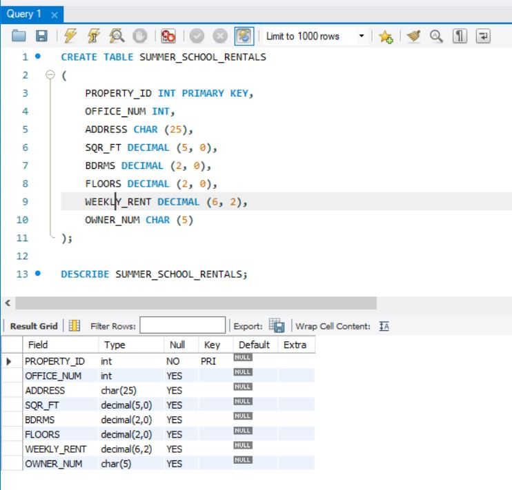


**Question 2**: Add the following row to the SUMMER_SCHOOL_RENTALS table: property ID: 13; office ID: 1; address: 5867 Goodwin Ave; square feet: 1,650; bedrooms: 2; floors 1; weekly rent: 400; owner number: CO103.

**Answer**: 

<pre style="white-space: pre-wrap;">
<code>
INSERT INTO SUMMER_SCHOOL_RENTALS
	VALUES (13, 1, "5867 Goodwin Ave", 1650, 2, 1, 400, "CO103");

SELECT * 
	FROM SUMMER_SCHOOL_RENTALS;
</code>
</pre>


**Question 3**: Delete the SUMMER_SCHOOL_RENTALS table.

**Answer**: 
<pre style="white-space: pre-wrap;">
<code>
DROP TABLE SUMMER_SCHOOL_RENTALS;
</code>
</pre>

**Question 4**: Run the script file for the StayWell database to create the six tables and add records to the tables. Be sure to select the script file for the particular DBMS that you are using (MySQL, Oracle, or SQL Server). (Note: If you do not have the script files for this text, ask your instructor for assistance.)

**Answer**: 

<pre style="white-space: pre-wrap;">
<code>
------STAYWELL DATABASE---------------

-- Create STAYWELL database
DROP DATABASE IF EXISTS STAYWELL;
CREATE DATABASE STAYWELL;
USE STAYWELL;

-----Table 2: OFFICE TABLE -------------

-- Create OFFICE table
DROP TABLE IF EXISTS OFFICE;
CREATE TABLE OFFICE 
(
	OFFICE_NUM INT PRIMARY KEY,
    OFFICE_NAME VARCHAR(50) NOT NULL,
    ADDRESS VARCHAR(100) NOT NULL,
    AREA VARCHAR(50) NOT NULL,
    CITY VARCHAR(20) NOT NULL,
    STATE CHAR(2) NOT NULL,
    ZIP_CODE CHAR(5) NOT NULL
);

-- Display the structure of the OFFICE table
DESCRIBE OFFICE;

-- Add data to the OFFICE table
INSERT INTO OFFICE 
	VALUES('1','StayWell-Colombia City','1135 N. Wells Avenue','Colombia City','Seattle','WA','98118');
INSERT INTO OFFICE 
	VALUES('2','StayWell-Georgetown','986 S. Madison Rd','Georgetown','Seattle','WA','98108');
    
-- Displaying the all the data in the OFFICE table
SELECT * 
	FROM OFFICE;

---------Table 2: OWNER TABLE --------------

-- Create OWNER table
DROP TABLE IF EXISTS OWNER;
CREATE TABLE OWNER 
(
	OWNER_NUM CHAR(5) PRIMARY KEY,
    LAST_NAME VARCHAR(20) NOT NULL,
    FIRST_NAME VARCHAR(20) NOT NULL,
    ADDRESS VARCHAR(100) NOT NULL,
    CITY VARCHAR(20) NOT NULL,
    STATE CHAR(2) NOT NULL,
    ZIP_CODE CHAR(5) NOT NULL
);

-- Display the structure of the OWNER table
DESCRIBE OWNER;

-- Add data to the OWNER table
INSERT INTO OWNER 
	VALUES('MO100','Moore','Elle-May','8006 W. Newport Ave.','Reno','NV','89508');
INSERT INTO OWNER 
	VALUES('PA101','Patel','Makesh','7337 Sheffield St.','Seattle','WA','98119');
INSERT INTO OWNER 
	VALUES('AK102','Aksoy','Ceyda','411 Griffin Rd.','Seattle','WA','98131');
INSERT INTO OWNER 
	VALUES('CO103','Cole','Meerab','9486 Circle Ave.','Olympia','WA','98506');
INSERT INTO OWNER 
	VALUES('KO104','Kowalczyk','Jakub','7431 S. Bishop St.','Bellingham','WA','98226');
INSERT INTO OWNER 
	VALUES('SI105','Sims','Haydon','527 Primrose Rd.','Portland','OR','97203');
INSERT INTO OWNER 
	VALUES('BU106','Burke','Ernest','613 Old Pleasant St.','Twin Falls','ID','83303');
INSERT INTO OWNER 
	VALUES('RE107','Redman','Seth','7681 Fordham St.','Seattle','WA','98119');
INSERT INTO OWNER 
	VALUES('LO108','Lopez','Janine','9856 Pumpkin Hill Ln.','Everett','WA','98213');
INSERT INTO OWNER 
	VALUES('BI109','Bianchi','Nicole','7990 Willow Dr.','New York','NY','10005');
INSERT INTO OWNER 
	VALUES('JO110','Jones','Ammarah','730 Military Ave.','Seattle','WA','98126');
    

-- Displaying the all the data in the OWNER table
SELECT * 
	FROM OWNER;

--------Table 3: PROPERTY TABLE ------------

-- Create PROPERTY table
DROP TABLE IF EXISTS PROPERTY;
CREATE TABLE PROPERTY 
(
    PROPERTY_ID INT PRIMARY KEY,
    OFFICE_NUM INT NOT NULL,
    ADDRESS VARCHAR(100) NOT NULL,
    SQR_FT INT NOT NULL,
    BDRMS INT NOT NULL,
    FLOORS INT NOT NULL,
    MONTHLY_RENT INT NOT NULL,
    OWNER_NUM CHAR(5) NOT NULL
);

-- Display the structure of the PROPERTY table
DESCRIBE PROPERTY;

 --Add data to the PROPERTY table
INSERT INTO PROPERTY 
	VALUES('1','1','30 West Thomas Rd.','1600','3','1',1400,'BU106');
INSERT INTO PROPERTY 
	VALUES('2','1','782 Queen Ln.','2100','4','2',1900,'AK102');
INSERT INTO PROPERTY 
	VALUES('3','1','9800 Sunbeam Ave.','1005','2','1',1200,'BI109');
INSERT INTO PROPERTY 
	VALUES('4','1','105 North Illinois Rd.','1750','3','1',1650,'KO104');
INSERT INTO PROPERTY 
	VALUES('5','1','887 Vine Rd.','1125','2','1',1160,'SI105');
INSERT INTO PROPERTY 
	VALUES('6','1','8 Laurel Dr.','2125','4','2',2050,'MO100');
INSERT INTO PROPERTY 
	VALUES('7','2','447 Goldfield St.','1675','3','2',1700,'CO103');
INSERT INTO PROPERTY 
	VALUES('8','2','594 Leatherwood Dr.','2700','5','2',2750,'KO104');
INSERT INTO PROPERTY 
	VALUES('9','2','504 Windsor Ave.','700','2','1',1050,'PA101');
INSERT INTO PROPERTY 
	VALUES('10','2','891 Alton Dr.','1300','3','1',1600,'LO108');
INSERT INTO PROPERTY 
	VALUES('11','2','9531 Sherwood Rd.','1075','2','1',1100,'JO110');
INSERT INTO PROPERTY 
	VALUES('12','2','2 Bow Ridge Ave.','1400','3','2',1700,'RE107');
    
-- Displaying the all the data in the PROPERTY table
SELECT * 
	FROM PROPERTY;
    
-------Table 4: SERVICE_CATEGORY TABLE -----------

-- Create SERVICE_CATEGORY table
DROP TABLE IF EXISTS SERVICE_CATEGORY;
CREATE TABLE SERVICE_CATEGORY 
(
	CATEGORY_NUM INT PRIMARY KEY,
    CATEGORY_DESCRIPTION VARCHAR(100) NOT NULL
);

-- Display the structure of the SERVICE_CATEGORY table
DESCRIBE SERVICE_CATEGORY;

-- Add data to the SERVICE_CATEGORY table
INSERT INTO SERVICE_CATEGORY 
	VALUES('1','Plumbing');
INSERT INTO SERVICE_CATEGORY 
	VALUES('2','Heating');
INSERT INTO SERVICE_CATEGORY 
	VALUES('3','Painting');
INSERT INTO SERVICE_CATEGORY 
	VALUES('4','Electrical Systems');
INSERT INTO SERVICE_CATEGORY 
	VALUES('5','Carpentry');
INSERT INTO SERVICE_CATEGORY 
	VALUES('6','Furniture replacement');
    
-- Displaying the all the data in the SERVICE_CATEGORY table
SELECT * 
	FROM SERVICE_CATEGORY;
    
-----Table 5: SERVICE_REQUEST TABLE -------------

-- Create SERVICE_REQUEST table
DROP TABLE IF EXISTS SERVICE_REQUEST;
CREATE TABLE SERVICE_REQUEST 
(
    SERVICE_ID INT PRIMARY KEY,
    PROPERTY_ID INT NOT NULL,
    CATEGORY_NUMBER INT NOT NULL,
    OFFICE_ID INT NOT NULL,
    DESCRIPTION VARCHAR(200) NOT NULL,
    STATUS VARCHAR(200) NOT NULL,
    EST_HOURS INT NOT NULL,
    SPENT_HOURS INT NOT NULL,
    NEXT_SERVICE_DATE DATE
);

-- Display the structure of the SERVICE_REQUEST table
DESCRIBE SERVICE_REQUEST;

-- Add data to the SERVICE_REQUEST table
INSERT INTO SERVICE_REQUEST 
	VALUES('1','11','2','2','The second bedroom upstairs is not heating up at night.','Problem has been confirmed. central heating engineer has been scheduled. ','2','1','2019-11-01');
INSERT INTO SERVICE_REQUEST 
	VALUES('2','1','4','1','A new strip light is needed for the kitchen.','Scheduled','1','0','2019-10-2');
INSERT INTO SERVICE_REQUEST 
	VALUES('3','6','5','1','The bathroom door does not close properly.','Service rep has confirmed issue. Scheduled to be refitted.','3','1','2019-11-09');
INSERT INTO SERVICE_REQUEST 
	VALUES('4','2','4','1','New outlet has been requested for the first upstairs bedroom. (There is currently no outlet).','Scheduled','1','0','2019-10-02');
INSERT INTO SERVICE_REQUEST 
	VALUES('5','8','3','2','New paint job requested for the common area (lounge). ','Open','10','0',NULL);
INSERT INTO SERVICE_REQUEST 
	VALUES('6','4','1 ','1','Shower is dripping when not in use.','Problem confirmed. Plumber has been scheduled.','4','2','2019-10-07');
INSERT INTO SERVICE_REQUEST 
	VALUES('7','2','2','1','Heating unit in the entrance smells like it’s burning.','Service rep confirmed the issue to be dust in the heating unit. To be cleaned.  ','1','0','2019-10-09');
INSERT INTO SERVICE_REQUEST 
	VALUES('8','9','1','2','Kitchen sink does not drain properly. ','Problem confirmed. Plumber scheduled.','6','2','2019-11-12');
INSERT INTO SERVICE_REQUEST 
	VALUES('9','12','6','2','New sofa requested.','Open','2','0',NULL);

-- Displaying the all the data in the SERVICE_REQUEST table
SELECT * 
	FROM SERVICE_REQUEST;

------Table 6: RESIDENTS TABLE ---------------

-- Create RESIDENTS table
DROP TABLE IF EXISTS RESIDENTS;
CREATE TABLE RESIDENTS 
(
    RESIDENT_ID INT PRIMARY KEY,
    FIRST_NAME VARCHAR(20) NOT NULL,
    SURNAME VARCHAR(20) NOT NULL,
    PROPERTY_ID INT NOT NULL
);

-- Display the structure of the RESIDENTS table
DESCRIBE RESIDENTS;

-- Add data to the RESIDENTS table
INSERT INTO RESIDENTS 
	VALUES('1','Albie ','O’Ryan','1');
INSERT INTO RESIDENTS 
	VALUES('2','Tariq ','Khan','1');
INSERT INTO RESIDENTS 
	VALUES('3','Ismail ','Salib','1');
INSERT INTO RESIDENTS 
	VALUES('4','Callen ','Beck','2');
INSERT INTO RESIDENTS 
	VALUES('5','Milosz ','Polansky','2');
INSERT INTO RESIDENTS 
	VALUES('6','Ashanti ','Lucas','2');
INSERT INTO RESIDENTS 
	VALUES('7','Randy ','Woodrue','2');
INSERT INTO RESIDENTS 
	VALUES('8','Aislinn ','Lawrence','3');
INSERT INTO RESIDENTS 
	VALUES('9','Monique ','French','3');
INSERT INTO RESIDENTS 
	VALUES('10','Amara ','Dejsuwan','4');
INSERT INTO RESIDENTS 
	VALUES('12','Rosalie ','Blackmore','4');
INSERT INTO RESIDENTS 
	VALUES('13','Carina ','Britton','4');
INSERT INTO RESIDENTS 
	VALUES('14','Valentino ','Ortega','5');
INSERT INTO RESIDENTS 
	VALUES('15','Kaylem ','Kent','5');
INSERT INTO RESIDENTS 
	VALUES('16','Alessia ','Wagner','6');
INSERT INTO RESIDENTS 
	VALUES('17','Tyrone ','Galvan','6');
INSERT INTO RESIDENTS 
	VALUES('18','Constance ','Fleming','6');
INSERT INTO RESIDENTS
	VALUES('19','Eamonn ','Bain','6');
INSERT INTO RESIDENTS 
	VALUES('20','Misbah ','Yacob','7');
INSERT INTO RESIDENTS 
	VALUES('21','Gianluca ','Esposito','7');
INSERT INTO RESIDENTS 
	VALUES('22','Elinor ','Lake','7');
INSERT INTO RESIDENTS 
	VALUES('23','Ray ','Rosas','8');
INSERT INTO RESIDENTS 
	VALUES('24','Damon ','Caldwell','8');
INSERT INTO RESIDENTS 
	VALUES('25','Dawood ','Busby','8');
INSERT INTO RESIDENTS 
	VALUES('26','Dora ','Harris','8');
INSERT INTO RESIDENTS 
	VALUES('27','Leroy ','Stokes','8');
INSERT INTO RESIDENTS 
	VALUES('28','Tamia ','Hess','9');
INSERT INTO RESIDENTS 
	VALUES('29','Amelia ','Sanders','9');
INSERT INTO RESIDENTS 
	VALUES('30','Zarah ','Byers','10');
INSERT INTO RESIDENTS 
	VALUES('31','Sara ','Farrow','10');
INSERT INTO RESIDENTS 
	VALUES('32','Delilah ','Roy','10');
INSERT INTO RESIDENTS 
	VALUES('33','Dougie ','McDaniel','11');
INSERT INTO RESIDENTS 
	VALUES('34','Tahir ','Halabi','11');
INSERT INTO RESIDENTS 
	VALUES('35','Mila ','Zhikin','12');
INSERT INTO RESIDENTS 
	VALUES('36','Glenn ','Donovan','12');
INSERT INTO RESIDENTS 
	VALUES('37','Zayn ','Fowler','12');

-- Displaying the all the data in the SERVICE_REQUEST table
SELECT * 
	FROM RESIDENTS;
</code>
</pre>

**Question 5**: Confirm that you have created the tables correctly by describing each table and comparing the results to Figures 3-48.

**Answer**: 

<pre style="white-space: pre-wrap;">
<code>
-- Display the structure of the OFFICE table
DESCRIBE OFFICE;

-- Display the structure of the OWNER table
DESCRIBE OWNER;

-- Display the structure of the PROPERTY table
DESCRIBE PROPERTY;

-- Display the structure of the SERVICE_CATEGORY table
DESCRIBE SERVICE_CATEGORY;

-- Display the structure of the SERVICE_REQUEST table
DESCRIBE SERVICE_REQUEST;

-- Display the structure of the RESIDENTS table
DESCRIBE RESIDENTS;
</code>
</pre>

**Question 6**: Confirm that you have added all data correctly by viewing the data in each table and comparing the results to Figures 1-4 through 1-9 in Module 1.

**Answer**: 

<pre style="white-space: pre-wrap;">
<code>
-- Displaying the all the data in the OFFICE table
SELECT * 
	FROM OFFICE;

-- Displaying the all the data in the OWNER table
SELECT * 
	FROM OWNER;

-- Displaying the all the data in the PROPERTY table
SELECT * 
	FROM PROPERTY;

-- Displaying the all the data in the SERVICE_CATEGORY table
SELECT * 
	FROM SERVICE_CATEGORY;

-- Displaying the all the data in the SERVICE_REQUEST table
SELECT * 
	FROM SERVICE_REQUEST;

-- Displaying the all the data in the SERVICE_REQUEST table
SELECT * 
	FROM RESIDENTS;
</code>
</pre>


##### Critical Thinking
1. The SERVICE_REQUEST table uses the CHAR data type for the DESCRIPTION and STATUS fields. Is there an alternate data type that could be used to store the values in these fields? Justify your reason for choosing an alternate data type or for leaving the data type as CHAR.

**Answer:**
- The alternate data types for the DESCRIPTION and STATUS fields should be VARCHAR(255) because the each they have variable lengths.


## MODULE 4: SINGLE-TABLE QUERIES

### INTRODUCTION

- In this module, you learn about the SQL SELECT command that is used to retrieve data in a database.
- You examine ways to sort data and use SQL functions to count rows and calculate totals.
- You also learn about a special feature of SQL that lets you nest SELECT commands by placing one SELECT command inside another.
- Finally, you learn how to group rows that have matching values in a column.

### CONSTRUCTING SIMPLE QUERIES

- One of the most important features of a DBMS is its ability to answer a wide variety of questions concerning the data in a database. When you need to find data that answers a specific question, you use a query. A **query** is a question represented in a way that the DBMS can understand.
- In SQL, you use the SELECT command to query a database. The basic form of the
SELECT command is SELECT-FROM-WHERE. After you type the word SELECT, you list
the columns that you want to include in the query results. This portion of the command is called the **SELECT clause**. Next, you type the word FROM followed by the name of the table that contains the data you need to query. This portion of the command is called the **FROM clause**. Finally, after the word WHERE, you list any conditions (restrictions) that apply to the data you want to retrieve. For example, when you need to retrieve the rows for only those customers with credit limits of $750, include a condition in the WHERE clause specifying that the value in the CREDIT_LIMIT column must be $750 (CREDIT_LIMIT = 750).
- There are no special formatting rules in SQL. In this text, the FROM clause and the WHERE clause (when it is used) appear on separate lines only to make the commands more readable and understandable.

#### Retrieving Certain Columns and All Rows

- You can write a command to retrieve specified columns and all rows from a table, as illustrated in Example 1.

**EXAMPLE 1: List the number, first name, last name, and balance for all customers.**
- Because you need to list all customers, the WHERE clause is unnecessary; you do not need to put any restrictions on the data to retrieve. You list the columns to be included (CUST_ID, FIRST_NAME, LAST_NAME, and BALANCE) in the SELECT clause and the name of the table (CUSTOMER) in the FROM clause. Type a semicolon to indicate the end of the command. The query and its results appear in Figure 4-1.


> **HELPFUL HINT:**
> - Notice in Figure 4-1 the dataset that was returned contained the rows you expected, but also returned a row of null values. Because MySQL Workbench is a very powerful tool, this row of null values is for you to enter an additional row of data. You could then create a new dataset to be used in the database. If you were using the MySQL Command Client and operating at a command prompt, this would not occur. MySQL Workbench was chosen to demonstrate the execution of the SQL commands due to its graphical interface.

> **HELPFUL HINT:**
> - During execution of a query in MySQL Workbench, the query is automatically limited to producing 1000 rows by default. This setting can be modified within the SQL editor preferences that can be found in the documentation if you prefer. The query results shown within this text include all results when possible due to their limited size, so there is no need to modify this preference.

> **HELPFUL HINT:**
> - You may change the size of output pane, and results grid, to accommodate your query results. To change the size of the area, use the vertical resize pointer that separates the two areas. For example, if you hover between the query pane and the output pane, the vertical resize pointer will appear, allowing you to move the border between the two areas vertically. It may be cumbersome for you to resize the panes each time to look exactly like the one in the text, so consider using the vertical scroll bar within the results grid.

#### Retrieving All Columns and All Rows

- You can use the same type of command illustrated in Example 1 to retrieve all columns and all rows from a table. As Example 2 illustrates, however, you can use a shortcut to accomplish this task.

**EXAMPLE 2: List the complete ITEM table.**

- Instead of including every column in the SELECT clause, you can use an asterisk (*) to indicate that you want to include all columns. The result lists all columns in the order in which you described them to the DBMS when you created the table. If you want the columns listed in a different order, type the column names in the order in which you want them to appear in the query results. In this case, assuming that the default order is appropriate, you can use the query shown in Figure 4-2 to display the complete ITEM table. This is similar to how you displayed the contents of the SALES_REP table in Figures 3-31 and 3-32 in Module 3.


#### Using a WHERE Clause

- When you need to retrieve rows that satisfy some condition, you include a WHERE clause in the SELECT command, as shown in Example 3.

**EXAMPLE 3: What is the last name of the customer with the customer ID 125?**

- You can use a WHERE clause to restrict the query results to customer number 125, as shown in Figure 4-3. Because CUST_ID is a character column, the value 125 is enclosed in single quotation marks. In addition, because the CUST_ID column is the primary key of the CUSTOMER table, there can be only one customer whose number matches the number in the WHERE clause.


- The condition in the preceding WHERE clause is called a **simple condition**. A simple condition has the form column name, comparison operator, and then either another column name or a value. Figure 4-4 lists the comparison operators that you can use in SQL.


**EXAMPLE 4: Find the last name of each customer located in the city Cody.**

- The only difference between this example and the previous one is that in Example 3, there could only be one row in the answer because the condition involved the table’s primary key. In Example 4, the condition involves a column that is not the table’s primary key. Because there is more than one customer located in the city of Cody, the results can and do contain more than one row, as shown in Figure 4-5.


**EXAMPLE 5: Find first name, last name, balance, and credit limit for all customers with balances that exceed their credit limits.**

- A simple condition can also compare the values stored in two columns. In Figure 4-6, the WHERE clause includes a comparison operator that selects only those rows in which the balance is greater than the credit limit.


#### Using Compound Conditions

- The conditions you have seen so far are called simple conditions. Examples 6, 7, and 8 require compound conditions. You form a compound condition by connecting two or more simple conditions with the `AND`, `OR`, and `NOT` operators. When the AND operator connects simple conditions, all the simple conditions must be true for the compound condition to be true. When the OR operator connects the simple conditions, the compound condition will be true whenever any one of the simple conditions is true. Preceding a condition by the NOT operator reverses the truth of the original condition. For example, if the original condition is true, the new condition will be false; if the original condition is false, the new one will be true.

**EXAMPLE 6: List the descriptions of all items that are stored in location B and for which there are more than 15 units on hand.**

- In Example 6, you need to retrieve those items that meet both conditions—the location is equal to B and the number of units on hand is greater than 15.
- To find the answer, you form a compound condition using the AND operator, as shown in Figure 4-7. The query examines the data in the ITEM table and lists the items that are stored in location B and for which there are more than 15 units on hand. When a WHERE clause uses the AND operator to connect simple conditions, it also is called an **AND condition**.

> **HELPFUL HINT**
> - You may have noticed the word DESCRIPTION is not blue in the command in Figure 4-7; however, it is blue in the screen shot of the results. The word DESCRIPTION was added to the keyword list in version 8.0.4 of MySQL; however, it is a non-reserved keyword and can be used.


- For readability, each of the simple conditions in the query shown in Figure 4-7 appears on a separate line. Some people prefer to put the conditions on the same line with parentheses around each simple condition, as shown in Figure 4-8. These two methods accomplish the same thing. In this text, simple conditions within a compound condition appear on the same line with parentheses around each simple condition.


> **HELPFUL HINT**
> - Notice that the simple conditions in the previous example are contained within parentheses. Although not necessary for the condition, it does make the condition more readable and easier to identify the simple conditions comprising the compound condition. As mentioned in a previous module, proper indenting also makes the command much more readable. Some coders like to also add a set of parentheses surrounding the entire compound condition, with the simple conditions also in parentheses. Just as in mathematical equations, the inner parentheses are evaluated first and helps to force proper interpretation of the condition. Additional parentheses can be helpful when you have very complicated compound conditions.

**EXAMPLE 7: List the descriptions of all items that are stored in location B or for which there are more than 15 units on hand.**

- In Example 7, you need to retrieve descriptions for those items for which the location is equal to B, or the number of units on hand is greater than 15, or both. To do this, you form a compound condition using the OR operator, as shown in Figure 4-9. When a WHERE clause uses the OR operator to connect simple conditions, it also is called an **OR condition**.


**EXAMPLE 8: List the descriptions of all items that are not stored in location B.**

- For Example 8, you could use a simple condition and the not equal to operator (WHERE LOCATION < > "B"). As an alternative, you could use the EQUAL operator (5) in the condition and precede the entire condition with the NOT operator, as shown in Figure 4-10. When a WHERE clause uses the NOT operator to connect simple conditions, it also is called a **NOT condition**. You do not need to enclose the condition LOCATION 5 "B" in parentheses; however, doing so makes the command more readable.


#### Using the BETWEEN Operator

Example 9 requires a compound condition to determine the answer.

**EXAMPLE 9: List the customer ID, first name, last name, and balance of all customers with balances greater than or equal to $125 and less than or equal to $250.**

- You can use a WHERE clause and the AND operator, as shown in Figure 4-11, to retrieve the data.

> **HELPFUL HINT**
> - In SQL, numbers included in queries are entered without extra symbols, such as dollar signs and commas.


- An alternative to this approach uses the BETWEEN operator, as shown in Figure 4-12. The BETWEEN operator lets you specify a range of values in a condition.


- The BETWEEN operator is inclusive, meaning that the query selects a value equal to either value in the condition and in the range of the values. In the clause BETWEEN 125 AND 250, for example, values of 125 through 250 would make the condition true. You can use the BETWEEN operator in MySQL, Oracle, and SQL Server.
- The BETWEEN operator is not an essential feature of SQL; you have just seen that you can obtain the same result without it. Using the BETWEEN operator, however, does make certain SELECT commands simpler to construct.

#### Using Computed Columns

- You can perform computations using SQL queries. A computed column does not exist in the database but can be computed using data in the existing columns. Computations can involve any arithmetic operator shown in Figure 4-13.


**EXAMPLE 10: Find the number, first and last name, and available credit (the credit limit minus the balance) for each customer.**

- There is no column in the KimTay Pet Supplies database that stores a customer’s available credit, but you can compute the available credit using the CREDIT_LIMIT and BALANCE columns. To compute the available credit, you use the expression CREDIT_LIMIT - BALANCE, as shown in Figure 4-14.


- You also can assign a name, or alias, to a computed column by following the computation with the word AS and the desired name. The command shown in Figure 4-15, for example, assigns the name AVAILABLE_CREDIT to the computed column using the AS keyword. Giving the column a descriptive name, such as AVAILABLE_CREDIT, is much more readable and easier to understand than using CREDIT_LIMIT – BALANCE. Because this calculation is very simple, using the calculation as the heading for the column is understandable; however, if the calculation were much more complicated and the column headings were not named accordingly, it could become quite difficult to understand.


> **HELPFUL HINT**
> - You can use names containing spaces following the word AS. In many SQL implementations, including MySQL and Oracle, you do so by enclosing the name in quotation marks (for example, AS "AVAILABLE CREDIT"). Other SQL implementations require you to enclose the name in other special characters. For example, in SQL Server, you can use either quotation marks or square brackets (AS [AVAILABLE CREDIT]).

**EXAMPLE 11: Find the customer ID, first name, last name, and available credit for each customer with at least $400 of available credit.**

- You also can use computed columns in comparisons, as shown in Figure 4-16. Notice it is not necessary to place parentheses around the computation (CREDIT_LIMIT – BALANCE); however, it does make the statement more readable.


#### Using the LIKE Operator

- In most cases, the conditions in WHERE clauses involve exact matches, such as retrieving rows for each customer located in the city of Cody. In some cases, however, exact matches do not work. For example, you might know that the desired value contains only a certain collection of characters. In such cases, you use the LIKE operator with a wildcard symbol, as shown in Example 12. Rather than testing for equality, the **LIKE** operator uses one or more wildcard characters to test for a pattern match.

**EXAMPLE 12: List the customer ID, first name, last name, and complete address of each customer located at an address that contains the letters "Rock."**

- All you know is that the addresses you want contain a certain collection of characters ("Rock") somewhere in the ADDRESS column, but you do not know where. In SQL, for MySQL, Oracle, SQL Server, the percent sign (%) is used as a wildcard to represent any collection of characters. As shown in Figure 4-17, the condition LIKE "%Rock%" retrieves information for each customer whose address contains some collection of characters, followed by the letters "Rock," followed potentially by some additional characters. Note that this query also would retrieve information for a customer whose address is "783 Rockabilly" because "Rockabilly" also contains the letters "Rock." Notice the results list two different occurrences where "Rock" is listed somewhere in the address of the
customer.


- Another wildcard symbol in SQL is the underscore (_), which represents any individual character. For example, "T_m" represents the letter "T" followed by any single character, followed by the letter "m," and would retrieve rows that include words such as Tim, Tom, or T3m.

> HELPFUL HINT
> In a large database, you should use wildcards only when absolutely necessary. Searches involving wildcards can be extremely slow to process.

#### Using the IN Operator

- An **IN** clause, which consists of the IN operator followed by a collection of values, provides a concise way of phrasing certain conditions, as Example 13 illustrates. You will see another use for the IN clause in more complex examples later in this module.

**EXAMPLE 13: List the customer ID, first name, last name, and credit limit for each customer with a credit limit of $500, $750, or $1,000.**

- In this query, you can use an IN clause to determine whether a credit limit is $500, $750, or $1,000. You could obtain the same answer by using the condition WHERE (CREDIT_LIMIT = 500) OR (CREDIT_LIMIT = 750) OR (CREDIT_LIMIT = 1000). The approach shown in Figure 4-18 is simpler because the IN clause contains a collection of values: 500, 750, and 1000. The condition is true for those rows in which the value in the CREDIT_LIMIT column is in this collection.


### SORTING

- Recall that the order of rows in a table is immaterial to the DBMS. From a practical standpoint, this means that when you query a relational database, there is no defined order in which to display the results. Rows might be displayed in the order in which the data was originally entered, but even this is not certain. If the order in which the data is displayed is important, you can specifically request that the results appear in a desired order. In SQL, you specify the results order by using the ORDER BY clause.

#### Using the ORDER BY Clause

- You use the ORDER BY clause to list data in a specific order, as shown in Example 14.

**EXAMPLE 14: List the customer ID, first name, last name, and balance of each customer. Order (sort) the output in ascending (increasing) order by balance.**

- The column on which to sort data is called a sort key or simply a key. In Example 14, you need to order the output by balance, so the sort key is the BALANCE column. To sort the output, use an ORDER BY clause followed by the sort key. If you do not specify a sort order, the default is ascending. The query appears in Figure 4-19.


#### Additional Sorting Options

- Sometimes you might need to sort data using more than one key, as shown in
Example 15.

**EXAMPLE 15: List the customer ID, first name, last name, and credit limit of each customer. Order the customers by last name within descending credit limit. (In other words, first sort the customers by credit limit in descending order. Within each group of customers that have a common credit limit, sort the customers by last name in ascending order.)**

- Example 15 involves two new ideas: sorting on multiple keys — CREDIT_LIMIT and LAST_NAME — and sorting one of the keys in descending order. When you need to sort data on two columns, the more important column (in this case, CREDIT_LIMIT) is called the major sort key (or the primary sort key) and the less important column (in this case, LAST_NAME) is called the minor sort key (or the secondary sort key). To sort on multiple keys, you list the keys in order of importance in the ORDER BY clause. To sort in descending order, you follow the name of the sort key with the DESC operator, as shown in Figure 4-20.


### USING FUNCTIONS

- SQL uses special functions, called aggregate functions, to calculate sums, averages, counts, maximum values, and minimum values. These functions apply to groups of rows. They could apply to all the rows in a table (for example, calculating the average balance of all customers). They also could apply to those rows satisfying some particular condition (for example, the average balance of all customers of sales rep 10). The descriptions of the
aggregate functions appear in Figure 4-21.


#### Using the COUNT Function

- The **COUNT** function, as illustrated in Example 16, counts the number of rows in a table.

**EXAMPLE 16: How many items are in the category DOG?**

- For this query, you need to determine the total number of rows in the ITEM table with the value DOG in the CATEGORY column. You use the COUNT function to assist you. You could count the item numbers in the query results, or the number of descriptions, or the number of entries in any other column. It does not matter which column you choose because all columns should provide the same answer. Rather than arbitrarily selecting one column, most SQL implementations let you use the asterisk (*) to represent any column, as shown in Figure 4-22.


- You also can count the number of rows in a query by selecting a specific column instead of using the asterisk, such as the ITEM_ID column, as show in Figure 4-23. This produces the same result as the command in Figure 4-22.


#### Using the SUM Function

- If you need to calculate the total of all customers’ balances, you can use the SUM function, as illustrated in Example 17.

**EXAMPLE 17: Find the total number of KimTay Pet Supplies customers and the total of their balances.**

- When you use the SUM function, you must specify the column to total, and the column’s data type must be numeric. (How could you calculate a sum of names or addresses?) Figure 4-24 shows the query and the results.


#### Using the AVG, MAX, and MIN Functions

- Using the AVG, MAX, and MIN functions is similar to using SUM, except that different statistics are calculated. AVG calculates the average value in a numeric range, MAX calculates the maximum value in a numeric range, and MIN calculates the minimum value in a numeric range.

**EXAMPLE 18: Find the sum of all balances, the average balance, the maximum balance, and the minimum balance of all KimTay Pet Supplies customers.**

- Figure 4-25 shows the query and the results.


> **HELPFUL HINT**
> - When you use the SUM, AVG, MAX, or MIN functions, SQL ignores any null value(s) in the column and eliminates them from the computations.
> - Null values in numeric columns can produce strange results when statistics are computed. For example, suppose the BALANCE column accepts null values, there are currently four customers in the CUSTOMER table, and their respective balances are $100, $200, $300, and null (unknown). When you calculate the average balance, SQL ignores the null value and obtains a result of $200 (($100 + $200 + $300) / 3). Similarly, when you calculate the total of the balances, SQL ignores the null value and calculates a total of $600. When you count the number of customers in the table, however, SQL includes the row containing the null value, and the result is 4. Thus, the total of the balances ($600) divided by the number of customers (4) results in an average balance of $150. Being aware of the details of how functions process their data prevents unexpected results.

> **HELPFUL HINT**
> - You can use an AS clause with a function. For example, the following command computes a sum of the BALANCE column and displays the column heading as TOTAL_BALANCE in the query results:

<pre style="white-space: pre-wrap">
<code>
SELECT SUM(BALANCE) AS TOTAL_BALANCE
    FROM CUSTOMER;
</code>
</pre>

#### Using the DISTINCT Operator

- In some situations, the DISTINCT operator is useful when used in conjunction with the COUNT function because it eliminates duplicate values in the query results. Examples 19 and 20 illustrate the most common uses of the DISTINCT operator.

**EXAMPLE 19: Find the customer ID of each customer that currently has an invoice (that is, an invoice currently in the INVOICES table).**

- The command seems fairly simple. When a customer currently has an invoice, there must be at least one row in the INVOICES table on which that customer’s ID appears. You could use the query shown in Figure 4-26 to find the customer IDs with invoices.


- Notice that customer IDs 125 and 435 each appear more than once in the results; this means that both customers currently have more than one invoice in the INVOICES table. Suppose you want to list each customer ID only once, as illustrated in Example 20.

**EXAMPLE 20: Find the number of each customer that currently has an open order. List each customer only once.**


- You might wonder about the relationship between COUNT and DISTINCT, because both involve counting rows. Example 21 identifies the differences.

**EXAMPLE 21: Count the number of customers that currently have invoices.**

- The query shown in Figure 4-28 counts the number of customers using the CUST_ID column in the INVOICES table.


> **Q & A**
> **Question**: What is wrong with the query results shown in Figure 4-28?
> **Answer**: The answer, 8, is the result of counting the customers that have invoices multiple times—once for each separate invoice currently on file. The result counts each customer ID and does not eliminate duplicate customer numbers to provide an accurate count of the number of customers.

- Some SQL implementations, including MySQL, Oracle, and SQL Server, allow you to use the DISTINCT operator to calculate the correct count, as shown in Figure 4-29. Notice the results show 6 customer ID values that have invoices, excluding duplicates.


### NESTING QUERIES

- Sometimes obtaining the results you need requires two or more steps, as shown in the next two examples.

**EXAMPLE 22: List the item ID of each item in category HOR.**

- The command to obtain the results are shown in Figure 4-30. Notice the results show four item ID values with a category of HOR (FM23, FS39, QB92, and WB49).


**EXAMPLE 23: List the invoice numbers that contain an invoice line for an item in category HOR.**

- Example 23 asks you to find the invoice numbers in the INVOICE_LINE table that correspond to the item ID values in the results of the query used in Example 22. After viewing those results (FM23, FS39, QB92, and WB49), you can use the command shown in Figure 4-31.


#### Subqueries

- It is possible to place one query inside another. The inner query is called a subquery. The subquery is evaluated first. After the subquery has been evaluated, the outer query can use the results of the subquery to find its results, as shown in Example 24.

**EXAMPLE 24: Find the answer to Examples 22 and 23 in one step.**

- You can find the same result as in the previous two examples in a single step by using a subquery. In Figure 4-32, the command shown in parentheses is the subquery. This subquery is evaluated first, producing a temporary table. The temporary table is used only to evaluate the query—it is not available to the user or displayed—and it is deleted after the evaluation of the query is complete. In this example, the temporary table has only a single column (ITEM_ID) and four rows (FM23, FS39, QB92, and WB49). The outer query is evaluated next. In this case, the outer query retrieves the invoice number on every row in the INVOICE_LINE table for which the item ID is in the results of the subquery. Because that table contains only the item numbers in category HOR, the results display the desired list of invoice numbers. The two items happen to be on the same invoice.


- Figure 4-32 shows duplicate invoice numbers in the results. To eliminate this duplication, you can use the DISTINCT operator as shown in Figure 4-33.


> **HELPFUL HINT**
> Notice the indentions with the command for readability. As previously mentioned, there are many ways to indent code for better readability. This is the method this text uses, with the beginning and ending parentheses for the subquery aligning vertically.

**EXAMPLE 25: List the customer ID, first name, last name, and balance for each customer whose balance exceeds the average balance of all customers.**

- In this case, you use a subquery to obtain the average balance. Because the subquery produces a single number (the average balance of all customers), each individual customer’s balance is compared to this number, and the row for a customer is selected when the customer’s balance is greater than the average balance. The query is shown in Figure 4-34. Notice the results show five customers whose balance exceeds the average balance for all customers.


> HELPFUL HINT
> You cannot use the condition BALANCE > AVG(BALANCE) in the WHERE clause; you must use a subquery to obtain the average balance. Then you can use the results of the subquery in a condition, as illustrated in Figure 4-34.

### GROUPING

- **Grouping** creates groups of rows that share some common characteristic. If you group customers by credit limit, for example, the first group contains customers with $250 credit limits, the second group contains customers with $500 credit limits, and so on. If, on the other hand, you group customers by sales rep ID, the first group contains those customers represented by sales rep 05, the second group contains those customers represented by sales rep 10, and the third group contains those customers represented by sales rep 15.
- When you group rows, any calculations indicated in the SELECT command are performed for the entire group. For example, if you group customers by sales rep ID and the query requests the average balance, the results include the average balance for the group of customers represented by rep 05, the average balance for the group represented by rep 10, and the average balance for the group represented by rep 15. The following examples illustrate this process.

#### Using the GROUP BY Clause

The GROUP BY clause lets you group data on a particular column, such as REP_ID, and then calculate statistics, when desired, as shown in Example 26.

**EXAMPLE 26: For each sales rep, list the rep ID and the average balance of the rep’s customers.**

- Because you need to group customers by rep ID and then calculate the average balance for all customers in each group, you must use the GROUP BY clause. In this case, GROUP BY REP_ID puts customers with the same rep ID into separate groups. Any statistics indicated in the SELECT command are calculated for each group. It is important to note that the GROUP BY clause does not sort the data in a particular order; you must use the ORDER BY clause to sort data. Assuming that the results should be ordered by rep ID, you can use the command shown in Figure 4-35.


- When rows are grouped, one line of output is produced for each group. The only things that can be displayed are statistics calculated for the group or columns whose values are the same for all rows in a group.

> **Q & A**
> **Question**: Is it appropriate to display the rep ID in the query for Example 26?
> **Answer**: Yes, because the rep ID in one row in a group must be the same as the rep ID in any other row in the group.

> **Q & A**
> **Question**: Would it be appropriate to display a customer ID in the query for Example 26?
> **Answer**: No, because the customer ID varies on the rows in a group. (The same rep is associated with many customers.) The DBMS would not be able to determine which customer ID to display for the group, and would display an error message if you attempt to display a customer ID.

#### Using a HAVING Clause

- The HAVING clause is used to restrict the groups that are included, as shown in Example 27.

**EXAMPLE 27: Repeat the previous example, but list only those reps whose customers have an average balance greater than $100.**

- The only difference between Examples 26 and 27 is the restriction to display only those reps whose customers have an average balance greater than $100. This restriction does not apply to individual rows but rather to groups. Because the WHERE clause applies only to rows, you cannot use it to accomplish the kind of selection that is required. Fortunately, the HAVING clause does for groups what the WHERE clause does for rows. The HAVING clause limits the groups that are included in the results. In Figure 4-36, the row created for a group is displayed only when the average balance for the rows in the group is greater than $100.


#### HAVING vs. WHERE

Just as you can use the WHERE clause to limit the *rows* that are included in a query’s result, you can use the HAVING clause to limit the groups that are included. Examples 28, 29, and 30 illustrate the difference between these two clauses.

**EXAMPLE 28: List each credit limit and the number of customers having each credit limit.**

- To count the number of customers that have a given credit limit, you must group the data by credit limit, as shown in Figure 4-37.


**EXAMPLE 29: Repeat Example 28, but list only those credit limits held by more than two customers.**

- Because this condition involves a group total, the query includes a HAVING clause, as shown in Figure 4-38.


**EXAMPLE 30: List each credit limit and the number of customers of sales rep 05 that have this limit.**

- The condition involves only rows, so using the WHERE clause is appropriate, as shown in Figure 4-39.


**EXAMPLE 31: Repeat Example 30, but list only those credit limits held by fewer than two customers.**

- Because the conditions involve rows and groups, you must use both a WHERE clause and a HAVING clause, as shown in Figure 4-40.


- In Example 31, rows from the original table are evaluated only when the sales rep ID is 05. These rows then are grouped by credit limit and the count is calculated. Only groups for which the calculated count is less than two are displayed.

### NULLS

- Sometimes a condition involves a column that can accept null values, as illustrated in Example 32.

**EXAMPLE 32: List the number and name of each customer with a null (unknown) address value.**

- You might expect the condition to be something like ADDRESS 5 NULL. The correct format actually uses the IS NULL operator (ADDRESS IS NULL), as shown in Figure 4-41. To select a customer whose address is not null, use the IS NOT NULL operator (ADDRESS IS NOT NULL). In the current KimTay Pet Supplies database, no customer has a null address value; therefore, no rows are retrieved in the query results.


### SUMMARY OF SQL CLAUSES, FUNCTIONS, AND OPERATORS

- In this module, you learned how to create queries that retrieve data from a single table by constructing appropriate SELECT commands. In the next module, you learn how to create queries that retrieve data from multiple tables. The queries you created in this module used the clauses, functions, and operators shown in Figure 4-42.


### Module Summary

- The basic form of the SQL SELECT command is SELECT-FROM-WHERE. Specify the columns to be listed after the word SELECT (or type an asterisk [*] to select all columns) and then specify the table name that contains these columns after the word FROM. Optionally, you can include one or more conditions after the word WHERE.
- Simple conditions are written in the following form: column name, comparison operator, column name or value. Simple conditions can involve any of the comparison operators: 5, >, >5, <, <5, or <>.
- You can form compound conditions by combining simple conditions using the AND, OR, and NOT operators.
- Use the BETWEEN operator to indicate a range of values in a condition.
- Use computed columns in SQL commands by using arithmetic operators and writing the computation in place of a column name. You can assign a name to the computed column by following the computation with the word AS and then the desired name.
- To check for a value in a character column that is similar to a particular string of characters, use the LIKE operator. In MySQL, Oracle, and SQL Server, the percent (%) wildcard represents any collection of characters, and the underscore (_) wildcard represents any single character.
- To determine whether a column contains a value in a set of values, use the IN
operator.
- Use an ORDER BY clause to sort data. List sort keys in order of importance. To sort in descending order, follow the sort key with the DESC operator.
- SQL processes the aggregate functions COUNT, SUM, AVG, MAX, and MIN. These
calculations apply to groups of rows.
- To avoid duplicates in a query that uses an aggregate function, precede the column name with the DISTINCT operator.
- When one SQL query is placed inside another, it is called a subquery. The inner query (the subquery) is evaluated first.
- Use a GROUP BY clause to group data.
- Use a HAVING clause to restrict the output to certain groups.
- Use the IS NULL operator in a WHERE clause to find rows containing a null value in a particular column. Use the IS NOT NULL operator in a WHERE clause to find rows that do not contain a null value.

### Key Terms

aggregate functions
AND
AND condition
AS
AVG
BETWEEN
compound condition
computed column
COUNT
DESC
DISTINCT
FROM clause
GROUP BY clause
grouping
HAVING clause
IN clause
IS NOT NULL
IS NULL
key
LIKE
major sort key
MAX
MIN
minor sort key
NOT
NOT condition
OR
OR condition
ORDER BY clause
primary sort key
query
secondary sort key
SELECT clause
simple condition
sort key
subquery
SUM
WHERE clause

### Review Questions

#### Module Quiz

**Question 1.** Describe the basic form of the SQL SELECT command.
**Answer**: 
- The SQL SELECT is used to query a database, that is, ask a DBMS such MySQL a question in a way that it can understand. 
- The basic form of the SQL SELECT command is SELECT-FROM-WHERE. After you type the word SELECT, you list the columns that you want to include in the query results. This portion of the command is called the **SELECT clause**. Next, you type the word FROM followed by the name of the table that contains the data you need to query. This portion of the command is called the **FROM clause**. Finally, after the word WHERE, you list any conditions (restrictions) that apply to the data you want to retrieve. This optional portion of the command is called the **WHERE clause**. 
- For example, the following SQL SELECT command retrieve customer ID, first name, last name and credit limit for only those customers with credit limits of $750: 

<pre style="white-space: pre-wrap;">
<code>
SELECT CUST_ID, FIRST_NAME, LAST_NAME, CREDIT_LIMIT
    FROM CUSTOMER
        WHERE (CREDIT_LIMIT = 750);
</code>
</pre>

**Question 2.** How do you form a simple condition?
**Answer**:
- When you need to retrieve rows that satisfy some condition, you include a WHERE clause in the SELECT command, as shown below.

<pre style="white-space: pre-wrap;">
<code>
SELECT CUST_ID, FIRST_NAME, LAST_NAME, CREDIT_LIMIT
    FROM CUSTOMER
        WHERE (CREDIT_LIMIT = 750);
</code>
</pre>

- The condition in the preceding WHERE clause is called a simple condition. A simple condition has the form column name, comparison operator, and then either another column name or a value. The comparison operators that can be used in SQL include `=` (equal to), `>` (greater than), `<` (less than),  `>=` (greater than or equal to), `<=` (less than or equal to), and `<>` (not equal to).


**Question 3.** How do you form a compound condition?
**Answer**: 
- A compound condition can be formed by connecting two or more simple conditions with the AND, OR, and NOT operators. 
- When the AND operator connects simple conditions, all the simple conditions must be true for the compound condition to be true. For example, the following SQL SELECT command list the the item ID and descriptions of all items that are stored in location B and for which there are more than 15 units on hand.

<pre style="white-space: pre-wrap;">
<code>
SELECT ITEM_ID, DESCRIPTION
    FROM ITEM
        WHERE (LOCATION = "B") AND (ON_HAND > 15);
</code>
</pre>

**Question 4.** In SQL, which operator do you use to determine whether a value is between two other values without using an AND condition?
**Answer**:
- We use the BETWEEN operator. 
- For example, the following SQL SELECT command List the customer ID, first name, last name, and balance of all customers with balances greater than or equal to 125 dollars and less than or equal to 250 dollars.
<pre style="white-space: pre-wrap;">
<code>
SELECT CUST_ID, FIRST_NAME, LAST_NAME, BALANCE
    FROM CUSTOMER
        WHERE (BALANCE BETWEEN 125 AND 250);
</code>
</pre>

- The BETWEEN operator is inclusive, meaning that the query selects a value equal to either value in the condition and in the range of the values. In the clause BETWEEN 125 AND 250, for example, values of 125 through 250 would make the condition true.

**Question 5.** How do you use a computed column in SQL? How do you name the computed column?
**Answer**:
- We use a computed column in SQL by first computing it using data in the existing columns. 
- For example, in the CUSTOMER table in KIMTAY database, available balance column can be computed by subtracting the balance a customer has from the credit limit of the customer as shown below:

<pre style="white-space: pre-wrap;">
<code>
SELECT CUST_ID, FIRST_NAME, LAST_NAME, CREDIT_LIMIT - BALANCE
    FROM CUSTOMER;
</code>
</pre>

- We can name the computed column by by following the computation with the word AS and the desired name as shown below:

<pre style="white-space: pre-wrap;">
<code>
SELECT CUST_ID, FIRST_NAME, LAST_NAME, CREDIT_LIMIT – BALANCE AS AVAILABLE_CREDIT
    FROM CUSTOMER;
</code>
</pre>

**Question 6.** In which clause would you use a wildcard in a condition?
**Answer**:
- We would use a wildcard in a condition in the WHERE clause to retrieve rows that match a particular pattern.
- For example, the following SQL SELECT command List the customer ID, first name, last name, and complete address of each customer located at an address that contains the letters "Rock" anywhere in the address.

<pre style="white-space: pre-wrap;">
<code>
SELECT CUST_ID, FIRST_NAME, LAST_NAME, ADDRESS, CITY, STATE, POSTAL
    FROM CUSTOMER
        WHERE (ADDRESS LIKE "%Rock%");
</code>
</pre>

**Question 7.** What wildcards are available in MySQL, and what do they represent?
**Answer**:
- The percent sign (%) is used as a wildcard to represent any collection of characters. 
- For example, in the SQL SELECT command below, the condition LIKE "%Rock%" retrieves information for each customer whose address contains some collection of characters, followed by the letters "Rock," followed potentially by some additional characters.
- For example, the following SQL SELECT command List the customer ID, first name, last name, and complete address of each customer located at an address that contains the letters "Rock." Notice the results list two different occurrences where "Rock" is listed somewhere in the address of the customer.

<pre style="white-space: pre-wrap;">
<code>
SELECT CUST_ID, FIRST_NAME, LAST_NAME, ADDRESS, CITY, STATE, POSTAL
    FROM CUSTOMER
        WHERE (FIRST_NAME LIKE "T_m");
</code>
</pre>


- Another wildcard symbol in SQL is the underscore (_), which represents any individual character. 
- For example, “T_m” represents the letter “T” followed by any single character, followed by the letter "m," and would retrieve rows that include words such as Tim, Tom, or T3m.

**Question 8.** How do you determine whether a column contains one of a particular set of values without using an AND condition?
**Answer**:
- We use an IN clause, which consists of the IN operator followed by a collection of values, provides a concise way of phrasing certain conditions.
- For example, the following SQL SELECT command List the customer ID, first name, last name, and credit limit for each customer with a credit limit of $500, $750, or $1,000.

<pre style="white-space: pre-wrap;">
<code>
SELECT CUST_ID, FIRST_NAME, LAST_NAME, CREDIT_LIMIT
    FROM CUSTOMER
        WHERE (CREDIT_LIMIT IN (500, 750, 1000));
</code>
</pre>

**Question 9.** How do you sort data?
**Answer**:
- We sort data using the ORDER BY clause. 
- For example, the following SQL SELECT command list the customer ID, first name, last name, and balance of each customer, and then order (sort) the output in ascending (increasing) order by balance.

<pre style="white-space: pre-wrap;">
<code>
SELECT CUST_ID, FIRST_NAME, LAST_NAME, BALANCE
    FROM CUSTOMER
        ORDER BY BALANCE;
</code>
</pre>


**Question 10.** How do you sort data on more than one sort key? What is the more important key called? What is the less important key called?
**Answer**:

- To sort on multiple keys, you list the keys in order of importance in the ORDER BY clause.
- For example, the following SQL SELECT command list the customer ID, first name, last name, and credit limit of each customer. Order the customers by last name within descending credit limit. (In other words, first sort the customers by credit limit in descending order. Within each group of customers that have a common credit limit, sort the customers by last name in ascending order.). 

<pre style="white-space: pre-wrap;">
<code>
SELECT CUST_ID, FIRST_NAME, LAST_NAME, CREDIT_LIMIT
    FROM CUSTOMER
        ORDER BY CREDIT_LIMIT DESC, LAST_NAME;
</code>
</pre>

- When you need to sort data on two columns, the more important column (in this case, CREDIT_LIMIT) is called the major sort key (or the primary sort key) and the less important column (in this case, LAST_NAME) is called the minor sort key (or the secondary sort key).

**Question 11.** How do you sort data in descending order?
**Answer**:

- To sort the data in descending (decreasing) order, we follow the name of the sort key with the DESC operator, as shown below

<pre style="white-space: pre-wrap;">
<code>
SELECT CUST_ID, FIRST_NAME, LAST_NAME, BALANCE
    FROM CUSTOMER
        ORDER BY BALANCE DESC;
</code>
</pre>

**Question 12.** What are the SQL aggregate functions?
**Answer**:
- SQL aggregate functions are special functions that SQL used to calculate sums, averages, counts, maximum values, and minimum values. 
    - The AVG function calculates the average value in a column, 
    - The COUNT function determines the number of rows in a table,
    - The MAX function determines the maximum value in a column,
    - The MIN function determines the minimum value in a column,
    - The SUM function calculates the total of the values in a column.
- These functions apply to groups of rows. They could apply to all the rows in a table (for example calculating the average balance of all customers). They also could apply to those rows satisfying some particular condition (for example, the average balance of all customers of sales rep 10).
- For example, the following SQL SELECT command finds how many items are in the category DOG

<pre style="white-space: pre-wrap;">
<code>
SELECT COUNT(ITEM_ID)
    FROM ITEM
        WHERE (CATEGORY = "DOG");
</code>
</pre>

- For example, the following SQL SELECT command finds the total number of KimTay Pet Supplies customers, the sum of all balances, the average balance, the maximum balance, and the minimum balance of all KimTay Pet Supplies customers.

<pre style="white-space: pre-wrap;">
<code>
SELECT COUNT(CUST_ID), SUM(BALANCE), AVG(BALANCE), MAX(BALANCE), MIN(BALANCE)
    FROM CUSTOMER;
</code>
</pre>

**Question 13.** How do you avoid including duplicate values in a query’s results?
**Answer**:
- We avoid including duplicate values in a query’s results by using the DISTINCT operator.
- For example, to count the number of customers that currently have invoices, we have to use the DISTINCT operator to ensure we count only unique customer IDs in the CUST_ID column of the INVOICE table.
<pre style="white-space: pre-wrap;">
<code>
SELECT COUNT(DISTINCT CUST_ID)
    FROM INVOICES;
</code>
</pre>

**Question 14.** What is a subquery?
**Answer**:
- When one SQL query is placed inside another query, the inner query is called a subquery.
- For example, the following SQL SELECT command list the invoice numbers that contain an invoice line for an item in category HOR.

<pre style="white-space: pre-wrap;">
<code>
SELECT DISTINCT INVOICE_NUM
    FROM INVOICE_LINE
        WHERE ITEM_ID IN (SELECT ITEM_ID
                              FROM ITEM
                              WHERE (CATEGORY = "HOR"));
</code>
</pre>

**Question 15.** How do you group data in an SQL query?
**Answer**:
- We use the GROUP BY clause to group data on a particular column, such as REP_ID, and then calculate statistics, when desired. 
- For example the following SQL SELECT command lists the rep ID and the average balance of the rep’s customers, for each sales rep.

<pre style="white-space: pre-wrap;">
<code>
SELECT REP_ID, AVG(BALANCE)
    FROM CUSTOMER
        GROUP BY REP_ID
        ORDER BY REP_ID;
</code>
</pre>

**Question 16.** When grouping data in a query, how do you restrict the output to only those groups satisfying some condition?
**Answer**:
- We use the HAVING clause to restrict the groups that are included.
- For example, the following SQL SELECT command lists the rep ID and the average balance of the rep’s customers, for each sales rep whose customers have an average balance greater than $100.

<pre style="white-space: pre-wrap;">
<code>
SELECT REP_ID, AVG(BALANCE)
    FROM CUSTOMER
        GROUP BY REP_ID
        HAVING (AVG(BALANCE) > 100)
        ORDER BY REP_ID;
</code>
</pre>

**Question 17.** How do you find rows in which a particular column contains a null value?
**Answer**:
- We use IS NULL operator to find rows in which a particular column contains a null value.
- For example, the following SQL SELECT command list the number and name of each customer with a null (unknown) address value.

<pre style="white-space: pre-wrap;">
<code>
SELECT CUST_ID, FIRST_NAME, LAST_NAME
    FROM CUSTOMER
        WHERE (ADDRESS IS NULL);
</code>
</pre>

#### Critical Thinking

**Question 1.** Use the Internet to research the SQL [charlist] wildcard that is available in Oracle and SQL Server. Using the information you find, complete the following SQL command to find all cities that begin with the letters "C" or "G."
**Answer**:
- The [charlist] WILDCARDS are used to represent any single character within a charlist.
- The [^charlist] and [!charlist] WILDCARDS is used to represents any single character not in the charlist.
- For example, to find all cities that begin with the letters "C" or "G.", you will execute the following SQL SELECT command:

<pre style="white-space: pre-wrap;">
<code>
SELECT *
    FROM CUSTOMER
        WHERE CITY LIKE "[CG]%";
</code>
</pre>

**Reference**
1. Sql [charlist] wildcards - w3resource. (2024, May 22). W3resource. https://www.w3resource.com/sql/wildcards-like-operator/wildcards-charlist.php

### Case Exercises

#### KimTay Pet Supplies

- Use SQL and the KimTay Pet Supplies database (see Figure 1-2 in Module 1) to complete the following exercises. If directed to do so by your instructor, use the information provided with the Module 3 Exercises to print your output or save it to a document.

**Question 1.** List the item ID, description, and price for all items.
**Answer**:

<pre style="white-space: pre-wrap;">
<code>
SELECT ITEM_ID, DESCRIPTION, PRICE
    FROM ITEM;
</code>
</pre>


**Question 2.** List all rows and columns for the complete INVOICES table.
**Answer**:

<pre style="white-space: pre-wrap;">
<code>
SELECT *
    FROM INVOICES;
</code>
</pre>


**Question 3.** List the first and last names of customers with credit limits of $1,000 or more.
**Answer**:

<pre style="white-space: pre-wrap;">
<code>
SELECT FIRST_NAME, LAST_NAME
    FROM CUSTOMER
        WHERE (CREDIT_LIMIT >= 1000);
</code>
</pre>


**Question 4.** List the order number for each order placed by customer number 125 on 11/15/2021. (Hint: If you need help, use the discussion of the DATE data type in Figure 3-19 in Module 3.)
**Answer**:

<pre style="white-space: pre-wrap;">
<code>
SELECT INVOICE_NUM
    FROM INVOICES
        WHERE ((CUST_ID = "125") AND (INVOICE_DATE = "2021-11-15"));
</code>
</pre>


**Question 5.** List the number and name of each customer represented by sales rep 10 or sales rep 15.
**Answer**:

<pre style="white-space: pre-wrap;">
<code>
SELECT CUST_ID, FIRST_NAME, LAST_NAME
    FROM CUSTOMER
        WHERE ((REP_ID = "10") OR (REP_ID = "15"));
</code>
</pre>


**Question 6.** List the item ID and description of each item that is not in category HOR.
**Answer**:

<pre style="white-space: pre-wrap;">
<code>
SELECT ITEM_ID, DESCRIPTION
    FROM ITEM
        WHERE CATEGORY <> "HOR";
</code>
</pre>


**Question 7.** List the item ID, description, and number of units on hand for each item that has between 10 and 30 units on hand, including both 10 and 30. Provide two alternate SQL statements to produce the same results.
**Answer**:

<pre style="white-space: pre-wrap;">
<code>
SELECT ITEM_ID, DESCRIPTION, ON_HAND
    FROM ITEM
        WHERE ((ON_HAND > 10) AND (ON_HAND < 30));
</code>
</pre>


<pre style="white-space: pre-wrap;">
<code>
SELECT ITEM_ID, DESCRIPTION, ON_HAND
    FROM ITEM
        WHERE (ON_HAND BETWEEN 10 AND 30);
</code>
</pre>


**Question 8.** List the item ID, description, and on-hand value (units on hand * unit price) of each item in category CAT. (On-hand value is technically units on hand * cost, but there is no COST column in the ITEM table.) Assign the name ON_HAND_VALUE to the computed column.
**Answer**:

<pre style="white-space: pre-wrap;">
<code>
SELECT ITEM_ID, DESCRIPTION, ON_HAND * PRICE AS ON_HAND_VALUE
    FROM ITEM
        WHERE CATEGORY = 'CAT';
</code>
</pre>


**Question 9.** List the item ID, description, and on-hand value for each item where the on-hand value is at least $1,500. Assign the name ON_HAND_VALUE to the computed column.
**Answer**:

<pre style="white-space: pre-wrap;">
<code>
SELECT ITEM_ID, DESCRIPTION, ON_HAND * PRICE AS ON_HAND_VALUE
    FROM ITEM
        WHERE ((ON_HAND * PRICE) >= 1500); 
</code>
</pre>


**Question 10.** Use the IN operator to list the item ID and description of each item in category FSH or BRD.
**Answer**:

<pre style="white-space: pre-wrap;">
<code>
SELECT CATEGORY, DESCRIPTION
    FROM ITEM
        WHERE CATEGORY IN ('FSH', 'BRD');
</code>
</pre>


**Question 11.** Find the ID, first name, and last name of each customer whose first name begins with the letter "S."
**Answer**:

<pre style="white-space: pre-wrap;">
<code>
SELECT CUST_ID, FIRST_NAME, LAST_NAME
    FROM CUSTOMER
        WHERE FIRST_NAME LIKE "S%";
</code>
</pre>


**Question 12.** List all details about all items. Order the output by description.
**Answer**:

<pre style="white-space: pre-wrap;">
<code>
SELECT *
    FROM ITEM
        ORDER BY DESCRIPTION;
</code>
</pre>


**Question 13.** List all details about all items. Order the output by item ID within location. (That is, order the output by location and then by item ID.)
**Answer**:

<pre style="white-space: pre-wrap;">
<code>
SELECT *
    FROM ITEM
        ORDER BY LOCATION, ITEM_ID;
</code>
</pre>


**Question 14.** How many customers have balances that are more than their credit limits?
**Answer**:
- One customer.
  
<pre style="white-space: pre-wrap;">
<code>
SELECT COUNT(*)
    FROM CUSTOMER
        WHERE (BALANCE > CREDIT_LIMIT);
</code>
</pre>


**Question 15.** Find the total of the balances for all customers represented by sales rep 10 with balances that are less than their credit limits.
**Answer**:

<pre style="white-space: pre-wrap;">
<code>
SELECT SUM(BALANCE)
    FROM CUSTOMER
        WHERE REP_ID = "10" AND BALANCE < CREDIT_LIMIT;
</code>
</pre>

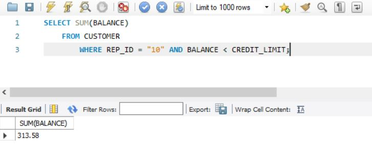

**Question 16.** List the item ID, description, and on-hand value of each item whose number of units on hand is more than the average number of units on hand for all items. (Hint: Use a subquery.)
**Answer**:

<pre style="white-space: pre-wrap;">
<code>
SELECT ITEM_ID, DESCRIPTION, ON_HAND * PRICE AS ON_HAND_VALUE
    FROM ITEM
        WHERE (ON_HAND > (SELECT AVG(ON_HAND)
                               FROM ITEM));
</code>
</pre>

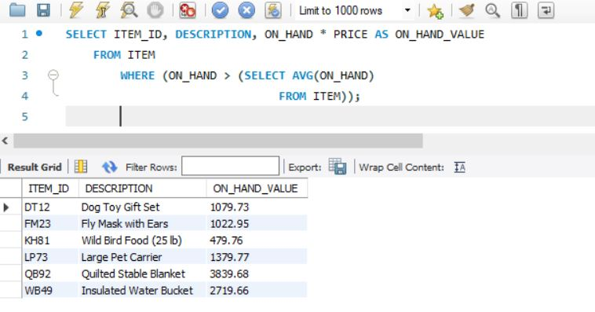

**Question 17.** What is the price of the least expensive item in the database?
**Answer**:

<pre style="white-space: pre-wrap;">
<code>
SELECT MIN(PRICE)
    FROM ITEM;
</code>
</pre>


**Question 18.** What is the item ID, description, and price of the least expensive item in the database? (Hint: Use a subquery.)
**Answer**:

<pre style="white-space: pre-wrap;">
<code>
SELECT ITEM_ID, DESCRIPTION, PRICE
    FROM ITEM
        WHERE (PRICE = (SELECT MIN(PRICE)
                            FROM ITEM));
</code>
</pre>


**Question 19.** List the sum of the balances of all customers for each sales rep. Order and group the results by sales rep ID.
**Answer**:

<pre style="white-space: pre-wrap;">
<code>
SELECT REP_ID, SUM(BALANCE)
    FROM CUSTOMER
        GROUP BY REP_ID
        ORDER BY REP_ID;
</code>
</pre>


**Question 20.** List the sum of the balances of all customers for each sales rep but restrict the output to those sales reps for which the sum is more than $150. Order the results by sales rep ID.
**Answer**:

<pre style="white-space: pre-wrap;">
<code>
SELECT REP_ID, SUM(BALANCE)
    FROM CUSTOMER
        GROUP BY REP_ID
        HAVING SUM(BALANCE) > 150
        ORDER BY REP_ID;
</code>
</pre>


**Question 21.** List the item ID of any item with an unknown description.
**Answer**:

<pre style="white-space: pre-wrap;">
<code>
SELECT ITEM_ID
    FROM ITEM
        WHERE DESCRIPTION = NULL;
</code>
</pre>

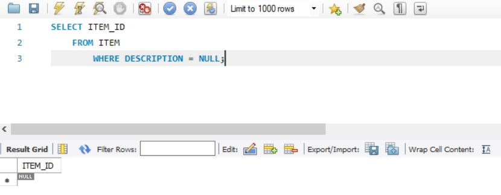


#### Critical Thinking

**Question 1.** List the item ID and description of all items that are in the DOG or CAT category and contain the word “Small” in the description.
**Answer**: 

<pre style="white-space: pre-wrap;">
<code>
SELECT *
    FROM ITEM
        WHERE ((CATEGORY IN ("DOG", "CAT")) AND (DESCRIPTION LIKE "%Small%"));
</code>
</pre>


**Question 2.** KimTay Pet Supplies is considering discounting the price of all items by 10 percent. List the item ID, description, and discounted price for all items. Use DISCOUNTED_PRICE as the name for the computed column.
**Answer**:

<pre style="white-space: pre-wrap;">
<code>
SELECT ITEM_ID, DESCRIPTION, PRICE * 0.9 AS DISCOUNTED_PRICE
    FROM ITEM;
</code>
</pre>

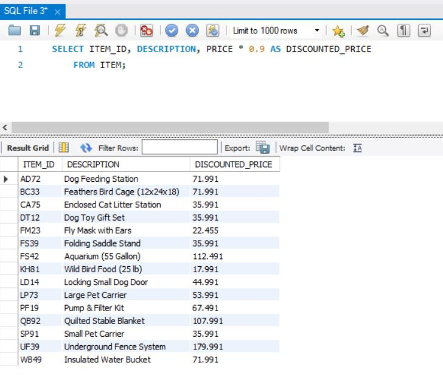


#### StayWell Student Accommodation

Use SQL and the StayWell Student Accommodation database (Figures 1-4 through 1-9 in Module 1) to complete the following exercises. If directed to do so by your instructor, use the information provided with the Module 3 Exercises to print your output or save it to a document.

**Question 1.** List the owner number, last name, and first name of every property owner.
**Answer**:

<pre style="white-space: pre-wrap;">
<code>
SELECT OWNER_NUM, LAST_NAME, FIRST_NAME
    FROM OWNER;
</code>
</pre>


**Question 2.** List the complete PROPERTY table (all rows and all columns).
**Answer**:

<pre style="white-space: pre-wrap;">
<code>
SELECT *
    FROM PROPERTY;
</code>
</pre>


**Question 3.** List the last name and first name of every owner who lives in Seattle.
**Answer**:

<pre style="white-space: pre-wrap;">
<code>
SELECT LAST_NAME, FIRST_NAME
    FROM OWNER
        WHERE CITY = "Seattle";
</code>
</pre>


**Question 4.** List the last name and first name of every owner who does not live in Seattle.
**Answer**:

<pre style="white-space: pre-wrap;">
<code>
SELECT LAST_NAME, FIRST_NAME
    FROM OWNER
        WHERE CITY <> "Seattle";
</code>
</pre>


**Question 5.** List the property ID and office number for every property whose square footage is equal to or less than 1,400 square feet.
**Answer**:

<pre style="white-space: pre-wrap;">
<code>
SELECT PROPERTY_ID, OFFICE_NUM
    FROM PROPERTY
        WHERE SQR_FT <= 1400;
</code>
</pre>


**Question 6.** List the office number and address for every property with three bedrooms.
**Answer**:

<pre style="white-space: pre-wrap;">
<code>
SELECT OFFICE_NUM, ADDRESS
    FROM PROPERTY
        WHERE BDRMS = 3;
</code>
</pre>


**Question 7.** List the property ID for every property with two bedrooms that is managed by StayWell-Georgetown.
**Answer**:

<pre style="white-space: pre-wrap;">
<code>
SELECT PROPERTY_ID
    FROM PROPERTY
        WHERE BDRMS = 2;
</code>
</pre>


**Question 8.** List the property ID for every property with a monthly rent that is between \$1,350 and \$1,750.
**Answer**:

<pre style="white-space: pre-wrap;">
<code>
SELECT *
    FROM PROPERTY
        WHERE MONTHLY_RENT BETWEEN 1350 AND 1750;
</code>
</pre>


**Question 9.** List the property ID for every property managed by StayWell-Columbia City whose monthly rent is less than \$1,500.
**Answer**:

<pre style="white-space: pre-wrap;">
<code>
SELECT PROPERTY_ID
    FROM PROPERTY
        WHERE MONTHLY_RENT < 1500;
</code>
</pre>


**Question 10.** Labor is billed at the rate of $35 per hour. List the property ID, category number, estimated hours, and estimated labor cost for every service request. To obtain the estimated labor cost, multiply the estimated hours by 35. Use the column name ESTIMATED_COST for the estimated labor cost.
**Answer**:

<pre style="white-space: pre-wrap;">
<code>
SELECT PROPERTY_ID, CATEGORY_NUMBER, OFFICE_ID, EST_HOURS, EST_HOURS * 35 AS    ESTIMATED_COST
    FROM SERVICE_REQUEST;
</code>
</pre>


**Question 11.** List the owner number and last name for all owners who live in Nevada (NV), Oregon (OR), or Idaho (ID).
**Answer**:

<pre style="white-space: pre-wrap;">
<code>
SELECT OWNER_NUM, LAST_NAME
    FROM OWNER
    WHERE STATE IN ("NV", "OR", "ID");
</code>
</pre>


**Question 12.** List the office number, property ID, square footage, and monthly rent for all properties. Sort the results by monthly rent within the square footage.
**Answer**:

<pre style="white-space: pre-wrap;">
<code>
SELECT OFFICE_NUM, PROPERTY_ID, SQR_FT, MONTHLY_RENT
    FROM PROPERTY
        ORDER BY SQR_FT, MONTHLY_RENT;
</code>
</pre>


**Question 13**. How many three-bedroom properties are managed by each office?
**Answer**:

<pre style="white-space: pre-wrap;">
<code>
SELECT OFFICE_NUM, COUNT(BDRMS)
    FROM PROPERTY
        WHERE BDRMS = 3
            GROUP BY OFFICE_NUM
            ORDER BY OFFICE_NUM;
</code>
</pre>


**Question 14.** Calculate the total value of monthly rents for all properties.
**Answer**:

<pre style="white-space: pre-wrap;">
<code>
SELECT SUM(MONTHLY_RENT)
    FROM PROPERTY;
</code>
</pre>


#### Critical Thinking

**Question 1.** There are two ways to create the query in Step 11. Write the SQL command that you used and then write the alternate command that also would obtain the correct result.
**Answer**:

<pre style="white-space: pre-wrap;">
<code>
SELECT OWNER_NUM, LAST_NAME
    FROM OWNER
    WHERE STATE IN ("NV", "OR", "ID");
</code>
</pre>


<pre style="white-space: pre-wrap;">
<code>
SELECT OWNER_NUM, LAST_NAME
    FROM OWNER
    WHERE STATE = "NV" OR STATE = "OR" OR STATE = "ID";
</code>
</pre>

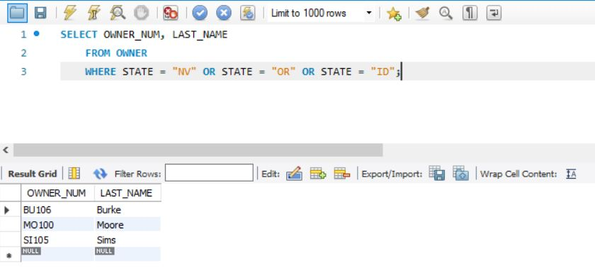

**Question 2.** What WHERE clause would you use to find all service requests with the word "heating" anywhere in the description field?
**Answer**:

<pre style="white-space: pre-wrap;">
<code>
SELECT SERVICE_ID, PROPERTY_ID, DESCRIPTION
    FROM SERVICE_REQUEST
        WHERE DESCRIPTION LIKE "%heating%";
</code>
</pre>


## MODULE 5: MULTIPLE-TABLE QUERIES

### INTRODUCTION

- In this module,
    - you learn how to use SQL to retrieve data from two or more tables using one SQL command. 
    - You join tables together and examine how to obtain similar results using the SQL IN and EXISTS operators. 
    - Then you use aliases to simplify queries and join a table to itself. 
    - You also implement the set operations of union, intersection, and difference using SQL commands. You examine two related SQL operators: ALL and ANY.
    - Finally, you perform inner joins, outer joins, and products.

### QUERYING MULTIPLE TABLES

- In Module 4, you learned how to retrieve data from a single table. Many queries require you to retrieve data from two or more tables. To retrieve data from multiple tables, you first must join the tables and then formulate a query using the same commands that you use for single-table queries.

> **HELPFUL HINT**
> In the following queries, your results might contain the same rows, but they might be listed in a different order. If order is important, you can include an ORDER BY clause in the query to ensure that the results are listed in the desired order.

**EXAMPLE 1: List the ID, first name, and last name of each customer, together with the ID, first name, and last name of the sales rep who represents the customer.**

- Because the customer ID values and names are in the CUSTOMER table and the sales rep ID values and names are in the SALES_REP table, you need to include both tables in the SQL command so you can retrieve data from both tables. To join (or relate) the tables, you construct the SQL command as follows:
    <ol style="list-style-type: decimal;">
    <li>In the SELECT clause, list all columns you want to display.</li>
    <li>In the FROM clause, list all tables involved in the query.</li>
    <li>In the WHERE clause, list the condition that restricts the data to be retrieved to only those rows from the two tables that match; that is, restrict it to the rows that have common values in matching columns.</li>
    </ol>
- As you learned in Module 2, it is often necessary to qualify a column name to specify the particular column you are referencing. Qualifying column names is especially important when joining tables because you must join tables on matching columns that frequently have identical column names. To qualify a column name, precede the name of the column with the name of the table, followed by a period. The matching columns in this example are both named REP_ID — there is a column in the SALES_REP table named REP_ID and a column in the CUSTOMER table that also is named REP_ID. The REP_ID column in the SALES_REP table is written as SALES_REP.REP_ID and the REP_ID column in the CUSTOMER table is written as CUSTOMER.REP_ID. The query and its results appear in Figure 5-1.

<pre style="white-space: pre-wrap;">
<code>
SELECT CUST_ID, CUSTOMER.FIRST_NAME, CUSTOMER.LAST_NAME, SALES_REP.REP_ID, SALES_REP.FIRST_NAME, SALES_REP.LAST_NAME
    FROM CUSTOMER, SALES_REP
        WHERE (CUSTOMER.REP_ID = SALES_REP.REP_ID);
</code>
</pre>


- When there is potential ambiguity in listing column names, you must qualify the columns involved in the query. It is permissible to qualify other columns as well, even when there is no possible confusion. Some people prefer to qualify all column names; however, in this text, you qualify column names only when necessary. In Figure 5-1, all columns are qualified except for CUST_ID. Because there are FIRST_NAME and LAST_NAME columns in both the CUSTOMER and SALES_REP tables, qualifying is necessary.

> **Q & A**
> Q & A
> **Question**: 
> - In the first row of output in Figure 5-1, the customer ID is 125, the customer first name is Joey, and the customer last name is Smith. These values represent the first row of the CUSTOMER table. How do you know the first and last names of sales rep ID 05 is Susan Garcia?
> **Answer**: 
> - In the CUSTOMER table, the sales rep ID for customer ID 125 is 05. (This indicates that customer ID 125 is related to sales rep ID 05.) In the SALES_REP table, the first name of sales rep 05 is Susan and the last name is Garcia.

**EXAMPLE 2: List the ID, first name, and last name of each customer whose credit limit is $500, together with the ID, first name, and last name of the sales rep who represents the customer.**

- In Example 1, you used a condition in the WHERE clause only to relate a customer with a sales rep to join the tables. Although relating a customer with a sales rep is essential in this example as well, you also need to restrict the output to only those customers whose credit limits are $500. You can restrict the rows by using a compound condition, as shown in Figure 5-2.

<pre style="white-space: pre-wrap;">
<code>
SELECT CUST_ID, CUSTOMER.FIRST_NAME, CUSTOMER.LAST_NAME, SALES_REP. REP_ID, SALES_REP.FIRST_NAME, SALES_REP.LAST_NAME
    FROM CUSTOMER, SALES_REP
        WHERE (CUSTOMER.REP_ID = SALES_REP.REP_ID) AND (CREDIT_LIMIT = 500);
</code>
</pre>


**EXAMPLE 3: For every item on an invoice, list the invoice number, item ID, description, quantity ordered, quoted price, and unit price.**

- An item is considered to be on an invoice when there is a row in the INVOICE_LINE table on which the item appears. You can find the invoice number, quantity ordered, and quoted price in the INVOICE_LINE table. To find the description and the unit price, however, you need to look in the ITEM table. Then you need to find rows in the INVOICE_ LINE table and rows in the ITEM table that match (rows containing the same item ID). The query and its results appear in Figure 5-3.

<pre style="white-space: pre-wrap;">
<code>
SELECT INVOICE_NUM, INVOICE_LINE.ITEM_ID, DESCRIPTION, QUANTITY, QUOTED_PRICE, PRICE
    FROM INVOICE_LINE, ITEM
        WHERE (INVOICE_LINE.ITEM_ID = ITEM.ITEM_ID);
</code>
</pre>


> **Q & A**
> **Question**: 
> - Can you use ITEM.ITEM_ID instead of INVOICE_LINE.ITEM_ID in the SELECT clause?
> **Answer**: 
> - Yes. The values for these two columns match because they must satisfy the condition INVOICE_LINE.ITEM_ID = ITEM.ITEM_ID.

**HELPFUL HINT**
- Remember the word DESCRIPTION was added to the keyword list in version 8.0.4 of MySQL; however, it is a non-reserved keyword and can be used. This is why the word DESCRIPTION is not blue in the command in Figure 5-3; however, it is blue in the screen shot of the results.

### COMPARING JOINS, IN, AND EXISTS

- You join tables in SQL by including a condition in the WHERE clause to ensure that matching columns contain equal values (for example, INVOICE_LINE.ITEM_ID = ITEM.ITEM_ID). You can obtain similar results by using either the IN operator (described in Module 4) or the EXISTS operator with a subquery. The choice is a matter of personal preference because either approach obtains the same results. The following examples illustrate the use of each operator.

**EXAMPLE 4: Find the description of each item included in invoice number 14233.**

- Because this query also involves retrieving data from the INVOICE_LINE and ITEM tables (as illustrated in Example 3), you could approach it in a similar fashion. There are two basic differences, however, between Examples 3 and 4. First, the query in Example 4 does not require as many columns; second, it involves only invoice number 14233. Having fewer columns to retrieve means that there are fewer columns listed in the SELECT clause. You can restrict the query to a single invoice by adding the condition INVOICE_NUM = '14233' to the WHERE clause. The query and its results appear in Figure 5-4.

<pre style="white-space: pre-wrap;">
<code>
SELECT DESCRIPTION
    FROM INVOICE_LINE, ITEM
        WHERE (INVOICE_LINE.ITEM_ID = ITEM.ITEM_ID)AND(INVOICE_NUM = "14233");
</code>
</pre>


- Notice that the INVOICE_LINE table is listed in the FROM clause, even though you do not need to display any columns from the INVOICE_LINE table. The WHERE clause contains columns from the INVOICE_LINE table, so it is necessary to include the table in the FROM clause.

#### Using the IN Operator

Another way to retrieve data from multiple tables in a query is to use the IN operator with a subquery. In Example 4, you first could use a subquery to find all item ID values in the INVOICE_LINE table that appear in any row on which the invoice number is 14233. Then you could find the description for any item whose item ID is in this list. The query and its results appear in Figure 5-5.

<pre style="white-space: pre-wrap;">
<code>
SELECT DESCRIPTION
    FROM ITEM
        WHERE ITEM_ID IN(SELECT ITEM_ID
                            FROM INVOICE_LINE
                                WHERE(INVOICE_NUM ="14233")
                        );
</code>
</pre>


In Figure 5-5, evaluating the subquery produces a temporary table consisting of those item ID values that are present in invoice number 14233. Executing the remaining portion of the query produces descriptions for each item whose ID is in this temporary table; in this case, Wild Bird Food (25 lb), Quilted Stable Blanket, and Insulated Water Bucket.

#### Using the EXISTS Operator

You also can use the EXISTS operator to retrieve data from more than one table, as shown in Example 5. The EXISTS operator checks for the existence of rows that satisfy some criterion.

**EXAMPLE 5: Find the invoice number and invoice date for each invoice that contains item ID KH81.**

- This query is similar to the one in Example 4, but this time the query involves the INVOICES table and not the ITEM table. In this case, you can write the query in either of the ways previously demonstrated. For example, you could use the IN operator with a subquery, as shown in Figure 5-6.

<pre style="white-space: pre-wrap;">
<code>
SELECT INVOICE_NUM, INVOICE_DATE
    FROM INVOICES
        WHERE INVOICE_NUM IN (SELECT INVOICE_NUM
                                    FROM INVOICE_LINE
                                        WHERE (ITEM_ID ="KH81")
                                    );
</code>
</pre>


- Using the EXISTS operator provides another approach to solving Example 5, as shown in Figure 5-7.

<pre style="white-space: pre-wrap;">
<code>
SELECT INVOICE_NUM, INVOICE_DATE
    FROM INVOICES
        WHERE EXISTS (SELECT *
                            FROM INVOICE_LINE
                                WHERE (INVOICES.INVOICE_NUM = INVOICE_LINE.INVOICE_NUM) AND (ITEM_ID = "KH81")
                            );
</code>
</pre>


- The subquery in Figure 5-7 is the first one you have seen that involves a table listed in the outer query. This type of subquery is called a correlated subquery. In this case, the INVOICES table, which is listed in the FROM clause of the outer query, is used in the subquery. For this reason, you need to qualify the INVOICE_NUM column in the subquery (INVOICES.INVOICE_NUM). You did not need to qualify the columns in the previous queries involving the IN operator.
- The query shown in Figure 5-7 works as follows. For each row in the INVOICES table, the subquery is executed using the value of INVOICES.INVOICE_NUM that occurs in that row. The inner query produces a list of all rows in the INVOICE_LINE table in which INVOICE_LINE.INVOICE_NUM matches this value and in which ITEM_ID is equal to KH81. You can precede a subquery with the EXISTS operator to create a condition that is true if one or more rows are obtained when the subquery is executed; otherwise, the condition is false.
- To illustrate the process, consider invoice numbers 14224 and 14228 in the
INVOICES table. Invoice number 14224 is included because a row exists in the INVOICE_ LINE table with this invoice number and item ID KH81. When the subquery is executed, there is at least one row in the results, which in turn makes the EXISTS condition true. Invoice number 14228, however, is not included because no row exists in the INVOICE_LINE table with this invoice number and item ID KH81. There are no rows contained in the results of the subquery, which in turn makes the EXISTS condition false.

#### Using a Subquery Within a Subquery

- You can use SQL to create a nested subquery (a subquery within a subquery), as
illustrated in Example 6.

**EXAMPLE 6: Find the invoice number and invoice date for each invoice that includes an item stored in location C.**

- One way to approach this request is first to determine the list of item ID values in the ITEM table for each item located in location C. Then you obtain a list of invoice numbers in the INVOICE_LINE table with a corresponding item ID in the item ID list. Finally, you retrieve those invoice numbers and invoice dates in the INVOICES table for which the invoice number is in the list of invoice numbers obtained during the second step. The query and its results appear in Figure 5-8.

<pre style="white-space: pre-wrap;">
<code>
SELECT INVOICE_NUM, INVOICE_DATE
    FROM INVOICES
        WHERE INVOICE_NUM IN(SELECT INVOICE_NUM
                                FROM INVOICE_LINE
                                    WHERE ITEM_ID IN (SELECT ITEM_ID
                                                            FROM ITEM
                                                                WHERE (LOCATION ="C")
                                                      )
                              );
</code>
</pre>


- As you might expect, SQL evaluates the queries from the innermost query to the outermost query. The query in this example is evaluated in three steps:
  1. The innermost subquery is evaluated first, producing a temporary table of item ID values for those items stored in location C.
  1. The next (intermediate) subquery is evaluated, producing a second temporary table with a list of invoice numbers. Each invoice number in this collection has a row in the INVOICE_LINE table for which the item ID is in the temporary table produced in Step 1.
  1. The outer query is evaluated last, producing the desired list of invoice numbers and invoice dates. Only those invoices whose numbers are in the temporary table produced in Step 2 are included in the results. Another approach to solving Example 6 involves joining the INVOICES, INVOICE_LINE, and ITEM tables. The query and its results appear in Figure 5-9.

- Another approach to solving Example 6 involves joining the INVOICES, INVOICE_LINE, and ITEM tables. The query and its results appear in Figure 5-9.

<pre style="white-space: pre-wrap;">
<code>
SELECT DISTINCT INVOICES.INVOICE_NUM, INVOICE_DATE
    FROM INVOICE_LINE, INVOICES, ITEM
        WHERE (INVOICE_LINE.INVOICE_NUM = INVOICES.INVOICE_NUM) AND (INVOICE_LINE.ITEM_ID = ITEM.ITEM_ID) AND (LOCATION= "C");
</code>
</pre>


- In this query, the following conditions join the tables: INVOICE_LINE.INVOICE_NUM = INVOICES.INVOICE_NUM INVOICE_LINE.ITEM_ID = ITEM.ITEM_ID 
- The condition LOCATION = "C" restricts the output to only those items stored in
location C.
- The query results are correct regardless of which command you use. You can use whichever approach you prefer.
- You might wonder whether one approach is more efficient than the other. SQL
performs many built-in optimizations that analyze queries to determine the best way to satisfy them. Given a good optimizer, it should not make much difference how you formulate the query—both set of results completed in less than 0.00 seconds in the computing environment used for this text; however, your computing environment may show different results. It is expected that using nested subqueries (Figure 5-8) produces the results in a slightly longer amount of time than joining the tables (Figure 5-9). If you are using a DBMS without an optimizer, the way you write a query can make a difference in the speed at which the DBMS executes the query. When you are working with a very large database and efficiency is a prime concern, consult the DBMS’s manual or try some timings yourself. Try running the same query both ways to see whether you notice a difference in the speed of execution. In small databases, there should not be a significant time difference between the two approaches.

#### A Comprehensive Example

- The query used in Example 7 involves several of the features already presented. The query illustrates all the major clauses that you can use in a SELECT command. It also illustrates the order in which these clauses must appear.

**EXAMPLE 7: List the customer ID, invoice number, invoice date, and invoice total for each invoice with a total that exceeds $250. Assign the column name INVOICE_TOTAL to the column that displays invoice totals. Order the results by invoice number.**

The query and its results appear in Figure 5-10.

<pre style="white-space: pre-wrap;">
<code>
SELECT CUST_ID, INVOICES.INVOICE_NUM, INVOICE_DATE, SUM(QUANTITY * QUOTED_PRICE) AS INVOICE_TOTAL
    FROM INVOICES, INVOICE_LINE
        WHERE (INVOICES.INVOICE_NUM = INVOICE_LINE.INVOICE_NUM)
            GROUP BY INVOICES.INVOICE_NUM, CUST_ID, INVOICE_DATE
            HAVING SUM(QUANTITY * QUOTED_PRICE) > 250
            ORDER BY INVOICES.INVOICE_NUM;
</code>
</pre>


- In this query, the INVOICES and INVOICE_LINE tables are joined by listing both tables in the FROM clause and relating them in the WHERE clause. Selected data is sorted by invoice number using the ORDER BY clause. The GROUP BY clause indicates that the data is to be grouped by invoice number, customer ID, and invoice date. For each group, the SELECT clause displays the customer ID, invoice number, invoice date, and invoice total (SUM(QUANTITY * QUOTED_PRICE)). In addition, the total was renamed INVOICE_TOTAL. Not all groups are displayed, however. The HAVING clause displays only those groups whose SUM(NUM_ORDERED * QUOTED_PRICE) is greater than $250.
- The invoice number, customer ID, and invoice date are unique for each invoice. Thus, it would seem that merely grouping by invoice number would be sufficient. SQL requires that both the customer ID and the invoice date be listed in the GROUP BY clause. Recall that a SELECT clause can include statistics calculated for only the groups or columns whose values are identical for each row in a group. By stating that the data is to be grouped by invoice number, customer ID, and invoice date, you tell SQL that the values in these columns must be the same for each row in a group.

#### Using an Alias

- When tables are listed in the FROM clause, you can give each table an alias, or an alternate name, that you can use in the rest of the statement. You create an alias by typing the name of the table, pressing the Spacebar, and then typing the name of the alias. No commas or periods are necessary to separate the two names. One reason for using an alias is simplicity. In Example 8, you assign the SALES_REP table the alias R and the CUSTOMER table the alias C. By doing this, you can type R instead of SALES_REP and C instead of CUSTOMER in the remainder of the query. The query in this example is simple, so you might not see the full benefit of this feature. When a query is complex and requires you to qualify the names, using aliases can simplify the process.

**EXAMPLE 8: List the ID, first name, and last name for each sales rep together with the ID, first name, and last name for each customer the sales rep represents.**

<pre style="white-space: pre-wrap;">
<code>
SELECT R.REP_ID, R.FIRST_NAME, R.LAST_NAME, C.CUST_ID, C.FIRST_NAME, C.LAST_NAME
    FROM SALES_REP R, CUSTOMER C
        WHERE (R.REP_ID = C.REP_ID);
</code>
</pre>


#### Joining a Table to Itself

A second situation for using an alias is to join a table to itself, called a self-join, as illustrated in Example 9.

**EXAMPLE 9: For each pair of customers located in the same city, display the customer ID, first name, last name, and city.**

- If you had two separate tables for customers and the query requested customers in the first table having the same city as customers in the second table, you could use a normal join operation to find the answer. In this case, however, there is only one table (CUSTOMER) that stores all the customer information. You can treat the CUSTOMER table as if it were two tables in the query by creating an alias, as illustrated in Example 8. In this case, you use the following FROM clause:

    `FROM CUSTOMER F, CUSTOMER S`

SQL treats this clause as a query of two tables: one that has the alias F (first), and another that has the alias S (second). The fact that both tables are really the same CUSTOMER table is not a problem. The query and its results appear in Figure 5-12.

<pre style="white-space: pre-wrap;">
<code>
SELECT F.CUST_ID, F.FIRST_NAME, F.LAST_NAME, S.CUST_ID, S.FIRST_NAME, S.LAST_NAME, F.CITY
    FROM CUSTOMER F, CUSTOMER S
        WHERE (F.CITY = S.CITY) AND (F.CUST_ID < S.CUST_ID)
        ORDER BY F.CUST_ID, S.CUST_ID;
</code>
</pre>

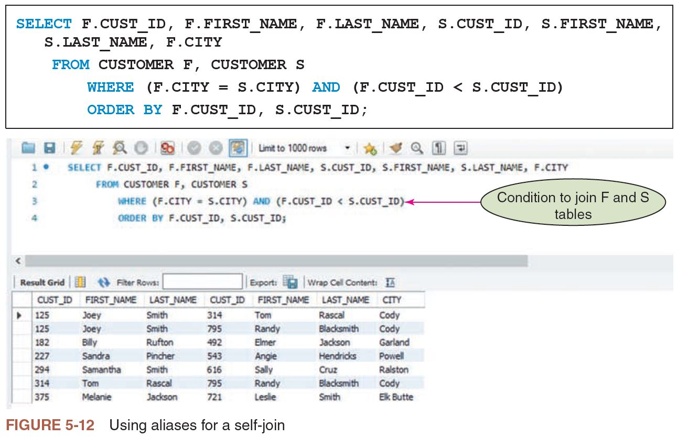

- You are requesting a customer ID, first name, and last name from the F table, followed by a customer ID, first name, and last name from the S table, and then the city. (Because the city in the first table must match the city in the second table, you can select the city from either table.) The WHERE clause contains two conditions: the cities must match, and the customer ID from the first table must be less than the customer ID from the second table. In addition, the ORDER BY clause ensures that the data is sorted by the first customer ID. For those rows with the same first customer ID, the data is further sorted by the second customer ID.

> **Q & A**
> **Question**: Why is the condition F.CUST_ID < S.CUST_ID important in the query?
> **Answer**: If you did not include this condition, you would get the query results shown in Figure 5-13. The first row is included because it is true that customer ID 125 (Joey Smith) in the F table has the same city as customer ID 125 (Joey Smith) in the S table. The second row indicates that customer ID 125 (Joey Smith) has the same city as customer number 314 (Tom Rascal). The tenth row, however, repeats the same information because customer number 314 (Tom Rascal) has the same city as customer ID 125 (Joey Smith). Of these three rows, the only row that should be included in the query results is the second row. The second row also is the only one of the three rows in which the first customer ID (125) is less than the second customer ID (314). This is why the query requires the condition F.CUST_ID < S.CUST_ID.
>
> 

#### Using a Self-Join on a Primary Key Column

- Figure 5-14 shows some fields from an EMPLOYEE table whose primary key is EMP_ID. Another field in the table is MGR_EMP_ID, which represents the ID of the employee’s manager, who also is an employee. If you look at the row for employee 217 (Lynn Thomas), you see that employee 182 (Edgar Davis) is Lynn’s manager. By looking at the row for employee 182 (Edgar Davis), you see that his manager is employee 105 (Samantha Baker). In the row for employee 105 (Samantha Baker), the manager number is null, indicating that she has no manager.


Suppose you need to list the employee ID, employee first name, and employee last name along with the ID, first name, and last name of each employee’s manager. Just as in the previous self-join, you would list the EMPLOYEE table twice in the FROM clause with aliases.


#### Joining Several Tables

It is possible to join several tables, as illustrated in Example 10. For each pair of tables you join, you must include a condition indicating how the columns are related.

**EXAMPLE 10: For each item on an invoice, list the item ID, quantity ordered, invoice number, invoice date, customer ID, customer first name, and customer last name, along with the last name of the sales rep who represents each customer.**

- As mentioned earlier, an item is on an invoice when it occurs on any row in the INVOICE_LINE table. The item ID, quantity ordered, and invoice number appear in the INVOICE_LINE table. If these requirements represent the entire query, you would write the query as follows:

<pre style="white-space: pre-wrap;">
<code>
SELECT ITEM_ID, QUANTITY, INVOICE_NUM
    FROM INVOICE_LINE;
</code>
</pre>

- This query is not sufficient, however. You also need the invoice date, which is in the INVOICES table; the customer ID, first name, and last name, which are in the CUSTOMER table; and the last name of the sales rep, which is in the SALES_REP table. Thus, you need to join four tables: INVOICE_LINE, INVOICES, CUSTOMER, and SALES_REP. The procedure for joining more than two tables is essentially the same as the one for joining two tables. The difference is that the condition in the WHERE clause becomes a compound condition. In this case, you write the WHERE clause as follows:

<pre style="white-space: pre-wrap;">
<code>
WHERE (INVOICES.INVOICE_NUM = INVOICE_LINE.INVOICE_NUM) AND (CUSTOMER.CUST_ID = INVOICES.CUST_ID) AND (SALES_REP.REP_ID = CUSTOMER.REP_ID)
</code>
</pre>

> **HELPFUL HINT**
> Note the entire WHERE clause could be typed on one line; however, because a single line in the textbook would not accommodate the entire WHERE clause, it is logically broken up here. Because the condition is very long, this option also promotes readability. Remember you can type a statement in any manner, and the statement ends only with a semicolon. The same is true for the columns in the SELECT clause because they would also not fit on one line in the textbook. The indention is consistent and makes the statement more readable.

- The first condition relates an invoice to an invoice line with a matching invoice number. The second condition relates the customer to the invoice with a matching customer ID. The final condition relates the sales rep to a customer with a matching sales rep ID.
- The first condition relates an invoice to an invoice line with a matching invoice number. The second condition relates the customer to the invoice with a matching customer ID. The final condition relates the sales rep to a customer with a matching sales rep ID.

<pre style="white-space: pre-wrap;">
<code>
SELECT ITEM_ID, QUANTITY, INVOICE_LINE.INVOICE_NUM, INVOICE_DATE, CUSTOMER.CUST_ID,CUSTOMER.FIRST_NAME, CUSTOMER.LAST_NAME,SALES_REP.LAST_NAME AS SALES_REP_LAST
    FROM INVOICE_LINE, INVOICES, CUSTOMER, SALES_REP
        WHERE (INVOICES.INVOICE_NUM = INVOICE_LINE.INVOICE_NUM) AND
              (CUSTOMER.CUST_ID = INVOICES.CUST_ID) AND
              (SALES_REP.REP_ID = CUSTOMER.REP_ID)
        ORDER BY ITEM_ID, INVOICE_LINE.INVOICE_NUM;
</code>
</pre>


> **Q & A**
> **Question**: Why is the ITEM_ID column, which appears in the ITEM and INVOICE_LINE tables, not qualified in the SELECT clause?
> **Answer**: Among the tables listed in the query, only one table contains a column named ITEM_ID, so it is not necessary to qualify the table. If the ITEM table also appeared in the FROM clause, you would need to qualify ITEM_ID to avoid confusion between the ITEM_ID columns in the ITEM and INVOICE_LINE tables.

- The query shown in Figure 5-16 is more complex than many of the previous ones you have examined. You might think that SQL is not such an easy language to use after all. If you take it one step at a time, however, the query in Example 10 really is not that difficult. To construct a detailed query in a systematic fashion, do the following:

    1. List in the SELECT clause all the columns that you want to display. If the name of a column appears in more than one table, precede the column name with the table name (that is, qualify the column name).
    2. List in the FROM clause all the tables involved in the query. Usually you include the tables that contain the columns listed in the SELECT clause. Occasionally, however, there might be a table that does not contain any columns used in the SELECT clause but that does contain columns used in the
    WHERE clause. In this case, you also must list the table in the FROM clause.
    For example, if you do not need to list a customer ID or name, but you do
    need to list the sales rep name, you would not include any columns from
    the CUSTOMER table in the SELECT clause. The CUSTOMER table still is
    required, however, because you must include a column from it in the WHERE
    clause.
    3. Take one pair of related tables at a time and indicate in the WHERE clause
    the condition that relates the tables. Join these conditions with the AND
    operator. If there are any other conditions, include them in the WHERE
    clause and connect them to the other conditions with the AND operator. For
    example, if you want to view items present on invoices placed by only those
    customers with $500 credit limits, you would add one more condition to the
    WHERE clause, as shown in Figure 5-17.

<pre style="white-space: pre-wrap;">
<code>
SELECT ITEM_ID, QUANTITY, INVOICE_LINE.INVOICE_NUM, INVOICE_DATE, CUSTOMER.CUST_ID, CUSTOMER.FIRST_NAME, CUSTOMER.LAST_NAME, SALES_REP.LAST_NAME AS SALES_REP_LAST
    FROM INVOICE_LINE, INVOICES, CUSTOMER, SALES_REP
        WHERE (INVOICES.INVOICE_NUM = INVOICE_LINE.INVOICE_NUM) AND
              (CUSTOMER.CUST_ID = INVOICES.CUST_ID) AND
              (SALES_REP.REP_ID = CUSTOMER.REP_ID) AND
              (CREDIT_LIMIT = 500)
        ORDER BY ITEM_ID, INVOICE_LINE.INVOICE_NUM;
</code>
</pre>


### SET OPERATIONS

- In SQL, you can use the set operations for taking the union, intersection, and difference of two tables. The union of two tables uses the UNION operator to create a temporary table containing every row that is in either the first table, the second table, or both tables. The intersection of two tables uses the INTERSECT operator to create a temporary table containing all rows that are in both tables. The difference of two tables uses the MINUS operator to create a temporary table containing the set of all rows that are in the first table but that are not in the second table.
- For example, suppose that TEMP1 is a table containing the ID and names of each customer represented by sales rep 05. Further, suppose that TEMP2 is a table containing the ID and names of those customers that currently have invoices on file, as shown in Figure 5-18.


- The union of TEMP1 and TEMP2 (TEMP1 UNION TEMP2) consists of the ID and names of those customers that are represented by sales rep 05 or that currently have invoices on file, or both. The intersection of these two tables (TEMP1 INTERSECT TEMP2) contains those customers that are represented by sales rep 05 and that have invoices on file. The difference of these two tables (TEMP1 MINUS TEMP2) contains those customers that are represented by sales rep 05 but that do not have invoices on file. The results of these set operations are shown in Figure 5-19.


- There is a restriction on set operations. It does not make sense, for example, to talk about the union of the CUSTOMER table and the INVOICES table because these tables do not contain the same columns. What might rows in this union look like? The two tables in the union must have the same structure for a union to be appropriate; the formal term is **union compatible**. Two tables are union compatible when they have the same number of columns and their corresponding columns have identical data types and lengths.
- Note that the definition of union compatible does not state that the columns of the two tables must be identical but rather that the columns must be of the same type. Thus, if one column is CHAR(20), the matching column also must be CHAR(20).

**EXAMPLE 11: List the ID and names of each customer that is either represented by sales rep 10 or currently has invoices on file, or both.**

- You can create a temporary table containing the ID, first name, and last name of each customer that is represented by sales rep 10 by selecting the customer ID values and names from the CUSTOMER table for which the sales rep number is 10. Then you can create another temporary table containing the ID, first name, and last name of each customer that currently has invoices on file by joining the CUSTOMER and INVOICES tables. The two temporary tables created by this process have the same structure; that is, they both contain the CUST_ID, FIRST_NAME, and LAST_NAME columns. Because the temporary tables are union compatible, it is possible to take the union of these two tables. The query and its results appear in Figure 5-20.

<pre style="white-space: pre-wrap;">
<code>
SELECT CUST_ID, FIRST_NAME, LAST_NAME
    FROM CUSTOMER
        WHERE (REP_ID = "10")
UNION
SELECT CUSTOMER.CUST_ID, CUSTOMER.FIRST_NAME, CUSTOMER.LAST_NAME
    FROM CUSTOMER, INVOICES
        WHERE (CUSTOMER.CUST_ID = INVOICES.CUST_ID);
</code>
</pre>


- Note the results of the query are not in order by CUST_ID as they were pictured in Figures 5-18 and 5-19. If you want your results in a particular order, you may use the ORDER BY clause. You would remove the semicolon from the second WHERE clause and add the following at the end of your statement:

    `ORDER BY CUST_ID;`

- If your SQL implementation truly supports the union operation, it removes any duplicate rows automatically. For example, any customer that is represented by sales rep 10 *and* that currently has invoices on file (such as customers 182 and 294 in this case) appears only once in the results. Oracle, Access, and SQL Server support the union operation and correctly remove duplicates.

**EXAMPLE 12: List the ID and names of each customer that is represented by sales rep 10 and that currently has invoices on file.**

- The only difference between this query and the one in Example 11 is that the appropriate operator to use is INTERSECT, as shown in Figure 5-21. Note that MySQL does not support the INTERSECT operator, so there is no screen shot with the figure. If your version of SQL does support the INTERSECT operator, the statement would be as follows:


- Some SQL implementations do not support the INTERSECT operator, such as MySQL, so you need to take a different approach. The command shown in Figure 5-22 produces the same results as the INTERSECT operator by using the IN operator and a subquery. The command selects the ID and names of each customer that is represented by sales rep 10 and whose customer ID also appears in the collection of customer ID values in the INVOICES table.

<pre style="white-space: pre-wrap;">
<code>
SELECT CUST_ID, FIRST_NAME, LAST_NAME
    FROM CUSTOMER
        WHERE (REP_ID = "10") AND (CUST_ID IN (SELECT CUST_ID
                                                    FROM INVOICES));
</code>
</pre>

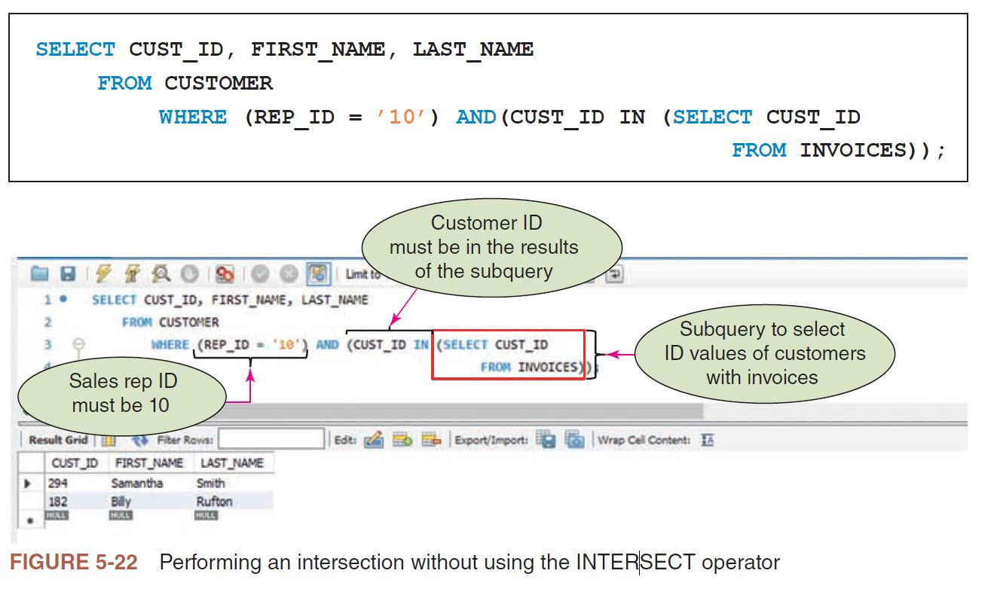

> **HELPFUL HINT**:
> Oracle and SQL Server support the INTERSECT operator.

> **HELPFUL HINT**:
> Note that the parentheses are formatted differently for the subquery than those previously used in this module (for example, see Figure 5-6). Remember that your formatting is a matter of preference to support readability on your part. This example was used on purpose to draw attention to the difference.

**EXAMPLE 13: List the ID and names of each customer that is represented by sales rep 10 but that does not have invoices currently on file.**

- The query uses the MINUS operator, as shown in Figure 5-23. Note that MySQL does not support the MINUS operator, so there is no screen shot with the figure. If your version of SQL does support the MINUS operator, the statement would be as follows:


- Just as with the INTERSECT operator, some SQL implementations do not support the MINUS operator. In such cases, you need to take a different approach, such as the one shown in Figure 5-24. This command produces the same results by selecting the ID and names of each customer that is represented by sales rep 10 and whose customer ID does not appear in the collection of customer ID values in the INVOICES table.


### ALL AND ANY

- You can use the ALL and ANY operators with subqueries to produce a single column of numbers. When you precede the subquery by the ALL operator, the condition is true only if it satisfies all values produced by the subquery. When you precede the subquery by the ANY operator, the condition is true if it satisfies any value (one or more) produced by the subquery. The following examples illustrate the use of these operators.

**EXAMPLE 14: Find the customer ID, full name, current balance, and sales rep ID of each customer whose balance exceeds the maximum balance of all customers represented by sales rep 10.**

- You can find the maximum balance of the customers represented by sales rep 10 in a subquery and then find all customers whose balances are greater than this number. There is an alternative method that is simpler, however. You can use the ALL operator, as shown in Figure 5-25.

<pre style="white-space: pre-wrap;">
<code>
SELECT C.CUST_ID, C.FIRST_NAME, C.LAST_NAME, C.BALANCE, C.REP_ID
    FROM CUSTOMER C
        WHERE C.BALANCE > ALL (SELECT (C.BALANCE)
                                FROM CUSTOMER C
                                    WHERE C.REP_ID = "10"
                              );
</code>
</pre>


- To some users, the query shown in Figure 5-25 might seem more natural than finding the maximum balance in the subquery. For other users, the opposite might be true. You can use whichever approach you prefer.

> **Q & A**
> **Question**: How would you get the same result for Example 14 without using the ALL operator?
> **Answer**: You could select each customer whose balance is greater than the maximum balance of any customer of sales rep 10, as shown in Figure 5-26.

<pre style="white-space: pre-wrap;">
<code>
SELECT CUST_ID, FIRST_NAME, LAST_NAME, BALANCE, REP_ID
    FROM CUSTOMER
        WHERE (BALANCE > (SELECT MAX(BALANCE)
                                FROM CUSTOMER
                                    WHERE REP_ID = "10"));
</code>
</pre>


**EXAMPLE 15: Find the customer ID, full name, current balance, and sales rep ID of each customer whose balance is greater than the balance of at least one customer of sales rep 10.**

- You can find the minimum balance of the customers represented by sales rep 10 in a subquery and then find all customers whose balance is greater than this number. To simplify the process, you can use the ANY operator, as shown in Figure 5-27.

<pre style="white-space: pre-wrap;">
<code>
SELECT CUST_ID, FIRST_NAME, LAST_NAME, BALANCE, REP_ID
    FROM CUSTOMER
        WHERE (BALANCE > ANY (SELECT BALANCE
                                    FROM CUSTOMER
                                        WHERE REP_ID = "10")
                             );
</code>
</pre>


> **Q & A**
> **Question**: How would you get the same results without using the ANY operator?
> **Answer**: You could select each customer whose balance is greater than the minimum balance of any customer of sales rep 10, as shown in Figure 5-28.

<pre style="white-space: pre-wrap;">
<code>
SELECT CUST_ID, FIRST_NAME, LAST_NAME, BALANCE, REP_ID
    FROM CUSTOMER
        WHERE (BALANCE > (SELECT MIN(BALANCE)
                                FROM CUSTOMER
                                    WHERE REP_ID = "10"));
</code>
</pre>


### SPECIAL OPERATIONS

- You can perform special operations within SQL, such as the self-join that you already used. Three other special operations are the inner join, the outer join, and the product.

#### Inner Join

- A join that compares the tables in a FROM clause and lists only those rows that satisfy the condition in the WHERE clause is called an inner join. The joins that you have performed so far in this text have been inner joins. Example 16 illustrates the inner join.

**EXAMPLE 16: Display the ID, first name, and last name for each customer, along with the invoice number, and invoice date for each invoice. Sort the results by customer ID.**

- This example requires the same type of join that you have been using. The command is as follows:

<pre style="white-space: pre-wrap;">
<code>
SELECT C.CUST_ID, C.FIRST_NAME, C.LAST_NAME, I.INVOICE_NUM, I.INVOICE_DATE
    FROM CUSTOMER C, INVOICES I
        WHERE C.CUST_ID = I.CUST_ID
        ORDER BY C.CUST_ID;
</code>
</pre>

- The previous approach should work in any SQL implementation. An update to the SQL standard approved in 1992, called SQL-92, provides an alternative way of performing an inner join, as shown in Figure 5-29.

<pre style="white-space: pre-wrap;">
<code>
SELECT CUSTOMER.CUST_ID, FIRST_NAME, LAST_NAME, INVOICE_NUM, INVOICE_DATE
    FROM CUSTOMER
        INNER JOIN INVOICES
            ON (CUSTOMER.CUST_ID = INVOICES.CUST_ID)
            ORDER BY CUSTOMER.CUST_ID;
</code>
</pre>


### Outer Join

- Sometimes you need to list all the rows from one of the tables in a join, regardless of whether they match any rows in a second table. For example, you can perform the join of the CUSTOMER and INVOICES tables in the query for Example 16, but display all customers—even the ones without invoices. This type of join is called an outer join.
- There are actually three types of outer joins. In a left outer join, all rows from the table on the left (the table listed first in the query) are included regardless of whether they match rows from the table on the right (the table listed second in the query). Rows from the table on the right are included only when they match. In a right outer join, all rows from the table on the right are included regardless of whether they match rows from the table on the left. Rows from the table on the left are included only when they match. In a full outer join, all rows from both tables are included regardless of whether they match
rows from the other table. (The full outer join is rarely used.)
- Example 17 illustrates the use of a left outer join.

**EXAMPLE 17: Display the ID, first name, and last name for each customer, along with the invoice number, and invoice date for all invoices. Include all customers in the results. For customers that do not have invoices, omit the invoice number and invoice date.**

<pre style="white-space: pre-wrap;">
<code>
SELECT CUSTOMER.CUST_ID, FIRST_NAME, LAST_NAME, INVOICE_NUM, INVOICE_DATE
    FROM CUSTOMER
        LEFT JOIN INVOICES
            ON (CUSTOMER.CUST_ID = INVOICES.CUST_ID)
            ORDER BY CUSTOMER.CUST_ID;
</code>
</pre>


- All customers are included in the results. For customers without invoices, the invoice number and date are blank. Technically, these blank values are null.

> **HELPFUL HINT**
> In Oracle, not MySQL, there is another way to perform left and right outer joins. You write the join as you have been doing, with one exception. You include parentheses and a plus sign in the WHERE clause after the column in the table for which only matching rows are to be included. In this example, the plus sign would follow the CUST_ID column in the INVOICES table because only invoices that match customers are to be included. Because customers that do not have invoices are to be included in the results, there is no plus sign after the CUST_ID column in the CUSTOMER table. The correct query is as follows:
> <pre style="white-space: pre-wrap;">
> <code>
> SELECT CUSTOMER.CUST_ID, FIRST_NAME, LAST_NAME, INVOICE_NUM, INVOICE_DATE
>    FROM CUSTOMER
>        LEFT JOIN INVOICES
>            ON (CUSTOMER.CUST_ID = INVOICES.CUST_ID)
>            ORDER BY CUSTOMER.CUST_ID;
> </code>
> </pre>

#### Product

- The **product** (formally called the **Cartesian product**) of two tables is the combination of all rows in the first table and all rows in the second table.

> **HELPFUL HINT**
> - The product operation is not common. You need to be aware of it, however, because it is easy to create a product inadvertently by omitting the WHERE clause when you are attempting to join tables.

**EXAMPLE 18: Form the product of the CUSTOMER and INVOICES tables. Display the customer ID, first name, and last name from the CUSTOMER table, along with the invoice number and invoice date from the INVOICES table.**

- Forming a product is actually very easy. You simply omit the WHERE clause, as shown in Figure 5-31.

<pre style="white-space: pre-wrap;">
<code>
SELECT CUSTOMER.CUST_ID, FIRST_NAME, LAST_NAME, INVOICE_NUM, INVOICE DATE
        FROM CUSTOMER, INVOICES;
</code>
</pre>


> **Q & A**
> **Question**: Figure 5-31 does not show all the rows in the result. How many rows are actually included?
> **Answer**: The CUSTOMER table has 12 rows and the INVOICES table has eight rows. Because each of the 12 customer rows is matched with each of the eight invoice rows, there are 96 (12 × 8) rows in the result.

### Module Summary

- To join tables, indicate in the SELECT clause all columns to display, list in the FROM clause all tables to join, and then include in the WHERE clause any conditions requiring values in matching columns to be equal.
- When referring to matching columns in different tables, you must qualify the column names to avoid confusion. You qualify column names using the following format: table name.column name.
- Use the IN or EXISTS operators with an appropriate subquery as an alternate way of performing a join.
- A subquery can contain another subquery. The innermost subquery is executed first.
- The name of a table in a FROM clause can be followed by an alias, which is an alternate name for a table. You can use the alias in place of the table name throughout the SQL command. By using two different aliases for the same table in a single SQL command, you can join a table to itself.
- The UNION operator creates a union of two tables (the collection of rows that are in either or both tables). The INTERSECT operator creates the intersection of two tables (the collection of rows that are in both tables). The MINUS operator creates the difference of two tables (the collection of rows that are in the first table but not in the second table). To perform any of these operations, the tables involved must be union compatible. Two tables are union compatible when they have the same number of columns and their corresponding columns have identical data types and lengths.
- When the ALL operator precedes a subquery, the condition is true only if it is satisfied by all values produced by the subquery.
- When the ANY operator precedes a subquery, the condition is true if it is satisfied by any value (one or more) produced by the subquery.
- In an inner join, only matching rows from both tables are included. You can use the INNER JOIN clause to perform an inner join.
- In a left outer join, all rows from the table on the left (the table listed first in the query) are included regardless of whether they match rows from the table on the right (the table listed second in the query). Rows from the table on the right are included only when they match. You can use the LEFT JOIN clause to perform a left outer join. In a right outer join, all rows from the table on the right are included regardless of whether they match rows from the table on the left. Rows from the table on the left are included only when they match. You can use the RIGHT JOIN clause to perform a right outer
join.
• The product (Cartesian product) of two tables is the combination of all rows in the first table and all rows in the second table. To form a product of two tables, include both tables in the FROM clause and omit the WHERE clause.

### Key Terms

- alias
- ALL
- ANY
- Cartesian product
- correlated subquery
- difference
- EXISTS
- full outer join
- inner join
- INTERSECT
- intersection
- join
- left outer join
- MINUS
- nested subquery
- outer join
- product
- right outer join
- self-join
- union
- UNION
- union compatible

### Review Questions

#### Module Quiz

**Question 1.** How do you join tables in SQL?
**Answer**:
- We can join tables by finding rows in the two tables that have identical values in matching columns. We can join tables by using a condition in the WHERE clause.
- For example, the following SQL SELECT command list the ID, first name, and last name of each customer, together with the ID, first name, and last name of the sales rep who represents the customer.

<pre>
<code>
SELECT CUST_ID, CUSTOMER.FIRST_NAME, CUSTOMER.LAST_NAME, 
       SALES_REP.REP_ID, SALES_REP.FIRST_NAME, SALES_REP.LAST_NAME
    FROM CUSTOMER, SALES_REP
        WHERE (CUSTOMER.REP_ID = SALES_REP.REP_ID);
</code>
</pre>

**Question 2.** When must you qualify names in SQL commands? How do you qualify a column name?
**Answer**:
- WE must qualify column names when joining tables with column names that have identical names. 
- For example, in customer table and sales rep table, there are FIRST_NAME, LAST_NAME, and SALES_REP identical columns. 
- We qualify the column names by preceeding the name of the column with
the name of the table, followed by a period. 
- The example, FIRST_NAME was qualified as CUSTOMER.FIRST_NAME to indicate that its the first name from the customer table, LAST_NAME was qualified as CUSTOMER.LAST_NAME to indicate that its the last name from the customer table, CUSTOMER.REP_ID was qualified as CUSTOMER.REP_ID to indicate that its the sales rep ID from the customer table. The same was done for FIRST_NAME, LAST_NAME, and SALES_REP from SALES_REP table.

<pre>
<code>
SELECT CUST_ID, CUSTOMER.FIRST_NAME, CUSTOMER.LAST_NAME, 
       SALES_REP.REP_ID, SALES_REP.FIRST_NAME, SALES_REP.LAST_NAME
    FROM CUSTOMER, SALES_REP
        WHERE (CUSTOMER.REP_ID = SALES_REP.REP_ID);
</code>
</pre>

**Question 3.** List two operators that you can use with subqueries as an alternate way of performing joins.
**Answer**:
- We can use the IN Operator, or the EXISTS Operator. 

**Question 4.** What is a nested subquery? In which order does SQL evaluate nested subqueries?
**Answer**:
- A nested subquery is a subquery within a subquery. 
- SQL evaluates the queries from the innermost query to the outermost query.

**Question 5.** What is an alias? How do you specify an alias in SQL? Why would you use an alias?
**Answer**:
- An alias is an alternative name that is given tables listed in the FROM clause, that we can use in the rest of the statement.
- We specify an alias in SQL by typing the name of the table, pressing the Spacebar, and then typing the name of the alias. No commas or periods are necessary to separate the two names.
- Aliases are used because they simplify the SQL command. For example, instead of typing CUSTOMER or SALES_REP when qualifying the table names in SQL commands, we simply type C or SR respectively.

<pre>
<code>
SELECT CUST_ID, C.FIRST_NAME, C.LAST_NAME, 
       SR.REP_ID, SR.FIRST_NAME, SR.LAST_NAME
    FROM CUSTOMER C, SALES_REP SR
        WHERE (C.REP_ID = SR.REP_ID);
</code>
</pre>

**Question 6.** How do you join a table to itself in SQL?
**Answer**:

- You can join a table to itself by specifying two different aliases for the same table. 
- For example: `FROM CUSTOMER F, CUSTOMER S`
- Here, SQL will treat customer table as 2 tables: one that has the alias F (first), and another that has the alias S (second). 

**Question 7.** What command would you use to show all rows of two tables? How would you use it? What command would you use to show only common rows between two tables? How would you use it?
**Answer**:
- We can use the UNION operator in SQL to show all rows of two tables. We use this by putting the UNION operator between two SQL querries that create temporary tables that are union compatible.
- We can use the INTERSECT operator to show only common rows between two tables. We use this by putting the INTERSECT operator between two SQL querries that create temporary tables that are union compatible.

**Question 8.** What does it mean for two tables to be union compatible?
**Answer**:

- The two tables are union compatible when they have the same number of columns and their corresponding columns have identical data types and lengths. For example, if one column is CHAR(20), the matching column also must be CHAR(20).

**Question 9.** How do you use the ALL operator with a subquery?
**Answer**:

- We precede the subquery by the ALL operator in the WHERE clause. The condition is true only if it satisfies all values produced by the subquery.

**Question 10.** How do you use the ANY operator with a subquery?
**Answer**:

- We precede the subquery by the ANY operator, the condition is true if it satisfies any value (one or more) produced by the subquery.

**Question 11.** Which rows are included in an inner join? What clause can you use to perform an inner join in SQL?
**Answer**:

- An inner join compares the tables in a FROM clause and lists only those rows that satisfy the condition in the WHERE clause.
- We use INNER JOIN clause and ON clause to perform an inner join in SQL. 

**Question 12.** Which rows are included in a left outer join? What clause can you use to perform a left outer join in SQL?
**Answer**:

- A left outer join includes all the rows from the table on the left (the table listed first in the query) regardless of whether they match rows from the table on the right (the table listed second in the query). Rows from the table on the right are included only when they match.
- We use LEFT JOIN clause and ON clause to perform an inner join in SQL. 

**Question 13.** Which rows are included in a right outer join? What clause can you use to perform a right outer join in SQL?
**Answer**:

- A right outer join includes all rows from the table on the right (the table listed second in the query) regardless of whether they match rows from the table on the left (the table listed first in the query). Rows from the table on the left are included only when they match.
- We use RIGHT JOIN clause and ON clause to perform an inner join in SQL. 

**Question 14.** What is the formal name for the product of two tables? How do you form a product in SQL?
**Answer**:

- The formal name for the product of two tables is called the Cartesian product. 
- A product in SQL is formed by omitting the WHERE clause when you are attempting to join tables.


#### Critical Thinking

**Question 1.** Use the Internet to find definitions for the terms equi-join, natural join, and cross join. Write a short report that identifies how these terms relate to the terms join, inner join, and Cartesian product. Be sure to reference your online sources properly.
**Answer**:
- Equi-join is a type of inner-join. It joins two or more tables where the specified columns are equal. It uses only the "=" operator in comparing the columns in the WHERE clause. For example,

<pre>
<code>
SELECT *
    FROM (SELECT CUST_ID, FIRST_NAME, LAST_NAME, REP_ID
                FROM CUSTOMER) C
INNER JOIN (SELECT REP_ID, FIRST_NAME, LAST_NAME
                FROM SALES_REP) SR
ON C.REP_ID = SR.REP_ID;
</code>
</pre>


- Natural join is the same as equi-join but the difference is that in natural join, the common attribute appears only once. For example:

<pre>
<code>
SELECT *
    FROM (SELECT CUST_ID, FIRST_NAME, LAST_NAME, REP_ID
                FROM CUSTOMER) C
NATURAL JOIN (SELECT REP_ID, FIRST_NAME, LAST_NAME
                FROM SALES_REP) SR;
</code>
</pre>


- A cross join produces Cartesian product of the tables. The size of a Cartesian product is the number of the rows in first table multiplied by the number of rows in the second table. For example:

<pre>
<code>
SELECT *
    FROM (SELECT CUST_ID, FIRST_NAME, LAST_NAME, REP_ID
                FROM CUSTOMER) C
CROSS JOIN (SELECT REP_ID, FIRST_NAME, LAST_NAME
                FROM SALES_REP) SR;
</code>
</pre>


**Reference**
1. https://javacodeimpl.blogspot.com/2013/08/difference-between-equi-join-natural.html

**Question 2.** Use the Internet to find information on cost-based query optimizers. Write a short report that explains how cost-based query optimization works and what type(s) of queries benefit the most from cost-based query optimization. Be sure to reference your online sources properly.
**Answer**:

- An SQL optimizer analyzes an SQL query and chooses the most efficient way to execute it. An SQL query might have more than one ways to execute it. The better an SQL optimizer, the closer it gets to choosing the optimal execution plan, that is, the most efficient way to execute a query.
- Am SQL cost-based query optimizers enumerates possible execution plans and assign a cost to each plan, which is an estimate of the time and resources required to execute that plan. Once the possibilities have been enumerated, the optimizer picks the lowest cost plan and hands it off for execution. While a cost model is typically designed to maximize throughput (i.e. queries per second), it can be designed to favor other desirable query behavior, such as minimizing latency (i.e. time to retrieve first row) or minimizing memory usage. 
- The accuracy of the costs are highly dependent on the accuracy of the row count estimates made by the optimizer, that is, the optimizer estimates how many rows will be returned by each stage of the query plan. 

**Reference**
1. https://www.cockroachlabs.com/blog/building-cost-based-sql-optimizer/

### Case Exercises

#### KimTay Pet Supplies

- Use SQL and the KimTay Pet Supplies database (see Figure 1-2 in Module 1) to complete the following exercises. If directed to do so by your instructor, use the information provided with the Module 3 Exercises to print your output or save it to a document.
**Question 1.** For each invoice, list the invoice number and invoice date along with the ID, first name, and last name of the customer for which the invoice was created.
**Answer**:

<pre style="white-space: pre-wrap;">
<code>
SELECT I.INVOICE_NUM, I.INVOICE_DATE, C.CUST_ID, C.FIRST_NAME, C.LAST_NAME
    FROM INVOICES I, CUSTOMER C
        WHERE I.CUST_ID = C.CUST_ID;
</code>
</pre>


**Question 2.** For each invoice placed on November 15, 2021, list the invoice number along with the ID, first name, and last name of the customer for which the invoice was created.
**Answer**:

<pre style="white-space: pre-wrap;">
<code>
SELECT I.INVOICE_NUM, C.CUST_ID, C.FIRST_NAME, C.LAST_NAME
    FROM INVOICES I, CUSTOMER C
        WHERE (I.CUST_ID = C.CUST_ID) AND (INVOICE_DATE = "2021-11-15");
</code>
</pre>


**Question 3.** For each invoice, list the invoice number, invoice date, item ID, quantity ordered, and quoted price for each invoice line that makes up the invoice.
**Answer**:

<pre style="white-space: pre-wrap;">
<code>
SELECT I.INVOICE_NUM, I.INVOICE_DATE, IL.ITEM_ID, IL.QUANTITY, IL.QUOTED_PRICE
    FROM INVOICES I, INVOICE_LINE IL
        WHERE I.INVOICE_NUM = IL.INVOICE_NUM;
</code>
</pre>


**Question 4.** Use the IN operator to find the ID, first name, and last name of each customer for which as invoice was created on November 15, 2021.
**Answer**:

<pre style="white-space: pre-wrap;">
<code>
SELECT C.CUST_ID, C.FIRST_NAME, C.LAST_NAME
    FROM CUSTOMER C
        WHERE C.CUST_ID IN (SELECT I.CUST_ID
                                FROM INVOICES I
                                    WHERE I.INVOICE_DATE = "2021-11-15"
                            );
</code>
</pre>


**Question 5.** Repeat Exercise 4, but this time use the EXISTS operator in your answer.
**Answer**:

<pre style="white-space: pre-wrap;">
<code>
SELECT C.CUST_ID, C.FIRST_NAME, C.LAST_NAME
    FROM CUSTOMER C
        WHERE EXISTS (SELECT *
                            FROM INVOICES I
                                    WHERE (C.CUST_ID = I.CUST_ID) AND (I.INVOICE_DATE = "2021-11-15")
                      );
</code>
</pre>


**Question 6.** Find the ID, first name, and last name of each customer for which an invoice was not created on November 15, 2021.
**Answer**:

<pre style="white-space: pre-wrap;">
<code>
SELECT C.CUST_ID, C.FIRST_NAME, C.LAST_NAME
    FROM CUSTOMER C
        WHERE C.CUST_ID IN (SELECT I.CUST_ID
                                FROM INVOICES I
                                    WHERE I.INVOICE_DATE <> "2021-11-15");
</code>
</pre>


**Question 7.** For each invoice, list the invoice number, invoice date, item ID, description, and category for each item that makes up the invoice.
**Answer**:

<pre style="white-space: pre-wrap;">
<code>
SELECT I.INVOICE_NUM, I.INVOICE_DATE, IL.ITEM_ID, ITEM.ITEM_ID, ITEM.DESCRIPTION, ITEM.CATEGORY
    FROM INVOICES I, INVOICE_LINE IL, ITEM
        WHERE (I.INVOICE_NUM = IL.INVOICE_NUM) AND (IL.ITEM_ID = ITEM.ITEM_ID);
</code>
</pre>


**Question 8.** Repeat Exercise 7, but this time order the rows by category and then by invoice number.
**Answer**:

<pre style="white-space: pre-wrap;">
<code>
SELECT I.INVOICE_NUM, I.INVOICE_DATE, IL.ITEM_ID, ITEM.ITEM_ID, ITEM.DESCRIPTION, ITEM.CATEGORY
    FROM INVOICES I, INVOICE_LINE IL, ITEM
        WHERE (I.INVOICE_NUM = IL.INVOICE_NUM) AND (IL.ITEM_ID = ITEM.ITEM_ID)
        ORDER BY ITEM.CATEGORY, I.INVOICE_NUM;
</code>
</pre>


**Question 9.**  Use a subquery to find the sales rep ID, first name, and last name of each sales rep who represents at least one customer with a credit limit of $500. List each sales rep only once in the results.
**Answer**:

<pre style="white-space: pre-wrap;">
<code>
SELECT SR.REP_ID, SR.FIRST_NAME, SR.LAST_NAME
    FROM SALES_REP SR
    WHERE SR.REP_ID IN (SELECT REP_ID
                            FROM CUSTOMER
                                WHERE CREDIT_LIMIT = 500);
</code>
</pre>


**Question 10.** Repeat Exercise 9, but this time do not use a subquery.
**Answer**:

<pre style="white-space: pre-wrap;">
<code>
SELECT DISTINCT SR.REP_ID, SR.FIRST_NAME, SR.LAST_NAME
    FROM SALES_REP SR, CUSTOMER C
        WHERE SR.REP_ID = C.REP_ID;
</code>
</pre>


**Question 11.** Find the ID, first name, and last name of each customer that currently has an invoice on file for Wild Bird Food (25 lb).
**Answer**:

<pre style="white-space: pre-wrap;">
<code>
SELECT C.CUST_ID, C.FIRST_NAME, C.LAST_NAME
    FROM CUSTOMER C, INVOICES I, INVOICE_LINE IL, ITEM
        WHERE (C.CUST_ID = I.CUST_ID) AND
              (I.INVOICE_NUM = IL.INVOICE_NUM) AND 
              (IL.ITEM_ID = ITEM.ITEM_ID) AND 
              (ITEM.DESCRIPTION = "Wild Bird Food (25 lb)");
</code>
</pre>


**Question 12.** List the item ID, description, and category for each pair of items that are in the same category. (For example, one such pair would be item FS42 and item PF19, because the category for both items is FSH.)
**Answer**:

<pre style="white-space: pre-wrap;">
<code>
SELECT F.ITEM_ID, F.DESCRIPTION, F.CATEGORY, S.ITEM_ID, S.DESCRIPTION, S.CATEGORY
    FROM ITEM F, ITEM S
        WHERE (F.CATEGORY = S.CATEGORY) AND (F.ITEM_ID < S.ITEM_ID)
        ORDER BY F.ITEM_ID, S.ITEM_ID;
</code>
</pre>


**Question 13.** List the invoice number and invoice date for each invoice created for the customer James Gonzalez.
**Answer**:

<pre style="white-space: pre-wrap;">
<code>
SELECT I.INVOICE_NUM, I.INVOICE_DATE
    FROM INVOICES I, CUSTOMER C
        WHERE (I.CUST_ID = C.CUST_ID) AND (C.FIRST_NAME = "James") AND (C.LAST_NAME = "Gonzalez");
</code>
</pre>


**Question 14.** List the invoice number and invoice date for each invoice that contains an invoice line for a Wild Bird Food (25 lb).
**Answer**:

<pre style="white-space: pre-wrap;">
<code>
SELECT I.INVOICE_NUM, I.INVOICE_DATE
    FROM INVOICES I, INVOICE_LINE IL, ITEM
        WHERE (I.INVOICE_NUM = IL.INVOICE_NUM) AND 
              (IL.ITEM_ID = ITEM.ITEM_ID) AND 
              (ITEM.DESCRIPTION = "Wild Bird Food (25 lb)");
</code>
</pre>

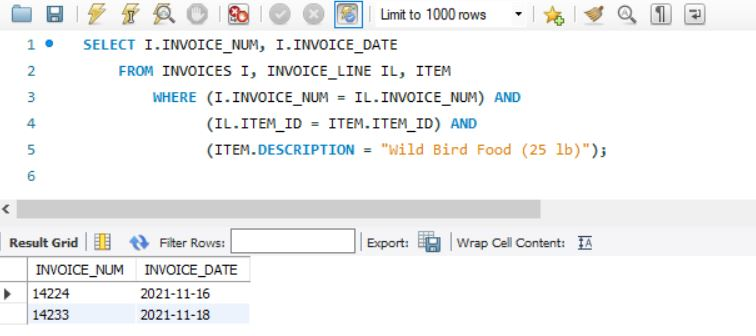

**Question 15.** List the invoice number and invoice date for each invoice that either was created for James Gonzalez or that contains an invoice line for Wild Bird Food (25 lb).
**Answer**:

<pre style="white-space: pre-wrap;">
<code>
SELECT DISTINCT I.INVOICE_NUM, I.INVOICE_DATE
    FROM INVOICES I, CUSTOMER C, INVOICE_LINE IL, ITEM
        WHERE ((I.CUST_ID = C.CUST_ID) AND 
              (C.FIRST_NAME = "James") AND 
              (C.LAST_NAME = "Gonzalez")) OR
              ((I.INVOICE_NUM = IL.INVOICE_NUM) AND 
              (IL.ITEM_ID = ITEM.ITEM_ID) AND 
              (ITEM.DESCRIPTION = "Wild Bird Food (25 lb)"));
</code>
</pre>


**Question 16.** List the invoice number and invoice date for each invoice that was created for James Gonzalez and that contains an invoice line for Wild Bird Food (25 lb).
**Answer**:

<pre style="white-space: pre-wrap;">
<code>
SELECT I.INVOICE_NUM, I.INVOICE_DATE
    FROM INVOICES I, CUSTOMER C, INVOICE_LINE IL, ITEM
        WHERE ((I.CUST_ID = C.CUST_ID) AND 
              (C.FIRST_NAME = "James") AND 
              (C.LAST_NAME = "Gonzalez")) AND
              ((I.INVOICE_NUM = IL.INVOICE_NUM) AND 
              (IL.ITEM_ID = ITEM.ITEM_ID) AND 
              (ITEM.DESCRIPTION = "Wild Bird Food (25 lb)"));
</code>
</pre>


**Question 17.** List the invoice number and invoice date for each invoice that was created for James Gonzalez but that does not contain an invoice line for Wild Bird Food (25 lb).
**Answer**:

<pre style="white-space: pre-wrap;">
<code>
SELECT I.INVOICE_NUM, I.INVOICE_DATE
    FROM INVOICES I, CUSTOMER C
        WHERE ((I.CUST_ID = C.CUST_ID) AND 
              (C.FIRST_NAME = "James") AND 
              (C.LAST_NAME = "Gonzalez")) AND
              I.INVOICE_NUM NOT IN (SELECT I.INVOICE_NUM
                                        FROM INVOICES I, INVOICE_LINE IL, ITEM
                                            WHERE (I.INVOICE_NUM = IL.INVOICE_NUM) AND 
                                                  (IL.ITEM_ID = ITEM.ITEM_ID) AND 
                                                  (ITEM.DESCRIPTION = "Wild Bird Food (25 lb)"));
</code>
</pre>


**Question 18.** List the item ID, description, unit price, and category for each item that has a unit price greater than the unit price of every item in category CAT. Use either the ALL or ANY operator in your query. (Hint: Make sure you select the correct operator.)
**Answer**:

<pre style="white-space: pre-wrap;">
<code>
SELECT ITEM_ID, DESCRIPTION, PRICE, CATEGORY
    FROM ITEM
        WHERE PRICE > ALL (SELECT PRICE
                                FROM ITEM
                                    WHERE CATEGORY = "CAT");
</code>
</pre>

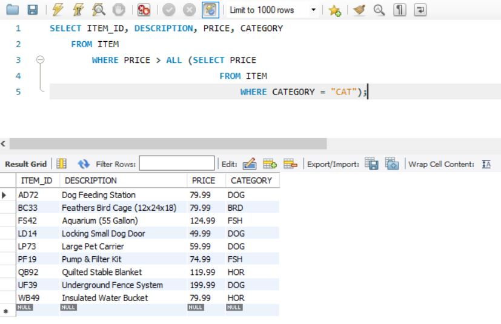

**Question 19.** For each item, list the item ID, description, units on hand, invoice number, and quantity ordered. All items should be included in the results. For those items that are currently not on an invoice, the invoice number and quantity ordered should be left blank. Order the results by item ID.
**Answer**:

<pre style="white-space: pre-wrap;">
<code>
SELECT IT.ITEM_ID, IT.DESCRIPTION, IT.ON_HAND, IL.INVOICE_NUM, IL.QUANTITY
    FROM (SELECT *
                FROM ITEM) IT
LEFT JOIN (SELECT *
                FROM INVOICE_LINE) IL 
ON IT.ITEM_ID = IL.ITEM_ID
ORDER BY ITEM_ID;
</code>
</pre>


#### Critical Thinking

**Question 1.** If you used ALL in Exercise 18, repeat the exercise using ANY. If you used ANY, repeat the exercise using ALL, and then run the new command. What question does the new command answer?
**Answer**:

- The new command ANY List the item ID, description, unit price, and category for each item that has a unit price greater than the unit price of one or more item in category CAT. 

<pre style="white-space: pre-wrap;">
<code>
SELECT ITEM_ID, DESCRIPTION, PRICE, CATEGORY
    FROM ITEM
        WHERE PRICE > ANY (SELECT PRICE
                                FROM ITEM
                                    WHERE CATEGORY = "CAT");
</code>
</pre>


**Question 2.** For each sales rep, list the ID, first name, and last name for the customer, along with the sales rep first name, and sales rep last name. All reps should be included in the results. Order the results by rep ID. There are two SQL commands for this query that lists the same results. Create and run each SQL command.
**Answer**:

- First SQL query
  
<pre style="white-space: pre-wrap;">
<code>
SELECT C.REP_ID, C.FIRST_NAME AS CUSTOMER_FIRST_NAME, C.LAST_NAME AS CUSTOMER_LAST_NAME, 
       SR.FIRST_NAME AS SALES_REP_FIRST_NAME, SR.LAST_NAME AS SALES_REP_LAST_NAME
    FROM CUSTOMER C, SALES_REP SR
    ORDER BY C.REP_ID
</code>
</pre>


- Second SQL query

<pre style="white-space: pre-wrap;">
<code>
SELECT C.REP_ID, C.FIRST_NAME AS CUSTOMER_FIRST_NAME, C.LAST_NAME AS CUSTOMER_LAST_NAME, 
       SR.FIRST_NAME AS SALES_REP_FIRST_NAME, SR.LAST_NAME AS SALES_REP_LAST_NAME
    FROM CUSTOMER C
    INNER JOIN SALES_REP SR
    ORDER BY C.REP_ID;
</code>
</pre>


#### StayWell Student Accommodation

- Use SQL and the StayWell Student Accommodation database (see Figures 1-4 through 1-9 in Module 1) to complete the following exercises. If directed to do so by your instructor, use the information provided with the Module 3 Exercises to print your output or save it to a document.
**Question 1.** For every property, list the management office number, address, monthly rent, owner number, owner’s first name, and owner’s last name.
**Answer**:

<pre style="white-space: pre-wrap;">
<code>
SELECT P.OFFICE_NUM, P.ADDRESS, P.MONTHLY_RENT, P.OWNER_NUM, 
       O.FIRST_NAME AS OWNER_FIRST_NAME, O.LAST_NAME AS OWNER_LAST_NAME
    FROM PROPERTY P, OWNER O
        WHERE (P.OWNER_NUM = O.OWNER_NUM);
</code>
</pre>


**Question 2.** For every completed or open service request, list the property ID, description, and status.
**Answer**:

<pre style="white-space: pre-wrap;">
<code>
SELECT SR.PROPERTY_ID, SR.DESCRIPTION, SR.STATUS
    FROM SERVICE_REQUEST SR;
</code>
</pre>


**Question 3.** For every service request for furniture replacement, list the property ID, management office number, address, estimated hours, spent hours, owner number, and owner’s last name.
**Answer**:

<pre style="white-space: pre-wrap;">
<code>
SELECT P.PROPERTY_ID, OFFICE.OFFICE_NUM, OFFICE.ADDRESS, SR.EST_HOURS, SR.SPENT_HOURS, 
       OWNER.OWNER_NUM, OWNER.LAST_NAME
    FROM PROPERTY P, SERVICE_REQUEST SR, OFFICE, OWNER, SERVICE_CATEGORY SC
        WHERE (P.PROPERTY_ID = SR.PROPERTY_ID) AND 
              (SR.OFFICE_ID = OFFICE.OFFICE_NUM) AND  
              (P.OWNER_NUM = OWNER.OWNER_NUM) AND
              (SC.CATEGORY_DESCRIPTION = "Furniture replacement");
</code>
</pre>


**Question 4.** List the first and last names of all owners who own a two-bedroom property. Use the IN operator in your query.
**Answer**:

<pre style="white-space: pre-wrap;">
<code>
SELECT O.FIRST_NAME, O.LAST_NAME
    FROM OWNER O
        WHERE O.OWNER_NUM IN (SELECT P.OWNER_NUM
                                    FROM PROPERTY P
                                        WHERE P.BDRMS = 2);
</code>
</pre>


**Question 5.** Repeat Exercise 4, but this time use the EXISTS operator in your query.
**Answer**:

<pre style="white-space: pre-wrap;">
<code>
SELECT O.FIRST_NAME, O.LAST_NAME
    FROM OWNER O
        WHERE EXISTS (SELECT P.OWNER_NUM
                            FROM PROPERTY P
                                WHERE (O.OWNER_NUM = P.OWNER_NUM) AND (P.BDRMS = 2));
</code>
</pre>


**Question 6.** List the property IDs of any pair of properties that have the same number of bedrooms. For example, one pair would be property ID 2 and property ID 6, because they both have four bedrooms. The first property ID listed should be the major sort key and the second property ID should be the minor sort key.
**Answer**:

<pre style="white-space: pre-wrap;">
<code>
SELECT F.PROPERTY_ID, S.PROPERTY_ID 
    FROM PROPERTY F, PROPERTY S
        WHERE (F.PROPERTY_ID < S.PROPERTY_ID) AND (F.BDRMS = S.BDRMS);
</code>
</pre>


**Question 7.** List the square footage, owner number, owner last name, and owner first name for each property managed by the Columbia City office.
**Answer**:

<pre style="white-space: pre-wrap;">
<code>
SELECT P.SQR_FT, P.OWNER_NUM, O.LAST_NAME AS OWNER_LAST_NAME , O.FIRST_NAME AS OWNER_FIRST_NAME
    FROM PROPERTY P, OWNER O
        WHERE (P.OWNER_NUM = O.OWNER_NUM) AND (P.OFFICE_NUM = 1);
</code>
</pre>


**Question 8.** Repeat Exercise 7, but this time include only those properties with three bedrooms.
**Answer**:

<pre style="white-space: pre-wrap;">
<code>
SELECT P.SQR_FT, P.OWNER_NUM, O.LAST_NAME AS OWNER_LAST_NAME , O.FIRST_NAME AS OWNER_FIRST_NAME
    FROM PROPERTY P, OWNER O
        WHERE (P.OWNER_NUM = O.OWNER_NUM) AND (P.OFFICE_NUM = 1) AND (P.BDRMS = 3);
</code>
</pre>


**Question 9.** List the office number, address, and monthly rent for properties whose owners live in Washington state or own two-bedroom properties.
**Answer**:

<pre style="white-space: pre-wrap;">
<code>
SELECT P.OFFICE_NUM, P.ADDRESS, P.MONTHLY_RENT
    FROM PROPERTY P, OWNER O
        WHERE (P.OWNER_NUM = O.OWNER_NUM) AND (O.STATE = "WA") AND (P.BDRMS = 2);
</code>
</pre>


**Question 10.** List the office number, address, and monthly rent for properties whose owners live in Washington state and own a two-bedroom property.
**Answer**:

<pre style="white-space: pre-wrap;">
<code>
SELECT P.OFFICE_NUM, P.ADDRESS, P.MONTHLY_RENT
    FROM PROPERTY P, OWNER O
        WHERE (P.OWNER_NUM = O.OWNER_NUM) AND (O.STATE = "WA") AND (P.BDRMS = 2);
</code>
</pre>


**Question 11.** List the office number, address, and monthly rent for properties whose owners live in Washington state but do not own two-bedroom properties.
**Answer**:

<pre style="white-space: pre-wrap;">
<code>
SELECT P.OFFICE_NUM, P.ADDRESS, P.MONTHLY_RENT
    FROM PROPERTY P, OWNER O
        WHERE (P.OWNER_NUM = O.OWNER_NUM) AND (O.STATE = "WA") AND (P.BDRMS <> 2);
</code>
</pre>


**Question 12.** Find the service ID and property ID for each service request whose estimated hours are greater than the number of estimated hours of at least one service request on which the category number is 5.
**Answer**:

<pre style="white-space: pre-wrap;">
<code>
SELECT SR.SERVICE_ID, SR.PROPERTY_ID, SR.EST_HOURS
    FROM SERVICE_REQUEST SR 
        WHERE SR.EST_HOURS > ANY (SELECT SR.EST_HOURS
                                        FROM SERVICE_REQUEST SR
                                            WHERE SR.CATEGORY_NUMBER = "5"
                                  );
</code>
</pre>


**Question 13.** Find the service ID and property ID for each service request whose estimated hours are greater than the number of estimated hours on every service request on which the category number is 5.
**Answer**:

<pre style="white-space: pre-wrap;">
<code>
SELECT SR.SERVICE_ID, SR.PROPERTY_ID, SR.EST_HOURS
    FROM SERVICE_REQUEST SR 
        WHERE SR.EST_HOURS > ALL (SELECT SR.EST_HOURS
                                        FROM SERVICE_REQUEST SR
                                            WHERE SR.CATEGORY_NUMBER = "5"
                                  );
</code>
</pre>


**Question 14.** List the address, square footage, owner number, service ID, number of estimated hours, and number of spent hours for each service request on which the category number is 4.
**Answer**:

<pre style="white-space: pre-wrap;">
<code>
SELECT P.ADDRESS, P.SQR_FT, P.OWNER_NUM, SR.SERVICE_ID, SR.EST_HOURS, SR.SPENT_HOURS
    FROM PROPERTY P, SERVICE_REQUEST SR
        WHERE (P.PROPERTY_ID = SR.PROPERTY_ID) AND (SR.CATEGORY_NUMBER = "4");
</code>
</pre>


**Question 15.** Repeat Exercise 14, but this time be sure each property is included regardless of whether the property currently has any service requests for category 4.**Answer**:

<pre style="white-space: pre-wrap;">
<code>
SELECT P.ADDRESS, P.SQR_FT, P.OWNER_NUM, SR.SERVICE_ID, SR.EST_HOURS, SR.SPENT_HOURS
    FROM PROPERTY P, SERVICE_REQUEST SR
        WHERE (P.PROPERTY_ID = SR.PROPERTY_ID);
</code>
</pre>


**Question 16.** Repeat Exercise 15 using a different SQL command to obtain the same result. What is the difference between the two commands?
**Answer**:

The difference is that question 16 I have used inner join while in question 15 there is no inner join.

<pre style="white-space: pre-wrap;">
<code>
SELECT P.ADDRESS, P.SQR_FT, P.OWNER_NUM, SR.SERVICE_ID, SR.EST_HOURS, SR.SPENT_HOURS
    FROM PROPERTY P
        INNER JOIN SERVICE_REQUEST SR
            ON (P.PROPERTY_ID = SR.PROPERTY_ID);
</code>
</pre>


